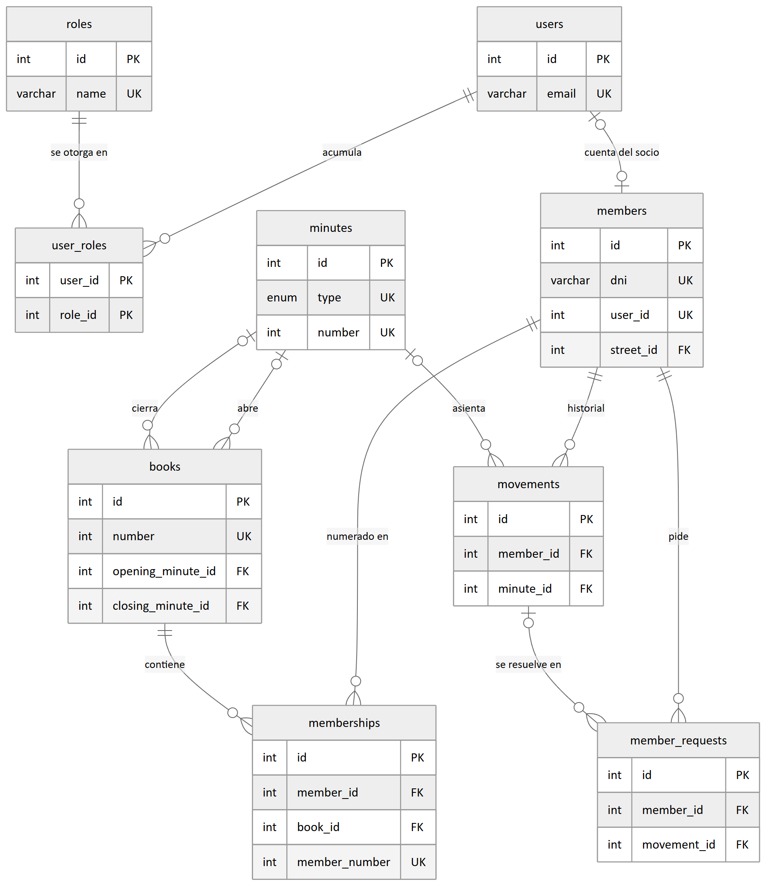
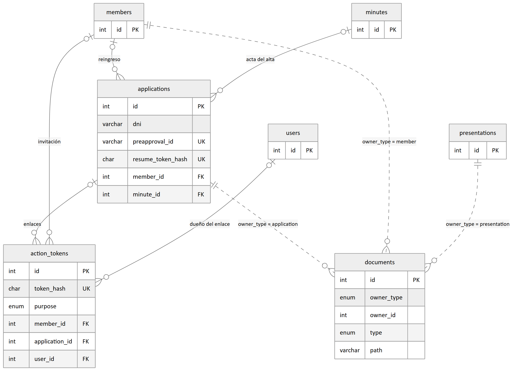
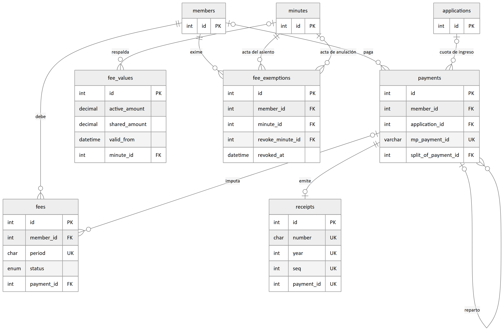
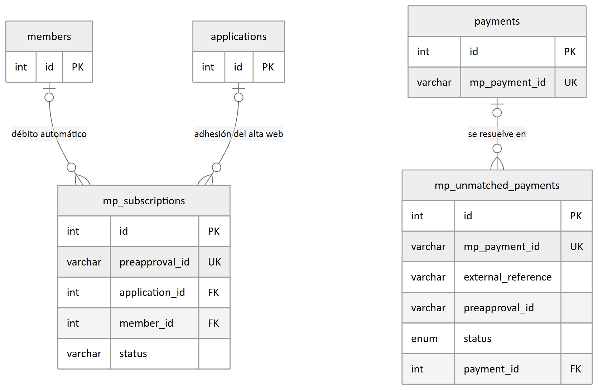
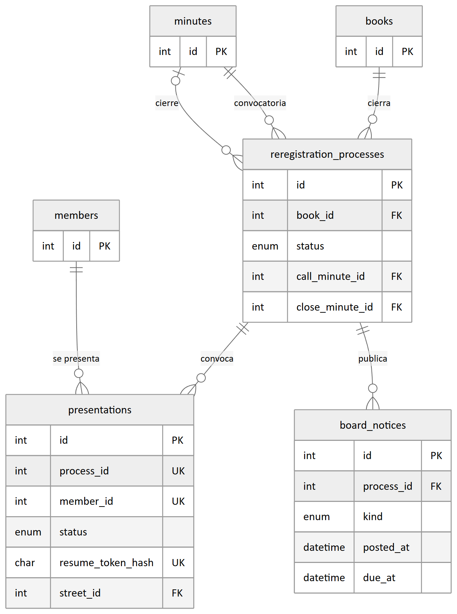
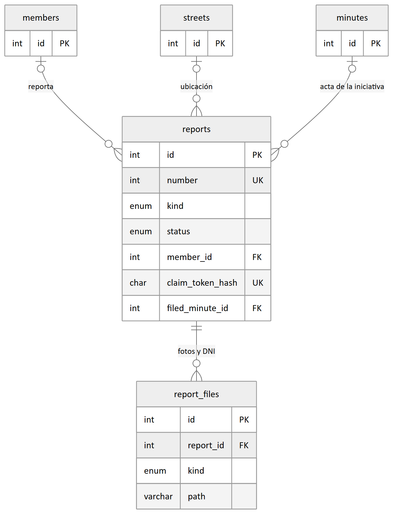
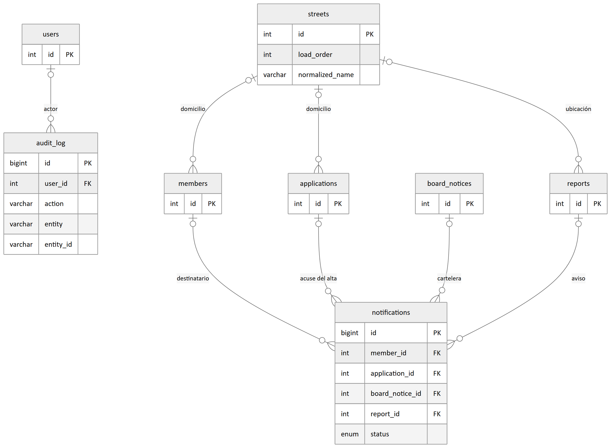

# 1. Cómo está guardado el dato

## Para quién es y qué da por sabido

Está escrito para quien revisa SIGeV desde afuera y necesita saber, en un rato, qué guarda el
sistema y cómo está organizado. Da por sabido SQL, claves foráneas e índices, y una noción de
qué hace un ORM; no da por sabido nada del dominio de la asociación. Es la versión corta de
la serie técnica: el detalle columna por columna, los 34 enums y las 24 migraciones están en
**T4 — Modelo de datos**, y acá no se repiten. La fuente de verdad de los dos es
`prisma/schema.prisma`.

## Cómo leer este documento

El capítulo 2 es el cuerpo: el mapa y, por dominio, un diagrama entidad-relación y una entrada
por cada tabla, con para qué sirve, sus claves, sus relaciones y su volumen. El 3 es material
de consulta. Los diagramas están también como PNG en `docs/manuales/img/r1/`, con el fuente
Mermaid de cada uno al lado.

## Las cuatro convenciones del esquema

La base es **MariaDB** y el acceso es por **Prisma** con el provider `mysql`. El esquema
declara **37 modelos** y **34 enums** en un solo archivo, y de ahí salen las migraciones:
siempre `prisma migrate`, nunca un `db push` contra producción.

**El modelo y la tabla no se llaman igual.** El modelo es singular y en mayúsculas camelladas;
la tabla, plural y en minúsculas con guión bajo (`FeeValue` es `fee_values`). Acá se nombra
siempre la tabla, que es lo que se ve desde SQL.

**Todo instante se guarda en UTC; toda fecha civil, al mediodía UTC.** Una fecha civil —la de
un acta, la de ingreso, un feriado— no tiene hora que signifique nada: con medianoche,
cualquier render en la zona local la correría un día para atrás.

**Casi nada se borra: se marca.** Un recibo anulado tiene su fecha de anulación, su motivo y
su autor, y su número sigue ocupado: la columna en nulo es el estado normal, y la fecha es a
la vez el hecho y su prueba. Las claves foráneas acompañan: la trazabilidad se anula
(`SetNull`), lo que no tiene vida propia se borra en cascada, y lo que **es** la prueba va con
`Restrict`.

**La plata es `Decimal(10, 2)`, nunca un flotante**, y toda comparación de dinero se hace en
centavos enteros, porque los importes que llegan de Mercado Pago sí son flotantes.

## La base en local, en dos comandos

```bash
docker compose up -d
docker exec -it sigev-db mariadb -u sigev -p sigev
```

El primero levanta MariaDB en un contenedor con el puerto publicado **sólo en loopback**; el
segundo abre el cliente contra la base de desarrollo, cuya contraseña está en
`docker-compose.yml`. El esquema está en `prisma/schema.prisma` —sus comentarios son parte de
la especificación— y las migraciones, en `prisma/migrations/`, una carpeta con SQL plano cada
una.

# 2. Los dominios, uno por uno

Las 37 tablas se agrupan en nueve dominios. El padrón es el centro y ahí termina la mitad de
las flechas del sistema; el bloque de contenido es el sitio público y no se conecta con nada
salvo con su autor.


**Cómo leer los siete diagramas.** Cada caja es una tabla, con su clave primaria y sólo las
claves foráneas y los uniques que importan; una tabla de **otro** dominio aparece apenas como
el extremo de una flecha, y las tablas que quedarían como cajas sueltas —sin ninguna relación
dentro de su dominio— no se dibujan, aunque figuran en las listas. Rige la misma omisión que
en el mapa: **no se dibuja quién creó, validó o anuló la fila**, que es una columna de casi
todas. La línea punteada del diagrama de solicitudes es una relación **sin clave foránea
real**. En los volúmenes, un número sale del padrón real importado; una raya quiere decir que
depende del uso y que no hay cifra que valga la pena afirmar.

## Usuarios, autenticación y padrón



- **`users`** — la cuenta de acceso, de gestión o de socio. *Uniques:* `email`.
  *Relaciones:* 1 a 1 con la ficha, N a N con los roles, y figura como autor en más de una
  docena de tablas. *Volumen:* —
- **`roles`** — el catálogo de los tres roles: superadmin, admin y socio. *Uniques:* `name`.
  *Relaciones:* la tabla puente. *Volumen:* 3 filas.
- **`user_roles`** — la puente que hace los roles acumulables. *Claves:* primaria compuesta de
  las dos columnas. *Relaciones:* a la cuenta, en cascada, y al rol. *Volumen:* —
- **`members`** — la ficha del socio. *Uniques:* el documento de identidad y la cuenta.
  *Relaciones:* una docena de listas inversas —membresías, movimientos, cuotas, cobros,
  presentaciones, reportes— más la calle. *Volumen:* 278 fichas, 160 vigentes (36 activos y
  124 adherentes) y 118 bajas.
- **`books`** — el libro de socios. *Uniques:* `number`. *Relaciones:* las actas de apertura y
  de cierre, y las membresías. *Volumen:* uno solo, el **Libro N° 1**, abierto, con el padrón
  importado.
- **`memberships`** — el número de socio, que es **por libro**. *Uniques:* dos, con el libro:
  uno sostiene la densidad de la numeración y el otro, un número por socio. *Relaciones:* a la
  ficha y al libro. *Volumen:* 278 filas, numeradas de 1 a 306 con 28 huecos.
- **`minutes`** — el acta: el respaldo institucional de casi todo. *Uniques:*
  `[type, number]`. *Relaciones:* la referencian siete tablas con diez columnas. *Volumen:* —
- **`movements`** — el historial de la ficha: altas, bajas, cambios de categoría, reingresos.
  *Claves:* índice por socio. *Relaciones:* a la ficha, al acta y al autor. *Volumen:* —
- **`member_requests`** — la baja o el cambio de categoría que pide el socio desde su panel.
  *Claves:* índices por socio y estado. *Relaciones:* a la ficha en cascada, a quien decidió y
  al movimiento que la ejecutó. *Volumen:* —

Un acta se identifica por **tipo y número**, nunca por su id: "Acta N° 16" sin decir si es de
Comisión Directiva o de Asamblea señala dos documentos distintos, y los dos suelen existir.
Las dos columnas de la foto de cierre de `memberships` siguen en nulo: se escriben recién
cuando un libro se cierra, y el Libro N° 1 está abierto.

## Solicitudes de alta



- **`applications`** — la solicitud que deja el formulario público de asociarse. *Uniques:* la
  suscripción y el enlace de retome; el documento de identidad **no**. *Relaciones:* a la
  ficha si es un reingreso, al acta y a la calle; cuelgan de ella los enlaces de un solo uso,
  los cobros y los avisos. *Volumen:* —
- **`documents`** — las dos caras del DNI y los anexos. *Claves:* índice por dueño.
  *Relaciones:* el dueño es **polimórfico y no tiene clave foránea** —una solicitud, una ficha
  o una presentación, según diga su columna de tipo— y la integridad la cuida la capa de
  servicio. *Volumen:* —

La solicitud es un espejo de la ficha donde los mismos campos son obligatorios, porque el
alta web exige la ficha completa y el padrón histórico vino incompleto. De los enlaces sólo se
guarda el hash: el valor crudo viaja una sola vez.

## Tesorería



- **`fee_values`** — el valor de cuota vigente y toda su historia: la **única** fuente de
  montos. *Claves:* índice por vigencia. *Relaciones:* al acta y al autor. *Volumen:* —
- **`fees`** — la cuota de un socio y un mes, **sin monto**. *Uniques:*
  `[member_id, period]`. *Relaciones:* a la ficha en cascada y al cobro que la pagó.
  *Volumen:* 3076 cuotas importadas, de 118 socios, por los años 2022 a 2026.
- **`payments`** — el cobro, de mostrador o de Mercado Pago. *Uniques:* el identificador del
  pago de Mercado Pago. *Relaciones:* a la ficha y a la solicitud, a lo sumo un recibo, y se
  autorreferencia para el reparto de un cobro entre socios. *Volumen:* —
- **`receipts`** — el recibo de la serie societaria. *Uniques:* tres, el número, el par de año
  y secuencia, y el cobro. *Relaciones:* al cobro, con `Restrict`. *Volumen:* —
- **`receipt_sequences`** — el contador anual de la serie. *Claves:* el año es la primaria.
  *Relaciones:* ninguna. *Volumen:* una fila por año.
- **`other_incomes`** — plata de la asociación que no es de ningún socio: alquileres, rifas.
  *Uniques:* el identificador del pago. *Relaciones:* **ninguna al núcleo de plata**, a
  propósito; sólo a quien registró y a quien anuló. *Volumen:* —
- **`fee_exemptions`** — la exención de cuota del Art. 7 inc. a.4. *Claves:* índice por socio.
  *Relaciones:* a la ficha y a las dos actas —la del asiento y la de la anulación—, las tres
  con `Restrict`. *Volumen:* —
- **`mp_unmatched_payments`** — la bandeja de los cobros que no se pudieron imputar.
  *Uniques:* el identificador del pago. *Relaciones:* al cobro que la resolvió y a quien lo
  hizo. *Volumen:* —

**Que la cuota no lleve monto es la decisión que ordena el dominio entero.** La deuda se valúa
al valor vigente en el momento del pago, así que guardarle un importe sería guardar un dato
que caduca; y un valor nunca se edita: se registra otro encima, como un acta. El número de
recibo se pide **dentro** de la transacción del cobro, contra la tabla de secuencias, que
bloquea la fila del año hasta el commit: dos cobros simultáneos se serializan y una
transacción abortada no consume número. Anular un recibo **no** borra el identificador de
Mercado Pago, que es la barrera de idempotencia del dinero.

## Mercado Pago



- **`mp_subscriptions`** — el espejo local de una suscripción de débito automático.
  *Uniques:* `preapproval_id`. *Relaciones:* a la solicitud y a la ficha, y el socio es
  **sólo** un índice, así que nada impide dos suscripciones vivas para la misma persona.
  *Volumen:* —
- **`webhook_events`** — el registro crudo de cada notificación entrante, con su cuerpo en
  JSON. *Uniques:* `[origin, external_event_id]`. *Relaciones:* ninguna. *Volumen:* —

El estado de la suscripción es texto y **no** un enum: el catálogo es del proveedor y puede
crecer sin avisar. El unique de `webhook_events` **es** la idempotencia de la ruta que recibe
los avisos, y es la primera de dos capas: la segunda es el identificador del pago en el cobro.

## Re-empadronamiento



- **`reregistration_processes`** — el proceso completo, con sus dos instancias. *Relaciones:*
  al libro que cierra y a las actas de convocatoria —obligatoria— y de cierre. *Volumen:* —
- **`presentations`** — lo que el socio presenta para ratificar su condición. *Uniques:*
  `[process_id, member_id]` y el enlace de retome. *Relaciones:* al proceso, a la ficha, a la
  calle y a quien validó. *Volumen:* una fila por convocado.
- **`board_notices`** — un cartel de la cartelera **física** de la sede. *Relaciones:* al
  proceso, y lo citan las notificaciones que acredita. *Volumen:* —
- **`holidays`** — los feriados, para contar plazos en días hábiles. *Uniques:* `date`.
  *Relaciones:* ninguna. *Volumen:* los feriados nacionales de 2026 y 2027.

La cohorte se congela al convocar: se crea una fila por cada adherente vigente en ese momento,
y ésa es la lista de convocados. Una fila pendiente **no significa que el socio haya hecho
algo**: existe para poder listar a quién le falta. Los datos declarados no tocan la ficha
hasta que la Comisión valida.

## Reportes



- **`reports`** — los reclamos y las iniciativas que entran los vecinos. *Uniques:* el número
  público —que admite nulo mientras es borrador— y la llave del borrador. *Relaciones:* a la
  ficha, a la calle, al acta con `Restrict` y a los usuarios que resolvieron. *Volumen:* —
- **`report_files`** — las fotos y las dos caras del DNI. *Claves:* índice por reporte y tipo.
  *Relaciones:* al reporte, en cascada. *Volumen:* —
- **`report_sequences`** — el contador del número público. *Relaciones:* ninguna. *Volumen:*
  una sola fila.

Un **reclamo** se presenta ante un organismo; una **iniciativa** la trata la Comisión
Directiva, y por eso el acta va con `Restrict`: es el respaldo de que la trató. Toda imagen se
recodifica antes de tocar el disco, porque una foto sacada en la esquina del problema trae la
posición en los metadatos.

## Contenido

Este dominio no lleva diagrama: dos de sus tablas apuntan sólo a su autor y la tercera no se
relaciona con nada.

- **`news`** — la cartelera **digital** del sitio público. *Uniques:* `slug`. *Relaciones:* al
  autor. *Volumen:* — El cuerpo se guarda como HTML ya saneado en el servidor.
- **`activities`** — las actividades semanales de la sede. *Claves:* índice por año y espacio.
  *Relaciones:* ninguna. *Volumen:* — Los horarios son texto de hora de pared y **sin
  convertir a UTC**: un horario recurrente no es un instante.
- **`institutional_documents`** — el estatuto, las memorias y los balances que la Comisión
  publica a los socios. *Uniques:* `year_key`. *Relaciones:* a quien lo subió. *Volumen:* —
  "Una memoria y un balance por año" lo sostiene la base con una clave materializada que queda
  en nulo para los otros tipos, porque los nulos de un unique de MySQL no chocan entre sí.

## Sistema



- **`configuration`** — las llaves que se editan sin desplegar, con el valor en JSON.
  *Claves:* la llave es la primaria. *Relaciones:* ninguna. *Volumen:* una fila por llave.
- **`audit_log`** — la auditoría de toda acción sensible. *Claves:* índices por usuario, por
  entidad y por acción. *Relaciones:* al usuario. *Volumen:* —
- **`action_tokens`** — los enlaces de un solo uso, guardados como hash. *Uniques:*
  `token_hash`. *Relaciones:* a la ficha, a la solicitud y a la cuenta. *Volumen:* —
- **`notifications`** — la acreditación de que a alguien se le avisó. *Claves:* índices por
  estado y por tipo y período. *Relaciones:* a la ficha, a la solicitud, al cartel y al
  reporte. *Volumen:* —
- **`cron_runs`** — la última corrida de cada tarea programada. *Claves:* índice por tarea y
  comienzo. *Relaciones:* ninguna. *Volumen:* una fila por corrida efectiva de los cinco
  crons.
- **`streets`** — las calles catastrales del barrio. *Claves:* índices por nombre normalizado
  y por orden de carga. *Relaciones:* la referencian cuatro tablas. *Volumen:* 40 filas.

Una notificación fallida registra un intento, **no** una acreditación: el correo no salió, y
su columna de error guarda el código del fallo y nunca la dirección, por la Ley 25.326. Los
identificadores de las calles no son autoincrementales: son los del municipio.

# 3. Los enums y las invariantes

## Los siete enums que hacen falta

De los 34, éstos alcanzan para leer una consulta sin adivinar.

- **`MemberStatus`** — `active`, `suspended`, `withdrawn`; "vigente" son los dos primeros.
- **`MemberCategory`** — `active`, `adherent`, `collaborator`, `cadet`, `honorary`,
  `lifetime`: las seis del estatuto, y por la web llegan sólo las tres primeras.
- **`FeeStatus`** — `pending`, `paid`, `exempt`, `voided`; la deuda pregunta por el primero a
  secas y el cuarto **no lo escribe nadie**.
- **`PaymentStatus`** — `applied`, `refunded`, `voided`.
- **`ApplicationStatus`** — la máquina del alta web, en orden: `started`, `pending_payment`,
  `approved_pending_minute`, `pending_board`, `completed`, `rejected`, `expired`.
- **`PresentationStatus`** — `pending` (lo escribe la convocatoria, no el vecino),
  `submitted`, `observed`, `validated`, `rejected`, `withdrawn`.
- **`ReportStatus`** — `draft` y `received` los escribe el formulario público; `filed` y
  `dismissed`, la bandeja del panel.

**Seis valores no los escribe nadie** —el cuarto estado de cuota, el origen `brevo` de los
avisos entrantes y, con él, el rebote de correo y tres estados de notificación—, así que una
consulta que los busque devuelve cero. Y **el orden es parte del contrato**: un enum de MySQL
se guarda como índice, así que intercalar un valor le corre el significado a cada fila ya
escrita.

## Lo que la base no sostiene

MySQL no tiene índices únicos **parciales**: todas éstas tienen la forma "a lo sumo uno
vigente" y se sostienen dentro de la transacción que las puede romper (detalle en T4 §5).

1. Una solicitud de alta viva por documento de identidad.
2. Un pedido pendiente por tipo y por socio, con un cerrojo que envuelve la transacción.
3. Una exención de cuota vigente por socio.
4. Un documento institucional destacado a lo sumo.
5. Un cobro lleva el identificador de Mercado Pago o el del reparto, nunca los dos.
6. Cada fila de `documents` apunta a un dueño que existe.

Los cerrojos viven **en memoria**: todo esto asume un solo proceso, y subir las instancias del
gestor rompería la segunda en silencio.

## Documentos relacionados

De esta serie, **R2**: cómo está armado el código. De la técnica: **T4 — Modelo de datos** (la
versión larga de éste), **T5 — Tesorería y Mercado Pago**, **T6 — Módulos de dominio** y
**T3 — Instalación, despliegue y operación**.
