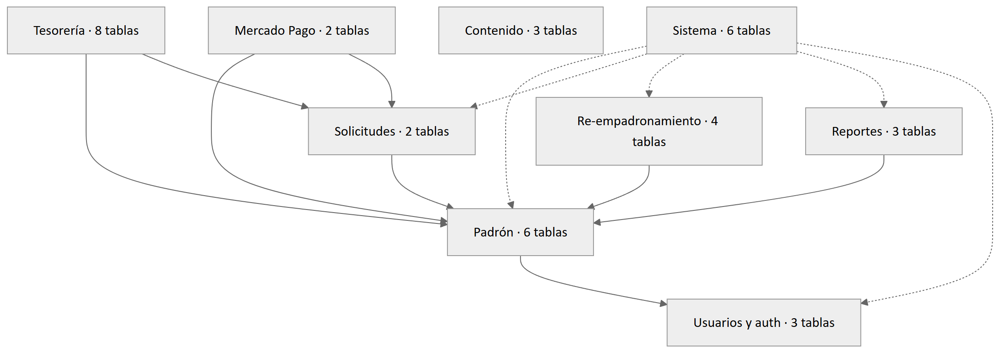

# Antes de empezar

## Para quién es y qué da por sabido

Este es el documento que conviene leer **primero** antes de revisar el código de SIGeV.
Condensa en pocas páginas lo que la serie técnica desarrolla en siete documentos, y cierra
con una guía de por dónde empezar: los puntos delicados, los tests que fijan convenciones y
la deuda conocida.

Da por sabido TypeScript, React con componentes de servidor, SQL relacional y el uso de un
ORM. **No** da por sabido nada del dominio: ni el estatuto de una asociación civil
argentina, ni cómo funciona Mercado Pago, ni qué es un re-empadronamiento.

La regla que gobierna toda la documentación de esta serie: **la verdad es el código**. Donde
la carpeta `docs/` del repositorio diga otra cosa que lo que hace el programa, estos
documentos describen el programa, y la diferencia queda anotada en el archivo de hallazgos
del 11/09/2026.

## Cómo leer este documento

Cada capítulo ocupa una o dos páginas y cierra con una línea "**Más en:**" que remite al
documento largo y al capítulo exacto, para no tener que buscar. Los capítulos 1 a 4 son el
panorama; el 5 y el 6, los dominios; el 7 y el 8, seguridad y operación; el 9 alcanza para
levantar el proyecto. El **capítulo 10 es la guía de revisión** y es el único que conviene
leer con el editor abierto al lado.

# 1. Qué es SIGeV

Es la plataforma web de la **Asociación Vecinal del Barrio Ciudadela**, de Comodoro Rivadavia,
Chubut, bajo contralor de la Inspección General de Justicia provincial. El primer principio de
diseño es que **el estatuto es la especificación**: cada regla cita su artículo y lleva un número
de `REG-01` a `REG-37`. La reforma del 15/08/2026 sigue pendiente de oficialización. Los cuatro
procesos que digitaliza:

| Proceso | Qué hace |
|---|---|
| Asociarse (ASOCIATE) | Alta web en seis pasos con documento, categoría y cuota de ingreso; la Comisión la asienta después en acta |
| Re-empadronarse (REEMPADRONATE) | Depuración del padrón de adherentes (Art. 9° bis): cohorte, plazos, bajas y cierre del libro |
| Cuotas sociales | Débito automático, links de pago, efectivo, recibos numerados y bandeja para el dinero sin dueño |
| Reportes | Un **reclamo** se presenta ante un organismo; una **iniciativa** la trata la Comisión |

## Tres públicos, tres zonas, tres roles

| Público | Zona | Rol (son acumulables) | Qué hace ahí |
|---|---|---|---|
| Vecino (socio o no) | sitio público | — | Se informa, se asocia, se re-empadrona, reporta, entra |
| Socio | `/mi` | `socio` | Estado de cuenta, pago, débito, datos, solicitudes |
| Comisión Directiva | `/admin` | `admin` | Altas, cobros, libros, actas, contenido |
| Quien opera el sistema | `/admin` | `superadmin` | Lo anterior, más configuración, usuarios, salud, padrón electoral y actos irreversibles |

**Los números del dominio y el estado.** El Libro N° 1 tiene 278 fichas de 1 a 306 con 28
huecos: 160 vigentes (36 activos y 124 adherentes) y 118 bajas; la foto de deuda del 21/08/2026
registra 3076 cuotas impagas de 118 socios. Son números chicos, y eso explica un solo proceso,
exclusiones en memoria y una sola base. Hay **un solo entorno desplegado**,
`vecinalciudadela.ar`. Corre el commit `243aa26` desde el 11/09/2026,
con las 24 migraciones aplicadas y con credenciales **productivas** de pago
desde el 22/08/2026: **no se prueban cobros contra el dominio**, porque ahí la plata es de un
vecino. Está publicado pero no difundido, con el alta web y la categoría colaborador apagadas.

> Más en: T1 §1, §2 y §5.

# 2. Stack y arquitectura

Un **monolito de Next.js con App Router**: un proyecto, un proceso y un puerto sirven el sitio
público, los dos paneles y la API. No hay backend separado, microservicios ni cola de mensajes.

| Pieza | Versión y nota |
|---|---|
| `next` 16.3.1 y React 19.2.8 | Fijas; el middleware se llama `proxy.ts` y los parámetros de ruta son promesas |
| Prisma 7.9 | Con `@prisma/adapter-mariadb`, sin motor binario |
| Auth.js v5 beta | Credenciales y token firmado; **sin tabla de sesiones** |
| Interfaz | Tailwind 4, Radix y shadcn sobre variables CSS; `leaflet` para los mapas |
| Otras | `zod`, `nodemailer`, `mercadopago`, `sharp`, `pdf-lib`, `docx`, `exceljs`, `sanitize-html` |

Todo cuelga de cuatro ramas bajo `src/app`: el grupo público con el sitio y los tres trámites
anónimos, el panel con doce secciones (tres con layout propio), el panel de socio con seis, y la
API con webhooks, tareas programadas y descargas. Hay **86 archivos de página**, 8 layouts y 23
manejadores de ruta sobre 556 archivos TypeScript.

## Las tres capas de autorización

| Capa | Qué mira | Para qué sirve |
|---|---|---|
| Proxy | Los roles del token | Filtro barato; redirige al inicio de sesión |
| Layout de zona | La fila viva | Pinta la pantalla de bloqueo con el motivo |
| Cada acción y cada ruta | La fila viva | **La autorización real** |

**Por qué no alcanza con el proxy.** Una acción de servidor no se invoca por su dirección web:
el framework la despacha por un identificador que viaja en una cabecera, así que un envío a la
portada ejecuta igual una acción declarada bajo el panel. Por eso **cada acción se autoriza a sí
misma en su primera línea**, y por eso la navegación es sólo presentación: el token dura ocho
horas y puede quedar desactualizado tras una degradación de rol.

**Las capas, y lo que no va adentro de una transacción.** El camino es pantalla → acción de
servidor → módulo de dominio (`src/lib`) → ORM. La pantalla no decide negocio: pide el veredicto
a la misma función que después usa la acción para rechazar. La acción se autoriza, valida,
pre-valida lo barato y delega; es la única capa que ve las cabeceras, así que **la IP del asiento
de auditoría la escribe la acción**, y el dominio revalida adentro de la transacción lo que ella
pre-validó. Tres cosas quedan **fuera** de toda transacción, las tres aprendidas caro: ninguna
llamada de red (el tiempo máximo del ORM es de cinco segundos y una externa sostiene el lock),
ninguna escritura de PDF y nada fila por fila cuando son muchas.

> Más en: T2 §1 a §4.

# 3. Mapa de carpetas

```text
src/
├── auth.ts / auth.config.ts    Auth.js: proveedores, eventos, sesión de 8 h
├── proxy.ts                    ex-middleware: sólo cubre /admin y /mi
├── app/
│   ├── (public)/               sitio público y los tres wizards anónimos
│   ├── admin/                  panel: 12 secciones, 3 con layout propio
│   ├── mi/                     panel de socio: 6 secciones
│   ├── api/                    admin, auth, cron (5), imagenes, mi, webhooks
│   ├── redirigir/              post-login: al panel que corresponde
│   ├── robots.ts / sitemap.ts  qué se indexa y qué no
│   └── globals.css             tokens de color, tema y estilos base
├── components/
│   ├── ui/                     12 primitivas de shadcn
│   ├── admin/                  29 componentes del marco del panel
│   ├── mi/                     marco y navegación del panel de socio
│   ├── public/                 encabezado, pie, hero y tarjetas
│   └── map/                    el pin de marca: módulo puro, sin Leaflet
├── generated/prisma/           cliente del ORM (no versionado)
├── lib/
│   ├── applications/           altas web: elegibilidad, wizard, cron, acta
│   ├── auth/                   guardas de rol, cupos, frescura, contraseñas
│   ├── board/                  cartelera física: días hábiles, aviso, PDF
│   ├── email/                  transporte, plantillas, presupuesto de envíos
│   ├── members/                padrón, altas y bajas, débito, electoral
│   ├── minutes/                actas y sus exportaciones
│   ├── mp/                     Mercado Pago: gateway, firma, webhook, conciliación
│   ├── reports/                reportes: servicio, reglas, almacenamiento, PDF
│   ├── reregistration/         re-empadronamiento: reglas, proceso, migración
│   ├── treasury/               cuotas, pagos, recibos, exenciones, reparto
│   ├── admin/ mi/ ui/          navegación, tarjetas, pastillas, pestañas
│   ├── …                       ocho carpetas menores de src/lib; árbol completo en T2 §3
│   └── (sueltos)               audit, cache-tags, config, dates, forms,
│                               keyed-mutex, log-safe, prisma, tokens, turnstile
└── types/                      ampliaciones de tipos de terceros
```

Fuera de `src` están el esquema con sus 24 migraciones, los scripts de importación y
respaldo, los tests, la documentación previa, los datos fuente y el script de despliegue.

**La convención estructural número uno**: `src/lib` son módulos **puros**, sin JSX, sin React,
sin iconos y, cuando se puede, sin cliente del ORM. Lo que renderiza vive en `src/components`.
La otra constante: cada archivo abre con un comentario que explica por qué existe y qué error
concreto previene. Casi todos documentan algo medido, y son la mejor fuente para entender una
decisión rara.

> Más en: T2 §3 y §3.1.

# 4. Los datos

El esquema vive entero en `prisma/schema.prisma`: 1375 líneas, **37 modelos y 34 enums**. El
proveedor es `mysql` y las URLs de conexión están fuera del archivo. Modelo y tabla no se llaman
igual: el modelo es singular en mayúsculas camelladas y la tabla, plural con guiones bajos.

Cuatro convenciones atraviesan el esquema entero:

- **Todo instante se guarda en UTC; toda fecha civil, al mediodía UTC** de ese día argentino.
  Con medianoche, cualquier render en la zona local corre la fecha un día para atrás.
- **La plata es decimal de dos posiciones, nunca un flotante**, y toda comparación contra
  Mercado Pago se hace en centavos enteros.
- **Casi nada se borra: se marca.** Un recibo anulado, una exención levantada, un documento
  purgado y un token gastado se resuelven con una columna de fecha en null.
- Las claves foráneas no son todas iguales: `Restrict` es deliberado y escaso, y aparece donde
  el referente **es** la prueba (el acta de una exención, el pago de un recibo).

## Los nueve dominios



`members` es el centro, pero no el único: las actas las referencian siete tablas con diez
columnas, porque casi todo acto institucional se asienta en una. El bloque de Contenido no se
conecta con nada salvo su autor, a propósito, y los ingresos no societarios están dibujados
dentro de Tesorería pero no tienen ninguna clave foránea hacia el núcleo del dinero.

## Las diez tablas centrales

| Tabla | Qué sostiene |
|---|---|
| `members` | La ficha del socio: documento, categoría, estado, ingreso y baja |
| `memberships` | El número de socio, que es **por libro**, más la foto de estado y categoría al cerrarse |
| `minutes` | El acta. La referencian siete tablas con diez columnas: casi todo acto institucional se asienta |
| `fees` | Una cuota: un socio y un mes. **Sin monto** |
| `payments` | El cobro, del mostrador o de Mercado Pago. Lleva la barrera de idempotencia del dinero |
| `receipts` | La serie numerada por año, sin huecos y sin repetidos |
| `fee_values` | El historial de valores de cuota: la **única** fuente de montos |
| `mp_subscriptions` | El espejo local de una suscripción de débito |
| `applications` | La solicitud del alta web: espejo de la ficha con los campos obligatorios |
| `audit_log` | Toda acción sensible, con identificadores, códigos, conteos y montos |

**MySQL no tiene índices únicos parciales**, y eso explica media docena de invariantes que no
sostiene la base sino la transacción que las puede romper: una solicitud viva por documento,
una solicitud del socio pendiente por tipo, una exención vigente por socio, un documento
institucional destacado.

> Más en: T4 §1 a §5, y el detalle de las 24 migraciones en T4 §6.

# 5. Cómo fluye la plata

Todo el dominio razona en **períodos** de un mes calendario escritos `"YYYY-MM"` y **decide en
hora argentina**, no en tiempo universal.

## El ciclo de una cuota

1. **Devengo.** Un cron crea la fila del mes **vencido** —no del corriente— para quien
   devenga: estado activo o suspendido, y categoría activo o colaborador. El adherente no
   devenga porque su aporte es voluntario; el suspendido sí, porque la suspensión es
   disciplinaria.
2. **Piso de cobertura.** Decide desde qué mes se le puede reclamar a cada socio, con tres
   términos donde gana el más nuevo: el mes siguiente a la foto de deuda importada, el mes
   siguiente al alta (la cuota de ingreso cubre el mes del alta) y el mes siguiente a una
   readmisión. Lo **comparten** el devengo, el recordatorio y la imputación.
3. **Valuación.** La cuota no guarda monto: la deuda es una cantidad, y se valúa al valor
   vigente el día del cobro. El valor nunca se edita: se registra otro encima, como un acta.
4. **Imputación.** `allocate` es la única aritmética: cubre **las pendientes más viejas
   primero** y, si sobra, sigue con los meses sin fila a partir del piso.
5. **Recibo.** El número se pide **tarde y dentro de la transacción**, y el concepto se
   congela al emitir. El PDF se escribe **después del commit**, es best-effort y es
   regenerable.

## Los seis caminos de cobro

Hay **un solo escritor** de pago, cuotas y recibo, partido en cuatro piezas: validación,
preparación fuera de la transacción, escritura del pago y las cuotas, y emisión del recibo.

| Camino | Quién lo dispara | Salida |
|---|---|---|
| Efectivo | El operador, desde Efectivo o desde la ficha | Recibo y correo |
| Link de pago | El operador desde la ficha, o el socio desde Mi cuenta | Recibo y correo |
| Débito automático | Mercado Pago, al cobrar el mes | Recibo y correo |
| Cuota de ingreso | Mercado Pago, en el primer cobro del alta web | Recibo con leyenda de admisión pendiente |
| Vinculación de suscripción | El operador, desde Suscripciones | Un recibo por fila de la bandeja |
| Reparto | El operador, desde Sin conciliar; hasta cinco partes | Un recibo por parte |

## Mercado Pago

Todo pasa por una **factory propia** de doce métodos: el dominio nunca ve el SDK y los tests
simulan esa interfaz. La ruta del webhook valida la firma con tiempo constante, registra el
evento crudo y delega; **el procesador nunca falla por una regla de negocio** —lo que no se
puede aplicar termina en la bandeja con su motivo— y el error 500 queda para los fallos
técnicos, que es cuando conviene que el proveedor reintente. A quién se imputa un cobro lo
decide `resolve.ts`, una tabla **pura** de nueve reglas cuya regla de oro es que la
suscripción manda sobre la referencia.

La **conciliación diaria** de las 03:17 es la red: reutiliza el mismo procesador, así que el
resultado de un aviso perdido es idéntico al del recibido. Hace falta porque un preapproval
**ignora la URL de notificación** —medido contra la API—, así que los avisos de suscripción
dependen enteramente de la configuración del panel del proveedor, y si eso se rompe los
débitos dejan de avisar sin ninguna señal.

## Las cinco invariantes que no se rompen

1. **El identificador de pago de Mercado Pago es único y es la barrera de idempotencia.**
   Anular un recibo **no** lo borra: si se borrara, un reenvío volvería a cobrar.
2. **Un socio, un mes, una cuota**, sostenido por un índice único. Su violación dispara el
   reintento único de la imputación, que es la carrera con el devengo del día 1.
3. **La serie de recibos no tiene huecos ni repetidos.** El número se pide dentro de la
   transacción, un rollback no lo consume, y nada se renumera: se anula (`REG-33`).
4. **La cuota no lleva monto y se valúa al valor vigente al pagar**, con una única fuente de
   importes. Los planes del proveedor son referencia, no registro.
5. **Un pago lleva el identificador del proveedor o cuelga de un portador, nunca los dos.** Lo
   garantiza por tipos el núcleo que escribe, no la base.

> Más en: T5 §2, §3, §4 y §7. Los cinco crons y las 27 plantillas de correo, en T5 §8 y §9.

# 6. Los otros módulos

## Solicitudes de alta (ASOCIATE)

Siete estados, de los cuales cuatro son "vivos" y bloquean una segunda solicitud con el mismo
documento. `checkEligibility` es una función **pura** con ocho causales evaluadas en orden —en
trámite, ya es socio, expulsado, dos desvíos a la sede indistinguibles entre sí, deuda,
espera por rechazo, y sin bloqueo—; la deuda se dice en cantidad de cuotas, nunca en pesos. La
categoría la decide la residencia, con una llave de configuración que cierra la de colaborador
hasta la oficialización del estatuto. La cuota de ingreso equivale a un mes de la categoría
elegida y no es reembolsable. El caso interesante es el **pago tardío**: el cron vence la
solicitud a los siete días, y si el aviso llega después, el pago manda sobre el vencimiento y
el asiento de ese hecho es **estricto**, porque es la única señal de que el alta puede haber
quedado sin débito. Desde el 01/09/2026 ninguna superficie dice "aceptada" ni "bienvenido"
antes del acta.

## Socios, libros e histórico

Cuatro entidades: la persona, el libro, la pertenencia a un libro con su número, y el
movimiento asentado en acta. La persona es una sola y la antigüedad nunca se reinicia, pero su
número cambia con cada libro. Toda acción societaria pasa por un mismo orden fijo —autorizar,
validar, resolver el acta, ejecutar, auditar— y si la ejecución falla, el acta recién creada
se descarta. La cancelación del débito al dar de baja vive **después del commit** y la
comparten la baja individual y el lote. El tope del lote cuenta **llamadas de red**, no
socios: copiarlo sin copiar su aritmética convirtió una vez una guarda de tiempo en una traba
de trabajo.

## Solicitudes de socios

Baja por renuncia y cambio de categoría, presentadas desde el panel del socio. Cinco estados,
y los dos terminales pasivos son hechos distintos que la pantalla no puede confundir: una
solicitud **retirada** por el socio no es lo mismo que una que quedó **sin efecto** porque lo
dieron de baja por otro camino. La invariante "una pendiente por tipo y por socio" se sostiene
con un mutex por socio que envuelve la transacción **entera**, con el conteo adentro. Renunciar
con deuda es un derecho estatutario y no lleva guarda.

## Re-empadronamiento (Art. 9° bis)

La **cohorte se congela al convocar**: se crea una fila por cada adherente vigente en ese
momento y ésa es la lista para todo el proceso. La presentación **no toca la ficha** hasta que
la Comisión valida, y el nombre, el documento, la categoría, el estado y la fecha de ingreso
no se escriben nunca desde una pantalla pública. Hay **dos aritméticas de plazos en módulos
separados que no comparten función** —días corridos para las instancias y el recurso, días
hábiles para la cartelera—, con un único comparador de vencimiento. Cien de los 124 convocados
no tienen casilla de correo: para ellos la notificación es el **cartel físico** en la sede, y
la fecha que acredita es la del cumplimiento del plazo, veinte días hábiles después, no la de
fijación. El cierre del libro se corta en etapas y sólo la última es una transacción, sin una
sola llamada de red, que escribe la foto **por conjuntos** porque fila por fila no entraba en
el presupuesto de cinco segundos.

## Reportes

Cuatro estados, y las tres transiciones son **actualizaciones condicionales** que llevan el
estado de origen en el filtro: dos administradores que aprietan a la vez no producen dos
asientos, y por eso no hay mutex. El wizard público arranca creando un borrador y acuñando una
llave de 32 bytes; el captcha va **únicamente en el paso 1**, el único que puede crear filas
desde afuera. Toda imagen de un vecino se re-codifica antes de tocar el disco, para borrar el
GPS del EXIF. El número público se asigna al enviar, con la misma mecánica que los recibos. La
purga de retención —360 días para las caras del documento, 48 horas para los borradores— corre
como primer paso del resumen diario, **todos los días, también los tranquilos**.

## Actas y contenido

Un acta se nombra por **tipo y número**, nunca por su identificador de fila: "Acta N° 16" sobre
lo que el libro llama Comisión Directiva N° 124 señala otro documento, y suele existir. Todo el
panel elige acta con el mismo selector, cuyo valor por omisión ya sorprendió tres veces. Del
lado del contenido: las noticias guardan HTML **ya sanitizado en el servidor**; las actividades
validan capacidad por espacio, no solape; y los documentos institucionales resuelven "una
memoria y un balance por año" con una clave materializada, porque los nulos de un índice único
de MySQL no chocan entre sí. Atención al nombre: la **cartelera digital** de noticias no es la
**cartelera física** de la sede, que es la única de las dos que acredita una notificación.

> Más en: T6 §1 a §7; usuarios y padrón electoral, en T6 §8 y §9.

# 7. Seguridad y privacidad

| Control | Cómo está resuelto |
|---|---|
| Sesión | Token firmado, sin tabla de sesiones; 8 horas de **inactividad** que se renuevan solas |
| Frescura | Un claim propio del instante de apertura (no el estándar, que el proxy hace avanzar) contra el sello de cambio de contraseña, más un techo de 7 días **en las guardas** |
| Contraseñas | bcrypt de costo 12, mínimo 8 caracteres, y comparación contra un hash literal cuando la cuenta no existe, para que la latencia no delate |
| Autorización | Las tres capas del capítulo 2; el token **puede quitar el permiso, nunca darlo** |
| Tokens de un solo uso | 32 bytes aleatorios, se persiste **sólo el sha256** y el consumo es atómico. Cuatro propósitos, de 30 minutos a 7 días |
| Captcha | Turnstile en los ocho formularios públicos **anónimos**; nada donde ya hay un token de un solo uso. **Falla cerrado**, y su ausencia rompe el build |
| Cupos | **21 limitadores** en memoria con ventana deslizante; los que apuntan a una casilla o un documento registran siempre, para que el techo no delate quién existe |
| Cabeceras | Una política de contenido global más **nueve entradas específicas** por ruta, declaradas después de la global |
| Archivos | Ninguna raíz dentro de la carpeta pública ni del repositorio; cuatro validadores por firma de bytes; nombres aleatorios; seis cabeceras fijas |
| Auditoría | Best-effort por omisión, con una variante **estricta** de tres llamadores para cuando el asiento **es** la señal |

**La lección de las cabeceras.** El framework copia las cabeceras de la configuración con un
método que **reemplaza**, así que una política emitida en la respuesta de un manejador de ruta
**nunca llega al cliente** salvo que haya una entrada declarada después de la global. Un test la
compara contra la constante del módulo, no contra una cadena escrita a mano.

**La premisa de un solo proceso.** Los limitadores y los mutex por clave viven en la memoria del
proceso: con más de una instancia el techo pasa a ser un múltiplo del configurado y las
invariantes que no sostiene la base desaparecen **sin ruido**. Nada en el código la fuerza.

**Ley 25.326.** Los logs enmascaran antes de escribir: el fallo de un aviso guarda el
**código**, nunca la dirección; los asientos llevan identificadores, códigos, conteos y montos,
y nunca nombres, documentos, domicilios ni texto libre; los lookups públicos responden con el
nombre enmascarado; y pedir el recibo de otro devuelve **404 y no 403**, sin tocar el disco,
porque un 403 confirmaría que existe. La guarda de la lista blanca de correo envuelve el
**transporte**, así que una pantalla nueva no puede olvidarse de aplicarla.

> Más en: T7 §2 a §9.

# 8. Operación

La aplicación corre bajo un gestor de procesos en el puerto **3006** —que vive en el script de
arranque del paquete, no en el entorno—, detrás de Nginx y de Cloudflare, con MariaDB en el mismo
host. De las cuatro piezas del bloque de Nginx que no son opcionales, la más fácil de perder son
las 22 líneas de rangos de Cloudflare con la cabecera de IP real, que es la **única** fuente de
dirección del proyecto: sin ellas, todos los limitadores por IP colapsan en una clave y nada
avisa.

El despliegue lo hace un script: traer los cambios, instalar sin podar las dependencias de
desarrollo, aplicar migraciones —**nunca** sincronización directa del esquema—, correr la semilla
idempotente, compilar y reiniciar. Dos variables se **hornean en el build** y un reinicio no
alcanza para cambiarlas: la dirección pública del sitio y la clave pública del captcha. Con
migración, el backup va primero y verificado, siempre.

## Las seis líneas del crontab

| Hora AR | Tarea | Cuándo saltea |
|---|---|---|
| 00:30 | Devengo de las cuotas del mes vencido | Todos los días salvo el 1° |
| 03:17 | Conciliación de cinco pasos con Mercado Pago | Nunca |
| 04:00 | Backup (script, no es un endpoint) | Nunca |
| 07:30 | Purga de retención y resumen diario a la Comisión | Sin novedades (la purga corre igual) |
| 08:05 | Recordatorio y expiración de solicitudes de alta | Nunca |
| 10:00 | Recordatorio de vencimiento de la cuota del mes | Todos los días salvo el último del mes |

El minuto 17 y no la hora en punto es deliberado: el rechazo por frecuencia del proveedor de
pagos es cuota compartida entre clientes y a las horas redondas se amontonan las tareas de todo
el mundo. **Un cron que decide no actuar no es una corrida**: responde con la marca de salteado
y no escribe fila, porque 29 filas vacías por mes taparían la única que importa. El código
**207** —y no 200— es la única señal de que terminó con errores, y un 524 de Cloudflare **no**
significa que no haya corrido: la verdad está en la tabla de corridas.

El script de respaldo de las 04:00 vuelca tres bases, empaqueta las subidas y los recibos, cifra
todo, lo sube a la nube, poda a 30 días y escribe el sello con la fecha que lee la pantalla de
salud. `/admin/salud` es de superadministrador y su veredicto tiene **dos niveles**, que es lo
que la hace servir: *actuar* es algo roto con una salida concreta que lo apaga, y es el único
rojo; *revisar* son ausencias, colas normales y cruces sanos. Fuera del veredicto queda una
tercera categoría, *historia*: los contadores acumulativos, redactados como contexto y **nunca
como trabajo pendiente**. Cada tarea se mide con **su propia vara** —24 horas para la
conciliación y las solicitudes, una semana para el resumen y 31 días para el devengo y el
recordatorio— y se marca atrasada al doble de su período.

> Más en: T3 §4 a §8; los runbooks, en T3 §10.

# 9. Cómo correrlo y probarlo en local

```bash
git clone <url-del-repo> ciudadela && cd ciudadela
cp .env.example .env          # completar; ver la tabla de T3 §2
docker compose up -d          # MariaDB 10.11, sólo en loopback
npm ci
npx prisma migrate dev
npx prisma generate           # medido: migrate dev NO regeneró el cliente
npx prisma db seed
npm run dev                   # http://localhost:3000
```

Para el entorno local alcanzan la conexión a la base y su sombra, el secreto de sesión, la
dirección base con su escotilla de localhost, las contraseñas de siembra, la lista blanca de
correo con la casilla propia, el secreto de los crons y las **claves dummy** de captcha que
publica Cloudflare: sin ellas el widget no monta y no se entra al panel. Sin credenciales de
correo el sistema cae a un transporte de consola, que en desarrollo es lo deseable.

Después van las cargas fundacionales, todas idempotentes y todas abortando ante cualquier
ambigüedad: las 40 calles del barrio, el padrón del Libro N° 1, la foto de deuda, los feriados
y el estatuto. La importación del padrón por defecto **sólo crea lo que falta**; su modo de
actualización pisa las fichas con el Excel y es destructivo con todo lo cargado a mano.

**Usuarios de prueba.** Son un opt-in explícito de dos variables de entorno: sin la que
habilita, no se crean pase lo que pase, y con ella más el entorno de producción la semilla
**lanza y rompe el despliegue**. La contraseña sale de una variable local y no se escribe en
ningún archivo versionado. Hay una cuenta de administración y una de socio.

## Las suites

```bash
npm test                  # 297 archivos, 4183 casos
npm run test:integration  # 4 archivos, contra una MariaDB real y migrada
npx tsc --noEmit && npm run lint && npm run build
```

La suite principal **no requiere archivo de entorno** —el patrón dominante es simular el
cliente de base— y esa garantía la sostienen dos tests de pureza; un módulo nuevo que importe
el cliente desde una cadena que un test toca rompe la suite entera en una máquina sin
configurar, con un síntoma que no apunta al culpable. En los 293 archivos que corren **no hay
un solo salteo**. Los cuatro de integración se saltean enteros si falta la variable que apunta
a la base de pruebas, y la suite pasa en verde sin haber probado nada: conviene saberlo antes
de confiar en el resultado. Corren en serie entre sí porque dos que toquen la serie de recibos
del mismo año producen un hueco en la numeración sin que haya ningún error.

**No hay integración continua.** Los tests y el linter se corren a mano, y nada impide
desplegar con la suite en rojo. En su lugar el proyecto sostiene la calidad con una
verificación manual de cierre de módulo contra criterios de aceptación escritos.

> Más en: T3 §1 a §3, y T7 §11.

# 10. Por dónde empezar a revisar

## Los puntos delicados

Por densidad de invariantes: los cuatro primeros concentran casi toda la historia de errores
medidos del proyecto.

| Pieza | Archivo raíz | Qué mirar |
|---|---|---|
| Núcleo de cobro | `src/lib/treasury/service.ts` | El único escritor de pago, cuotas y recibo; dos barreras de idempotencia y un reintento acotado **por nombre de índice** |
| Webhook de pagos | `src/app/api/webhooks/mp/route.ts` | El orden de la ruta: legacy antes de parsear, auditoría antes de autenticar, firma, evento, procesador |
| Procesador del webhook | `src/lib/mp/webhook-processor.ts` | **Nunca falla por una regla de negocio**: veinte resultados tipados, y el asiento estricto del pago que llegó tarde |
| Tabla de resolución | `src/lib/mp/resolve.ts` | Nueve reglas **puras**: a quién se imputa un cobro. La regla 2 se antepone a todo por `REG-14` |
| Conciliación diaria | `src/lib/mp/reconcile.ts` | Los cinco pasos, la guarda de pagos ajenos, y el 207 como única señal de que la red se rompió |
| Cierre del libro | `src/lib/reregistration/close-book.ts` | Transacción sin red, precondiciones revalidadas adentro, escritura por conjuntos y renumeración |
| Reparto de la bandeja | `src/lib/treasury/split-group.ts` | La aritmética del grupo que comparten pantalla y lista, y el estado que el núcleo rederiva tras escribir |
| Guardas de rol | `src/lib/auth/require-admin.ts` | Las seis verificaciones en orden, y por qué la navegación es sólo presentación |
| Guarda del socio | `src/lib/auth/require-member.ts` | El modo lectura del suspendido: consulta su cuenta y paga, pero no muta |
| Exención de cuota | `src/lib/treasury/exemptions.ts` | `activeExemption` como fuente única de cinco guardas de cobro y tres pantallas |
| Correo | `src/lib/email/transport.ts` | La lista blanca envuelve el transporte; un bloqueo no es un fallo |
| Fechas del dinero | `src/lib/treasury/periods.ts` | Día civil argentino al mediodía UTC; de ahí salen el devengo y la vigencia de un valor |
| Lectura de unicidad | `src/lib/treasury/unique-violation.ts` | Con el adaptador de MariaDB **no existe** el campo que documenta Prisma; falla cerrada |

Tres reglas transversales para leer cualquiera de esas piezas: **una función compartida en lugar
de copias** (cinco casos vivos, varios corregidos después de que una copia divergiera en
silencio); **red y disco fuera de toda transacción**; y **medir antes de suponer**, que disparó
cinco arreglos contra la API de pagos y uno contra el driver de la base que ningún test veía.

## Los trece tests "de fuente"

No ejercitan una función: **leen el repositorio** y fijan convenciones que ningún test de
comportamiento sostiene. Un test que falla al renombrar una carpeta suele ser uno de estos.

| Test | Qué fija |
|---|---|
| `admin-nav.test.ts` | Cada entrada de la navegación del panel tiene su página en disco |
| `public-nav.test.ts` | Los enlaces públicos son únicos, existen y conservan su orden |
| `treasury-tabs.test.ts` | Cada pestaña de Tesorería tiene su página y se marca en subrutas |
| `dashboard-cards.test.ts` | Cada sección viva tiene **exactamente una** tarjeta, con el mismo título y alcance |
| `section-tabs.test.ts` | Prohíbe color crudo del framework de clases y fija un **negativo** deliberado |
| `report-file-routes.test.ts` | Importa la configuración del framework y exige la política exacta, el orden y la pureza del módulo |
| `institutional-documents-routes.test.ts` | Lo mismo para los PDF institucionales |
| `reports-headers.test.ts` | Sólo las dos páginas del wizard levantan la geolocalización |
| `news-images.test.ts` | El módulo de direcciones de imagen no importa nada del runtime de servidor |
| `applications-query.test.ts` | Parte la pantalla del alta por sus tres guardas |
| `asociate-wizard-client.test.ts` | Quita los comentarios antes de medir, para medir el programa y no la prosa |
| `mp-subscription-status.test.ts` | Fija sólo el negativo de la pantalla de vinculación |
| `reports-boundary.test.ts` | Compara vértice por vértice el polígono del barrio contra la constante |

Y dos reglas de los dobles de base: **honran los filtros que reciben** en vez de reimplementarlos
como constantes, y una consulta de forma desconocida **tira**. La única prueba de que una guarda
se está probando es **borrarla y ver el test en rojo**.

## Deuda conocida

Selección del archivo de hallazgos del 11/09/2026, que tiene el desarrollo completo con archivo
y línea. Nada de esto se corrigió: la serie describe el código y anota la diferencia.

| Punto | Qué pasa |
|---|---|
| Dos familias de rutas con política de contenido que no llega | El PDF de un aviso de cartelera y los PDF de recibos la emiten en la respuesta pero no tienen entrada en la configuración, así que rige la global |
| Seis valores de enum sin ningún escritor | Un estado de cuota anulada alcanzable sólo por SQL manual, y cinco que dependen de un webhook de correo entrante que se previó y no se implementó |
| Una columna muerta en el espejo de suscripciones | Los cuatro escritores ponen nulo explícito y ningún lector la consulta |
| El tope del lote de cesantía cuenta socios | Cuenta personas para el mismo problema —el tiempo máximo del proxy— que su hermano resuelve contando llamadas de red |
| Una pantalla del panel sin guarda propia | Hereda del layout, que sí resuelve contra la fila viva, pero es la única que lista documentos y domicilios sin la suya |
| El tope de 60 cuotas escrito tres veces | Ninguna de las tres copias tiene test de fuente, a diferencia de otras constantes del proyecto |
| Documentación previa desactualizada | El diseño de infraestructura fija una versión mayor del framework que ya no corre y una tarea programada que no existe; los flujos dan por pendientes tres pantallas cerradas en agosto |
| Lo diferido no se recupera solo | Lo que el recordatorio y la conciliación difieren por el tope de correos no lo levanta la corrida siguiente |

Hay además un hallazgo **abierto** desde el 11/09/2026: los avisos del proveedor de pagos llegan
tarde o no llegan, y por ahora el dinero lo asienta la conciliación diaria; la red funciona, pero
la causa no está cerrada. Y tres pendientes operativos que no son de código: la lista blanca de
correo sigue definida en producción y borrarla es un paso manual del lanzamiento; los
destinatarios del resumen diario no están cargados; y el script que reconcilia los motivos de
baja todavía no se corrió en el servidor.

> Más en: T7 §11 y §12, y `docs/manuales/HALLAZGOS-2026-09-11.md`.

# 11. Documentos relacionados

| Documento | Qué cubre |
|---|---|
| R1 — Tablas del sistema | Qué guarda cada tabla, cómo se relacionan y cuánto hay |
| R2 — Resumen técnico | Este documento |
| T1 — Visión y panorama | Qué es SIGeV, los roles, el mapa del sitio, los módulos y su estado |
| T2 — Arquitectura y código | Stack, zonas, capas, once patrones transversales y el marco del panel |
| T3 — Instalación, despliegue y operación | Entorno local, variables, servidor, crons, respaldos, salud y runbooks |
| T4 — Modelo de datos | El esquema por dominios, los enums, las invariantes y las migraciones |
| T5 — Tesorería y Mercado Pago | Cuotas, cobros, recibos, exención, integración de pagos y correos |
| T6 — Módulos de dominio | Altas, socios y libros, re-empadronamiento, reportes, actas y contenido |
| T7 — Seguridad, privacidad y calidad | Sesión, tokens, cupos, cabeceras, archivos, Ley 25.326, auditoría y tests |
| M1 — Manual del operador | El panel de administración, pantalla por pantalla |
| M2 — Manual del socio | El panel de socio |
| M3 — Guía del vecino | El sitio público y los tres trámites |

La carpeta `docs/` del repositorio conserva la especificación acordada con el cliente y el
material operativo: visión y alcance (01), marco estatutario con las reglas numeradas (02),
arquitectura e infraestructura (03), modelo de datos (04), flujos funcionales (05), integración
de pagos (06), plan de etapas (07), seguridad y privacidad (08), relevamiento del servidor (09),
runbook del dominio productivo (10) y preparación del entorno de pruebas (11).

Las diferencias detectadas entre esos documentos y el código están listadas en
`docs/manuales/HALLAZGOS-2026-09-11.md`. No se corrigieron en su origen, porque esta serie
describe el código.
