# Para quién es y qué da por sabido

Este manual es para las personas de la Comisión Directiva que trabajan en el panel de
administración de SIGeV: la bandeja de solicitudes, el padrón, la tesorería, las actas y el
contenido del sitio.

No da por sabido nada de informática. Sí da por sabido que conocés el estatuto de la asociación
y cómo trabaja la Comisión: qué es un acta, qué es un socio activo y uno adherente, y por qué
una baja no existe hasta que queda asentada.

El capítulo 13, **Solo superadmin**, es para quien además tiene ese rol. Si al entrar no ves el
grupo **Sistema** en la barra de la izquierda, ese capítulo no es para vos y no necesitás
leerlo.

# Cómo leer este documento

Cada capítulo es una sección del panel, en el mismo orden en que aparecen en la barra lateral.
Las pantallas se nombran como las nombra el sistema (Tesorería → Recibos), con la dirección web
entre paréntesis la primera vez.

Los pasos van numerados. Los mensajes que el sistema muestra en pantalla van entre comillas y
son textuales: si ves uno de esos mensajes, buscalo acá.

Las capturas se sacaron de una base de prueba con fichas inventadas. Ningún nombre, DNI ni
domicilio de las imágenes corresponde a un socio real.

# 0. Antes de empezar

## Qué es el panel y qué no es

El panel (`/admin`) es la herramienta de trabajo de la Comisión. Desde ahí se resuelven las
altas, se lleva el padrón, se cobra, se emiten recibos, se publican noticias y se asienta todo
lo que después va al libro de actas.

**El panel no reemplaza a la Comisión.** No aprueba altas solo, no da de baja a nadie por su
cuenta y no cambia la cuota. Cada acto societario —un alta, una baja, una recategorización, una
exención, el cierre del libro— se registra **con un acta**: el sistema te pide elegirla o
cargarla antes de escribir nada. Sin acta no hay alta ni baja.

## Quién entra

Hay tres roles y se acumulan:

- **Administrador**: ve y usa todo lo de los grupos **Gestión** y **Contenido**.
- **Superadministrador**: además ve el grupo **Sistema** (Salud, Padrón electoral, Usuarios,
  Configuración) y es el único que puede convocar el re-empadronamiento, cerrar el libro,
  registrar el valor de la cuota y asentar o anular exenciones.
- **Socio**: no es un rol del panel; da acceso a Mi cuenta, el portal del socio.

Una misma persona puede tener los tres. Cuando te cambian el rol, la barra lateral puede tardar
en actualizarse (hasta ocho horas, o hasta que vuelvas a ingresar), pero los permisos reales
cambian en el acto: si te sacaron un permiso, la pantalla te lo rechaza aunque el menú siga
mostrándola.

## Navegador y celular

Cualquier navegador moderno actualizado sirve. El panel funciona en el celular: en pantallas
chicas la barra lateral se guarda en un cajón que se abre con el botón de menú. Las pantallas
de mucha tabla (el padrón, los recibos, la conciliación) se leen mejor en una computadora.

## Un consejo que vale para todo el panel

Cada vez que una pantalla te pida un acta, viene **preseleccionada la más reciente**. Casi nunca
es la que querés. Revisá el selector antes de confirmar: el acta que elijas es la que va a
figurar en el libro.

# 1. Entrar y salir

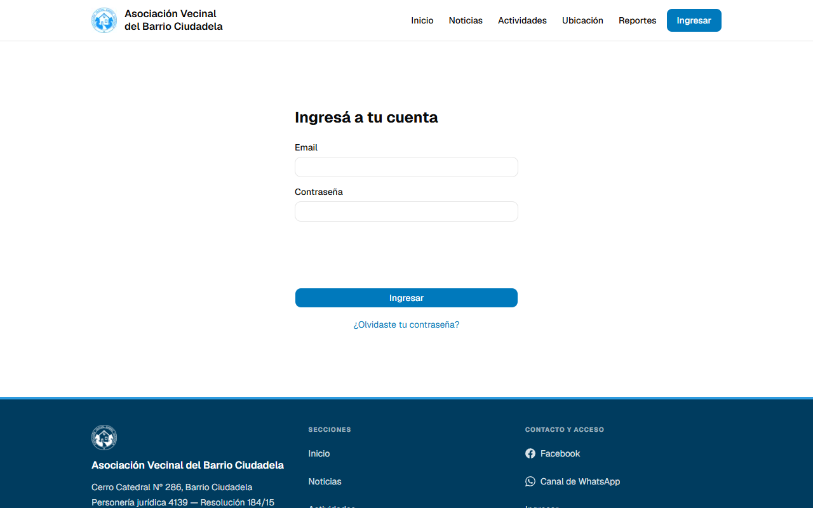

## Cómo se consigue la contraseña la primera vez

Nadie se registra solo en el panel. Un superadministrador da de alta tu cuenta y el sistema te
manda un correo con el asunto **"Tu acceso al panel de administración — Vecinal Ciudadela"**.
Ese correo trae un enlace de un solo uso: lo abrís, elegís tu contraseña y quedás adentro. Si el
enlace venció o se perdió, pedí que te lo reenvíen desde Usuarios; no hay forma de recuperarlo
por otro lado.

## Ingresar

1. Entrá a `/ingresar` (el botón **Ingresar** del sitio público).
2. Escribí tu **Email** y tu **Contraseña**.
3. Debajo de los campos aparece la casilla de verificación de Cloudflare —la que confirma que
   no sos un programa automático—. Tildala si te lo pide. En la captura de arriba ese espacio se
   ve vacío porque la imagen se sacó en un entorno de prueba.
4. Hacé clic en **Ingresar**.

Si acabás de crear tu contraseña, la pantalla te recibe con "Tu contraseña quedó creada. Ingresá
con tu email y la contraseña que elegiste."

## Recuperar la contraseña

En **¿Olvidaste tu contraseña?** pedís el enlace. Llega un correo con el asunto **"Restablecé tu
contraseña — Vecinal Ciudadela"**, elegís una nueva y volvés a la pantalla de ingreso, que te
avisa: "Tu contraseña quedó actualizada. Ingresá con la nueva."

Cambiar la contraseña **cierra todas las sesiones abiertas de esa cuenta**, también la tuya en
otra computadora. Es a propósito: si sospechás que alguien la tiene, cambiarla lo deja afuera.

## Cuánto dura la sesión

La sesión se mantiene mientras trabajes: se renueva sola en cada pantalla que abrís. Si dejás el
panel quieto **ocho horas**, vence. Y aunque lo uses todos los días, a los **siete días** vence
igual y hay que volver a ingresar. No es un error.

Si la cuenta queda deshabilitada mientras estás adentro, el panel se muestra sin menú y con el
aviso "Tu cuenta de acceso está deshabilitada. Comunicate con la vecinal."

Para salir, **Cerrar sesión** al pie de la barra lateral.

# 2. Inicio

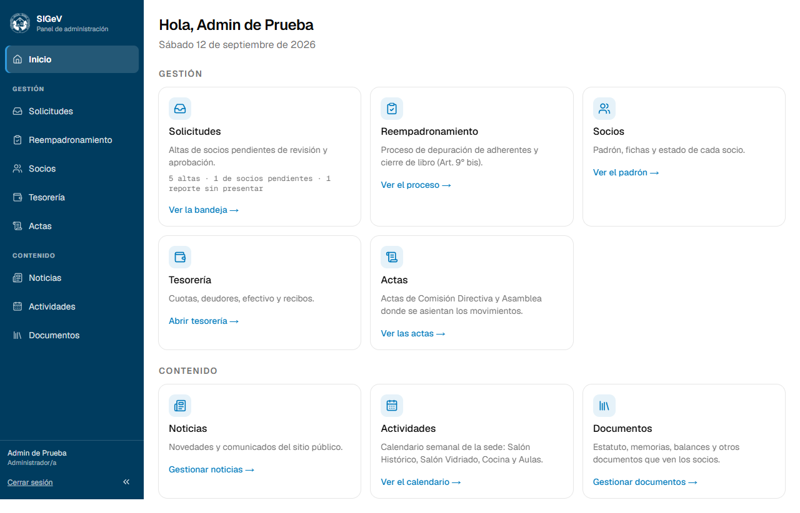

`/admin` te saluda por tu nombre, muestra la fecha de hoy y ofrece una tarjeta por sección,
agrupadas igual que la barra lateral.

La única tarjeta que lleva números es **Solicitudes**, y solo cuando hay algo pendiente. La
línea dice, por ejemplo, "5 altas · 1 de socios pendientes · 1 reporte sin presentar", y cada
número es exactamente lo que vas a encontrar en su pestaña:

- **altas**: solicitudes de asociación esperando pago, decisión de la Comisión o asiento en
  acta.
- **de socios pendientes**: pedidos que mandaron los socios desde Mi cuenta (baja o cambio de
  categoría) y todavía nadie resolvió.
- **reportes sin presentar**: reclamos e iniciativas recibidos que todavía no se presentaron
  ante un organismo ni trató la Comisión.

Las tarjetas de **Sistema** (Salud, Padrón electoral, Usuarios, Configuración) solo aparecen si
sos superadministrador.

# 3. Solicitudes → Altas

La sección Solicitudes (`/admin/solicitudes`) tiene tres pestañas con su contador: **Altas**,
**De socios** y **Reportes**. Esta es la primera.

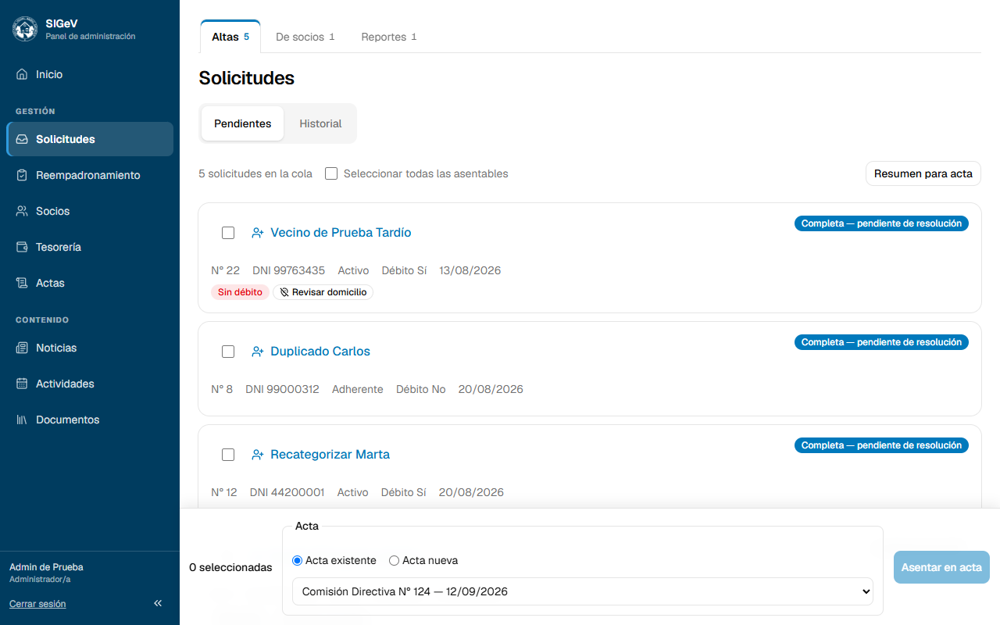

## La cola y sus estados

La vista **Pendientes** es una cola, no una tabla paginada: trae todas las solicitudes vivas y
las ordena por lo que se puede hacer con ellas. Arriba va lo que ya está listo para asentar;
abajo, lo que todavía espera algo.

| Estado en pantalla | Qué significa | Qué hacer |
|---|---|---|
| Completa — pendiente de resolución | Pagó y cumplió los requisitos | Tildarla y asentarla en acta |
| A resolver por la CD | Falta una decisión de la Comisión | Abrirla, revisarla, aprobar o rechazar |
| Esperando pago | Mandó la solicitud y todavía no pagó | Esperar; el sistema le recuerda solo |
| Vencida | Pasaron siete días sin pagar | Nada; puede volver a empezar |

Debajo del nombre, cada tarjeta muestra el N° de solicitud, el DNI, la categoría pedida, si
eligió débito automático y la fecha. Y puede traer avisos:

- **Reingreso**: esa persona ya fue socia y vuelve.
- **Sin débito**: pagó tarde y la suscripción de débito ya había quedado cancelada.
- **Verificar débito**: pagó tarde y no figura suscripción; conviene mirarlo.
- **Revisar domicilio**: el domicilio declarado no coincide con la categoría pedida.
- **Email en uso**: esa casilla ya figura en otra ficha. Es un aviso, no un bloqueo.

La vista **Historial** tiene buscador por nombre o DNI, filtro por estado y paginado de a
cincuenta.

## La ficha de una solicitud

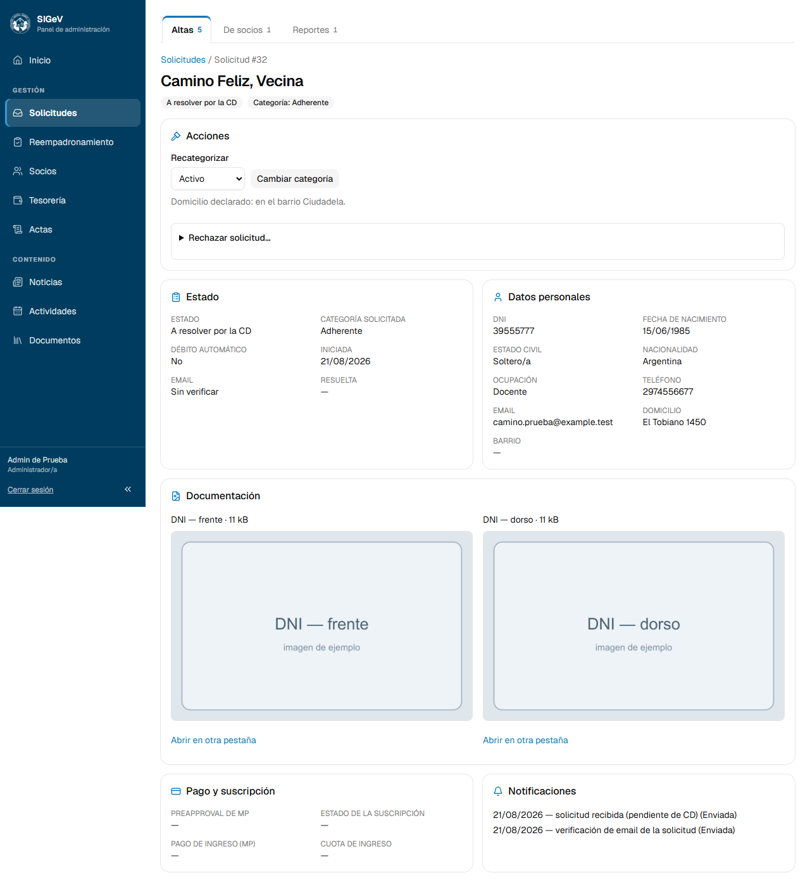

Se abre haciendo clic en el nombre, con las tarjetas **Acciones**, **Estado**, **Datos
personales**, **Documentación**, **Pago y suscripción** y **Notificaciones**.

En **Documentación** se ven las dos caras del DNI que subió. **Cada vez que abrís una de esas
imágenes queda registrado** quién la vio y cuándo: es documentación personal y la ley obliga a
llevar ese registro. No las descargues ni las reenvíes.

**Notificaciones** lista los correos que el sistema ya le mandó, con la fecha y si salieron.

## Aprobar y asentar en acta

El asiento es lo que convierte una solicitud en socio. Se hace en lote:

1. Entrá a **Solicitudes**, vista **Pendientes**.
2. Si querés, abrí las solicitudes para revisar la documentación.
3. Tildá las que vas a asentar. Solo tienen casilla las que están listas; **Seleccionar todas
   las asentables** tilda esas.
4. En la barra de abajo elegí **Acta existente** (y revisá cuál) o cargá un **Acta nueva**.
5. **Asentar en acta**.

El sistema las procesa una por una y le asigna a cada una su número del libro. Si todas entran,
volvés a la cola con el cartel verde. Si alguna falla, la pantalla te lista cuáles y por qué,
con el enlace a cada una; las que entraron quedan asentadas.

Después del asiento, y sin que tengas que hacer nada, el sistema le manda la invitación al
portal de socios a cada ficha nueva que tenga el email verificado y todavía no tenga cuenta.

## Rechazar una solicitud

1. Abrí la solicitud y desplegá **Rechazar solicitud…** dentro de **Acciones**.
2. Elegí el acta. **Es obligatoria**: un rechazo también se asienta.
3. Confirmá.

Si otra persona la resolvió mientras tanto, aparece "La solicitud ya fue resuelta por otro
admin." y no pasa nada más.

Un rechazo bloquea a esa persona para volver a pedir el alta **durante seis meses**. Si tenía
débito automático contratado, el sistema lo manda a cancelar; si Mercado Pago no responde, la
ficha se abre con este aviso, que hay que atender **fuera del panel**: "La solicitud está
rechazada pero la suscripción de Mercado Pago no figura cancelada: puede seguir debitándole la
cuota al vecino. Cancelá el preapproval {id} a mano desde el panel de Mercado Pago."

## Corregir la categoría

En **Acciones** hay un selector **Recategorizar**. Sirve para corregir la categoría antes de
asentar: todavía no hay socio, así que **no lleva acta**. Si la persona tenía débito automático
y la cuota cambia de valor, el sistema ajusta el monto en Mercado Pago primero. Si Mercado Pago
rechaza el cambio, aparece "MP no aceptó el cambio de monto de la suscripción. Reintentá o
resolvelo desde el panel de MP." y la categoría no se toca.

## El resumen para acta

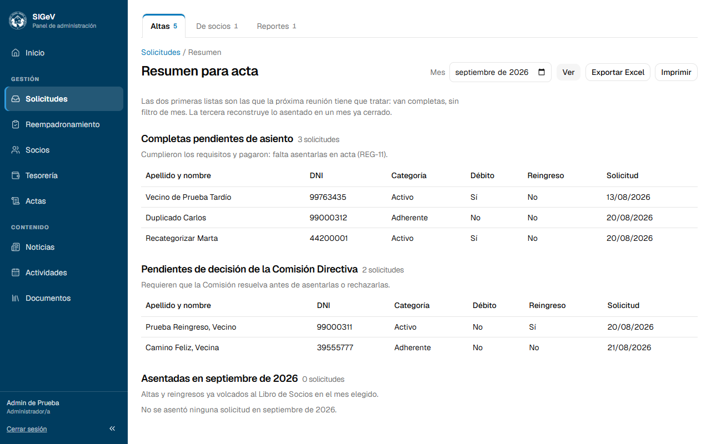

El botón **Resumen para acta** abre una hoja pensada para llevar a la reunión
(`/admin/solicitudes/resumen`). Tiene tres listas:

- **Completas pendientes de asiento**: cumplieron y pagaron; falta asentarlas.
- **Pendientes de decisión de la Comisión Directiva**: hay que resolverlas antes de asentar o
  rechazar.
- **Asentadas en el mes elegido**: lo ya volcado al libro, para reconstruir un mes cerrado.

Las dos primeras van completas, sin filtro de mes. El selector **Mes** solo cambia la tercera.
Se puede **Exportar Excel** o **Imprimir**.

## Una solicitud vencida que revive

Si alguien paga después de que su solicitud venció, el pago entra igual y la solicitud vuelve a
la cola. **No lleva ningún cartel que diga que revivió**: se ve y se resuelve como cualquier
otra. Lo único que puede cambiar es el débito, y eso sí se avisa en la tarjeta: **Sin débito** si
la suscripción ya había quedado cancelada, o **Verificar débito** si no figura ninguna. Si el
débito quedó autorizado, la cola no muestra nada y el detalle está en la ficha.

## Qué correos recibe el vecino

| Cuándo | Asunto del correo |
|---|---|
| Manda la solicitud y paga | Recibimos tu solicitud y tu pago |
| Manda la solicitud sin pagar | Recibimos tu solicitud |
| A los tres días sin pagar | Tu solicitud está esperando el pago |
| Se le corta el trámite a medias | Retomá tu solicitud |
| La Comisión la rechaza | Sobre tu solicitud de asociación |
| Queda asentada y tiene email verificado | Creá tu contraseña |

Todos llevan el agregado "— Vecinal Ciudadela" al final del asunto. **Al asentar el alta no se
manda ningún correo de "bienvenida" ni de "aceptación"**: el aviso de que hay ficha es la
invitación a crear la contraseña.

# 4. Solicitudes → De socios

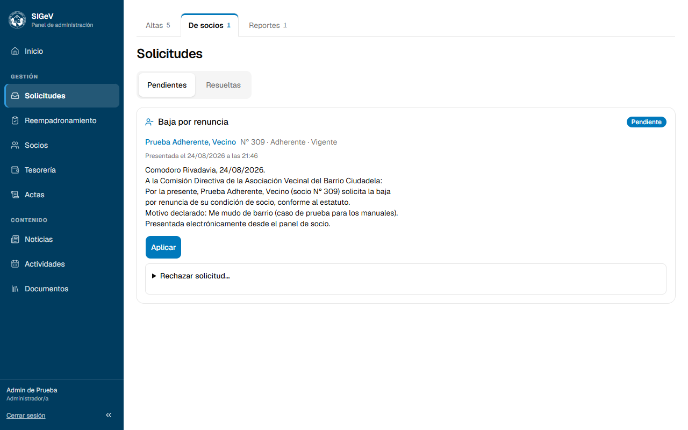

Acá caen los pedidos que los socios presentan desde Mi cuenta: **baja por renuncia** y **cambio
de categoría**. Cada tarjeta trae el tipo, el nombre y el número del socio, la fecha y el escrito
completo tal como lo redactó. Hay dos vistas: **Pendientes** y **Resueltas**.

## Aplicar

**Aplicar** te lleva a la pantalla de la acción societaria correspondiente, con los datos
precargados y un aviso que dice qué solicitud estás aplicando. Ahí elegís el acta y confirmás.

En una baja por renuncia, el motivo viene fijado. Si lo cambiás por otro, el sistema lo rechaza:
"La solicitud es de baja por renuncia: para asentar otro motivo, rechazá la solicitud y hacé la
baja aparte." El motivo de la baja es lo que después se lee en el libro, y no puede decir una
cosa distinta de la que el socio pidió.

Al aplicar una baja, el sistema cancela además el débito automático del socio. Si Mercado Pago
no acepta cancelarlo, la ficha se abre con un aviso rojo y el enlace a Tesorería →
Suscripciones para terminarlo a mano.

## Rechazar

**Rechazar solicitud…** pide una nota (hasta 500 caracteres) y cierra el pedido. Al socio le
llega un correo con el asunto "Tu solicitud de … fue rechazada — Vecinal Ciudadela". La nota que
escribas no queda en el registro de auditoría; sí viaja en el correo.

# 5. Solicitudes → Reportes

Los reportes son de dos tipos y se tratan distinto:

- un **reclamo** es un problema de la vía pública, y la asociación lo **presenta ante un
  organismo** (la Municipalidad, la cooperativa de servicios);
- una **iniciativa** es una propuesta, y la **trata la Comisión Directiva**.

Todo lo que escribas o elijas en esta sección tiene que respetar esa diferencia.

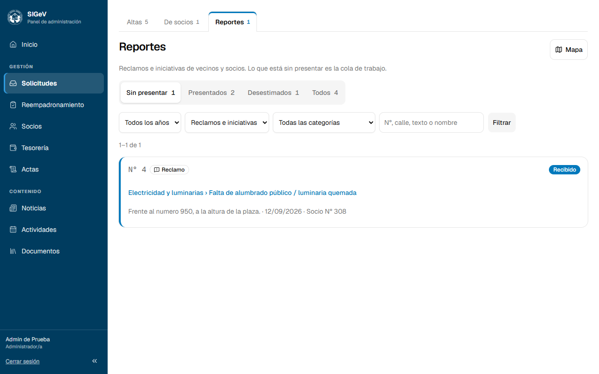

## La bandeja

Cuatro vistas con su contador: **Sin presentar**, **Presentados**, **Desestimados** y **Todos**.
La cola de trabajo es la primera. Los filtros son por año, por tipo y por categoría, más un
buscador que mira el número, la calle, el texto y el nombre de quien reporta.

Los borradores sin enviar **no aparecen**: no son trabajo de nadie.

El botón **Mapa** abre los mismos reportes como puntos sobre el plano del barrio, con los
filtros que tengas puestos.

## La ficha

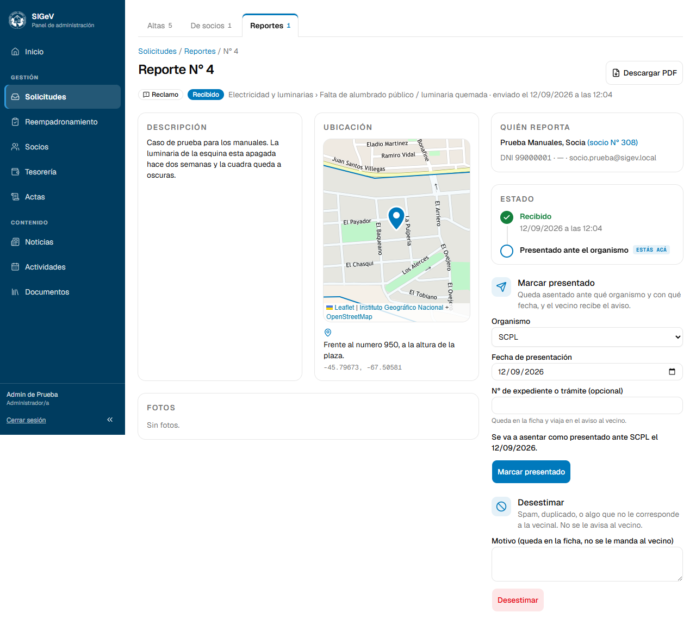

Tres columnas: la descripción tal como la escribió el vecino, la ubicación en el mapa con la
referencia en texto y las coordenadas, y a la derecha quién reporta, el estado y los dos actos
posibles. Si el reporte trae fotos, aparecen debajo de la descripción; el de la captura no
tiene.

**Descargar PDF** genera el documento para presentar, con membrete, el N°, la categoría, la
descripción, la ubicación con un mini-mapa y el estado. Si quien reportó pidió reserva de
identidad, **el PDF sale sin sus datos**; en el panel, en cambio, la identidad siempre se ve, y
la ficha lo aclara.

## Presentar ante un organismo

1. Elegí el **Organismo**. Viene sugerido según la categoría.
2. Poné la **Fecha de presentación**. No puede ser futura.
3. Si tenés, cargá el **N° de expediente o trámite**. Es opcional y viaja en el aviso al vecino.
4. Leé la frase que arma el sistema —"Se va a asentar como presentado ante SCPL el
   12/09/2026"— y recién ahí **Marcar presentado**.

En una iniciativa cambian cuatro cosas: el botón dice **Marcar tratada**, la fecha se llama
**Fecha de tratamiento**, el campo pasa a ser **Organismo (opcional)** y viene elegida la opción
**Comisión Directiva (sin organismo)**, y aparece **Asentar con acta**, apagada por defecto. Una
iniciativa la trata la Comisión; el organismo queda disponible por si además se deriva.

Al confirmar, el reporte deja la cola y al vecino le llega el aviso.

## Desestimar

Es para spam, duplicados o cosas que no le corresponden a la vecinal. Pide un motivo de entre 5
y 300 caracteres, que **queda en la ficha y no se le manda al vecino**. Al desestimar **no se
manda ningún correo**.

# 6. Reempadronamiento

Es el proceso del Art. 9° bis: se cita a todos los adherentes vigentes a confirmar sus datos, y
quien no se presenta queda fuera del libro nuevo. Convocarlo y cerrarlo es tarea del
superadministrador (capítulo 13); validar presentaciones y atender la cartelera es trabajo de
cualquier administrador.

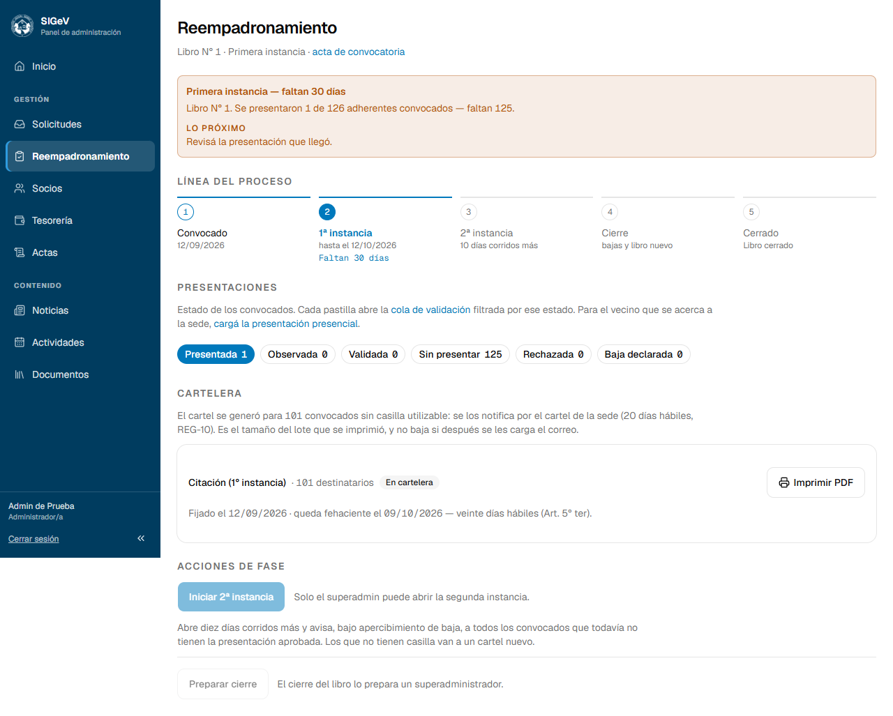

## El tablero

Arriba, el libro, la instancia en curso y el enlace al acta de convocatoria. El recuadro del
veredicto dice cuánto falta, cuántos se presentaron sobre el total de convocados y, bajo **LO
PRÓXIMO**, qué conviene hacer ahora.

La **línea del proceso** tiene cinco etapas: Convocado, 1ª instancia (treinta días corridos), 2ª
instancia (diez días corridos más), Cierre y Cerrado.

Las pastillas de **PRESENTACIONES** son enlaces: cada una abre la cola filtrada por ese estado.

La cohorte se **congela al convocar**. Quien pase a ser adherente después no fue convocado y no
le corre ningún plazo.

## Validar una presentación

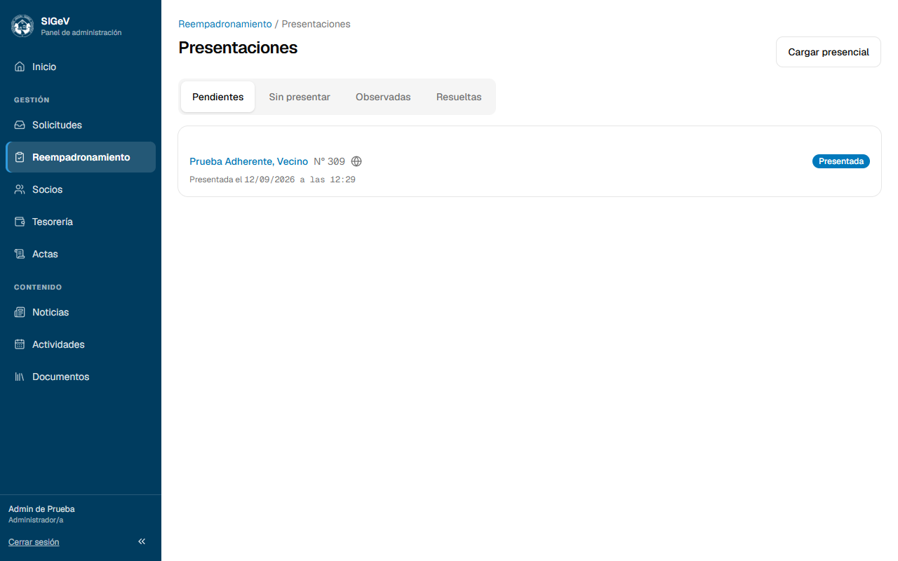

1. Entrá desde **cola de validación** o desde una pastilla del tablero.
2. Abrí una presentación. La ficha muestra lado a lado **Datos declarados** y **Ficha actual**,
   más los documentos que subió.
3. Decidí:
   - **Validar y aplicar a la ficha**: copia a la ficha del socio lo que declaró.
   - **Observar y avisarle**, dentro de **Observar (pedir una corrección)…**: le pedís que
     corrija algo. La nota es obligatoria y le llega por correo.
   - **Rechazar**, dentro de **Rechazar la presentación…**: la nota es opcional. Le llega un
     correo y se puede deshacer.

Lo que se copia son los datos de contacto y domicilio. **El nombre, el DNI, la categoría, el
estado y la fecha de ingreso nunca se escriben desde el formulario público**: eso lo cambia un
administrador desde la ficha, con acta si corresponde. Un DNI tipeado en una página pública no
prueba quién es nadie.

Si el correo declarado es distinto del que tenía, el sistema le manda la verificación de la
casilla nueva y, si ya tenía cuenta, además el aviso a la anterior.

## Carga presencial

Para el vecino que se acerca a la sede, **Cargar presencial** abre el mismo formulario para que
lo llenes vos: datos, fecha de nacimiento, calle del catálogo y los documentos escaneados (hasta
10 MB por archivo). Al registrarla, al vecino le llega el acuse de presentación recibida.

## La cartelera

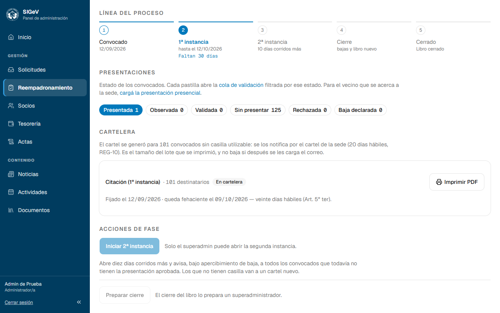

La cartelera vive dentro del tablero del proceso, en la sección **CARTELERA**; no es una
pantalla aparte, y por eso la imagen de arriba es el mismo tablero del principio del capítulo,
corrido hasta esa altura.

A quien no tiene casilla de correo utilizable no se lo puede notificar por email, así que se lo
notifica **por el cartel de la sede**. El sistema arma solo la lista al convocar: en la captura,
101 convocados sin casilla.

La unidad de trabajo es el **cartel entero**, no cada vecino:

1. **Imprimir PDF** saca el cartel con la nómina.
2. Se fija en la cartelera de la sede.
3. En el panel asentás la **fecha de fijación**. El sistema pide una confirmación extra antes de
   escribirla.
4. A partir de ahí calcula solo la fecha en que el aviso **queda fehaciente**: **veinte días
   hábiles** después, feriados incluidos. En la captura, fijado el 12/09/2026, fehaciente el
   09/10/2026.

Dos cosas importantes. La fecha que acredita la notificación es la de **vencimiento** del plazo,
no la de fijación: los veinte días hábiles son del vecino para defenderse. Y la fijación **se
asienta una sola vez y no se corrige**: revisá la fecha antes de confirmar.

El tamaño del lote es el que se imprimió. Si después le cargás el correo a alguno de esos
vecinos, el número del cartel no baja.

# 7. Socios

## El padrón

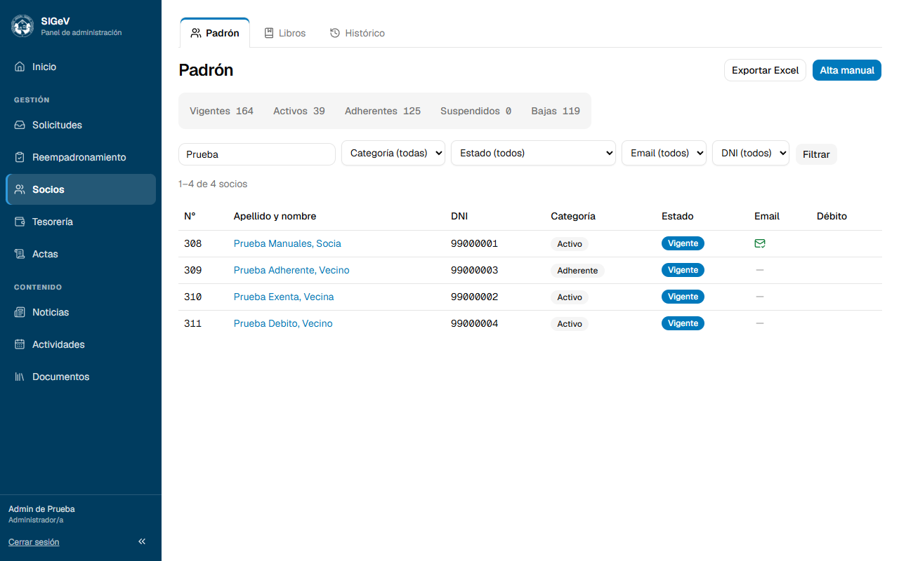

`/admin/socios` es la lista de socios del libro abierto. Arriba, cinco contadores que además son
filtros: **Vigentes**, **Activos**, **Adherentes**, **Suspendidos** y **Bajas**. Cada uno filtra
exactamente lo que cuenta.

El buscador acepta nombre, DNI o número de socio. Los selectores filtran por categoría, estado,
si tiene o no email (y si está verificado) y si tiene o no DNI cargado.

El ícono de la columna Email tiene cuatro estados: verificado (con tilde), declarado (cargado y
sin verificar), rebotado, y un guion cuando no hay casilla. **Exportar Excel** baja lo que estás
viendo con los filtros puestos, no solo la página.

## La ficha del socio

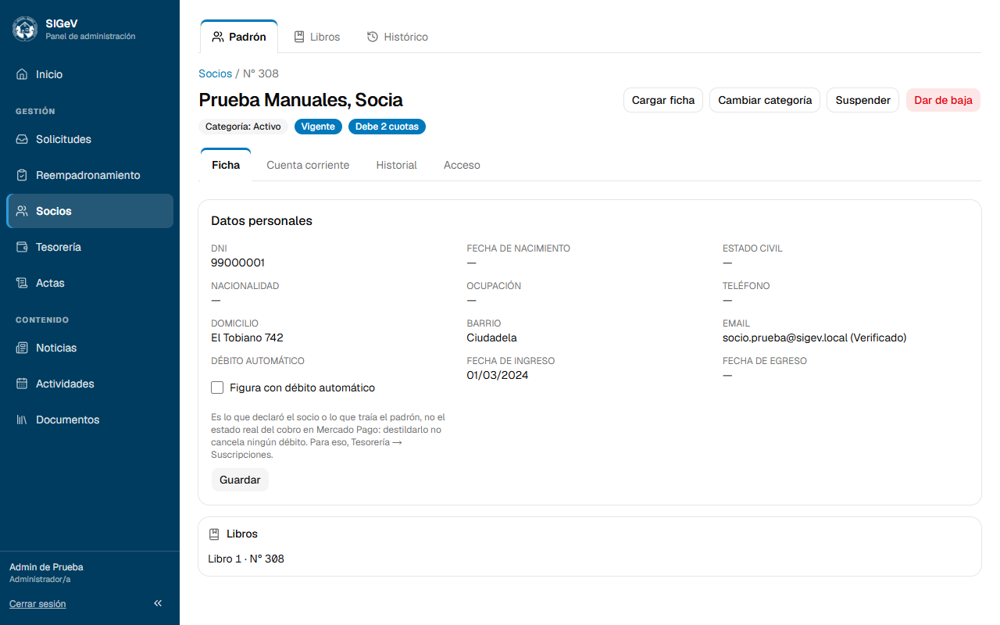

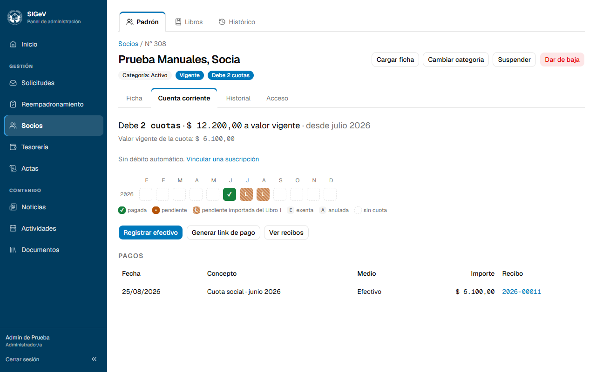

Se abre con clic en el nombre. En el encabezado, el nombre, la categoría, el estado, y si debe,
un badge **Debe N cuotas**. A la derecha, los botones de las acciones societarias.

Cuatro pestañas:

- **Ficha**: datos personales, el domicilio, el email con su estado y los libros en los que
  figura.
- **Cuenta corriente**: la deuda, el calendario del año y los pagos.
- **Historial**: cada movimiento con su acta, y los correos que se le mandaron.
- **Acceso**: si creó su cuenta del portal y el botón para mandarle el enlace.

En la pestaña Ficha está la casilla **Figura con débito automático**. Ojo con lo que significa:
es lo que declaró el socio o lo que traía el padrón, **no** el estado real del cobro en Mercado
Pago. Destildarla no cancela ningún débito. Para eso, Tesorería → Suscripciones.

En la **Cuenta corriente**, la primera línea dice cuánto debe, en cuántas cuotas y desde qué
mes, valuado **a valor vigente**: la deuda vieja se cobra al precio de hoy, no al del año en que
se generó. El calendario pinta un cuadrito por mes, con su referencia debajo: pagada, pendiente,
pendiente importada del Libro 1, exenta, anulada y sin cuota. Tres botones —**Registrar
efectivo**, **Generar link de pago** y **Ver recibos**— y, abajo, la tabla de pagos con su
recibo enlazado.

## Las acciones societarias

Todas se hacen desde los botones del encabezado, **todas piden acta** y todas dejan un
movimiento en el Historial.

| Acción | Qué pide | Regla |
|---|---|---|
| Dar de baja | Motivo y acta | Cancela además el débito automático |
| Cambiar categoría | Categoría nueva y acta | Bloqueada si hay elecciones en curso o si el socio debe cuotas |
| Suspender | Desde, hasta y acta | Hasta 180 días (Art. 10 inc. b) |
| Levantar suspensión | Acta | Solo si está suspendido |
| Reingreso | Categoría y acta | Se puede aunque tenga deuda |

Dos bloqueos del cambio de categoría: "Hay elecciones en curso: los cambios de categoría están
bloqueados (Art. 5° ter)." y las cuotas pendientes. El tope de la suspensión avisa con "La
suspensión no puede exceder 180 días (Art. 10 inc. b).".

Un socio con deuda **sí** puede reingresar: la deuda anterior no se borra ni impide el
reingreso, y queda registrada.

## Alta manual

**Alta manual** (`/admin/socios/nuevo`) carga una ficha sin pasar por el formulario público:
nombre y apellido, categoría, DNI y email si los tenés, más el acta. El sistema le asigna el
número que sigue en el libro abierto. Si el DNI ya está en otra ficha, aparece "Ya existe un
socio con ese DNI."

## Modo carga

**Cargar ficha** abre una pantalla pensada para completar fichas viejas de a una: todos los
datos del socio editables, sin salir a buscar. Si no cambiás nada, no escribe nada.

Cuidado con un caso: si cambiás el email de un socio que ya tiene cuenta en el portal, **esa
dirección es con la que ingresa**. El sistema le avisa a la casilla anterior y le manda a
verificar la nueva.

## Invitar al portal

Desde la pestaña **Acceso** (o desde el modo carga) hay un botón para mandarle al socio el
enlace para crear su contraseña. Llega como "Creá tu contraseña — Vecinal Ciudadela".

Hay un tope de envíos por socio y por operador en la misma hora. Si te pasás, vas a leer "Ya se
le enviaron varios correos de acceso a este socio en la última hora…". Si el correo no sale, el
sistema te lo dice: "No se pudo enviar el email. Verificá la dirección y reintentá…".

## Generar y mandar un link de pago

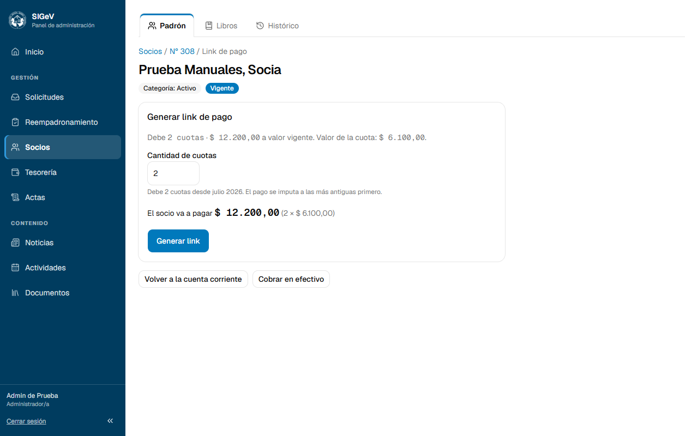

1. Desde la cuenta corriente, **Generar link de pago**.
2. Indicá la **Cantidad de cuotas**. La pantalla te dice cuántas debe y te muestra el total que
   va a pagar el socio.
3. **Generar link**.
4. Copiá la dirección, o usá el botón para mandársela por correo.

Tres cosas que conviene saber. El link **vence a las 72 horas**: pasado ese plazo hay que
generar uno nuevo, porque si no congelaría el precio del día en que se emitió. La cantidad es
**cuántas cuotas paga**, no cuáles: cuando el pago llega, se imputa siempre a las más viejas. Y
si el socio está eximido de la cuota, no se genera nada y la pantalla lo explica.

Si el correo no sale, el link sigue sirviendo: "No se pudo enviar el email. El link sigue siendo
válido: copialo y mandalo por otro medio."

## Libros e Histórico

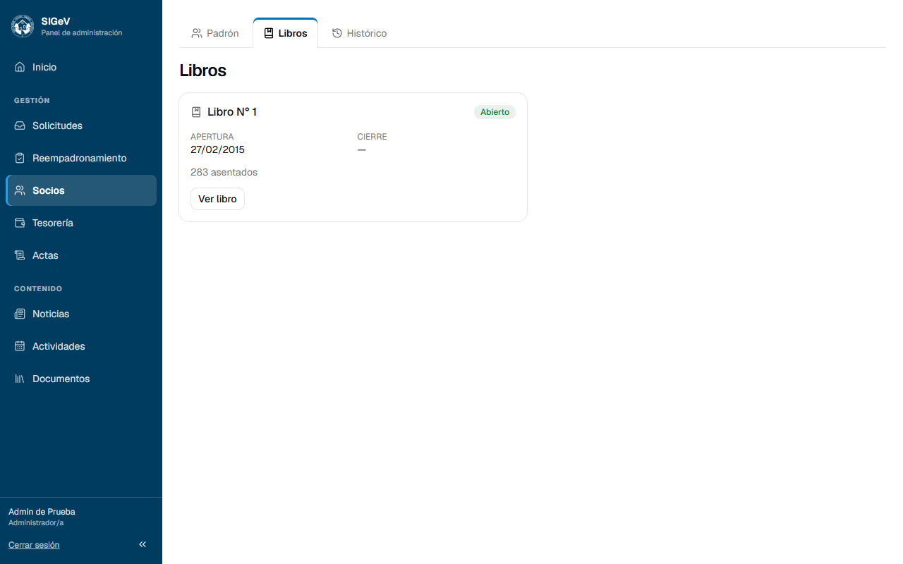

**Libros** lista los libros de socios con su fecha de apertura, la de cierre si está cerrado y
cuántos asientos tiene. **Ver libro** muestra su contenido y ofrece exportarlo a Excel. En un
libro cerrado, lo que se ve es la **foto congelada al cierre**: el estado y la categoría que cada
socio tenía ese día, no los de hoy.

**Histórico** es la lista de socios que quedaron en libros cerrados, con sus propios filtros.

# 8. Tesorería

Tesorería (`/admin/tesoreria`) tiene ocho pestañas. Las dos últimas —Valores de cuota y
Exenciones— se ven acá pero se operan desde el capítulo 13.

## Deudores

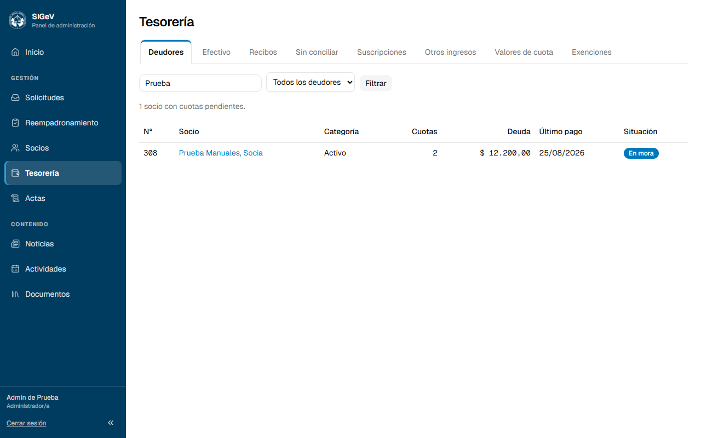

Lista de socios con cuotas pendientes, con lo que debe cada uno a valor vigente y la fecha de su
último pago. El filtro tiene tres opciones: todos, **En mora
(2 o más)** y **4 cuotas o más**.

El enlace **Lista para gestión manual** aparece solo si hay deudores sin casilla de correo, y
saca una hoja imprimible para ir a buscarlos. Abrirla queda registrada: es una lista con datos
personales que se puede fotografiar.

### Cesantía por mora en lote

El estatuto (Art. 9 inc. c) permite declarar cesante a quien debe cuatro cuotas o más. Solo
alcanza a socios activos y colaboradores: un adherente no devenga cuota y nunca puede quedar
cesante por mora, aunque el filtro lo muestre.

1. Filtrá por **4 cuotas o más** y tildá a quienes corresponda.
2. Elegí el acta y apretá **Declarar cesantía (N)**, que lleva en el botón cuántos tildaste.
3. **Paso 1**: el sistema te devuelve la lista resuelta contra la base —nombre, número y cuotas
   de cada uno— y el acta elegida. Todavía no escribió nada y el acta nueva todavía no existe.
4. Leé la lista y confirmá. Recién ahí se crea el acta y se declaran las bajas, una por una.

El lote acepta hasta **25 socios por vez**. Si tildás más, la pantalla te frena antes de enviar
con "Tenés N socios tildados y el lote acepta hasta 25 por vez. Destildá los que sobren…".

Al terminar puede haber dos clases de problema: quienes **no** quedaron cesantes (con el motivo)
y quienes sí quedaron cesantes **pero** el débito sigue vivo en Mercado Pago. En los dos casos la
pantalla se queda mostrándote el detalle en vez de redirigir.

## Efectivo

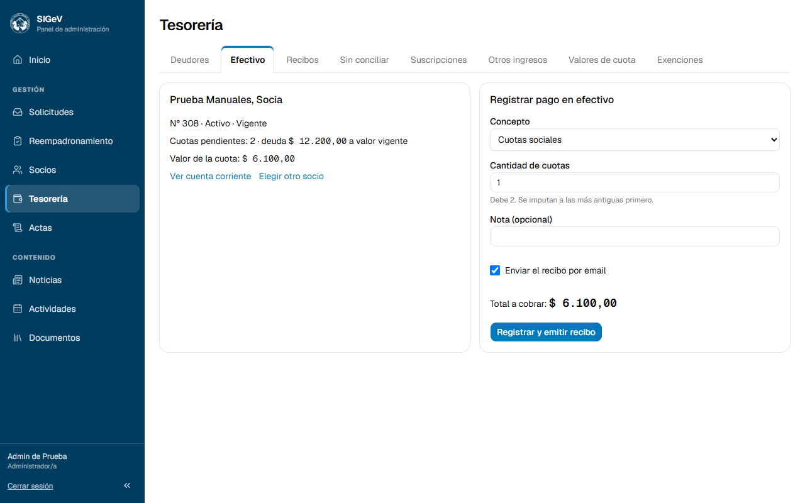

Es el mostrador. Se busca al socio por número, apellido o DNI, y la ficha de la izquierda
confirma a quién le estás cobrando.

1. Elegí el **Concepto**: Cuotas sociales, Aporte voluntario o Aporte extraordinario.
2. Si es cuotas, poné la **Cantidad de cuotas**; la ayuda te dice cuántas debe. Si es un aporte,
   poné el **Monto**.
3. **Nota** si querés dejar constancia de algo.
4. Dejá tildado **Enviar el recibo por email** si el socio tiene casilla.
5. Revisá el **Total a cobrar** y apretá **Registrar y emitir recibo**.

El sistema imputa siempre las cuotas **más viejas primero**, numera el recibo y te lleva a
verlo. El total sale de multiplicar la cantidad por el valor vigente de la cuota: no hay forma de
cobrar una cuota vieja a precio viejo.

Si el socio está eximido de la cuota, la pantalla no ofrece formulario y explica hasta cuándo
está eximido y con qué acta.

**Un aviso que confunde.** Si después de cobrar aparece en ámbar "Recibo emitido, pero el email
no salió. Podés reenviarlo desde acá.", **el cobro está hecho y el recibo existe**. Lo único que
no pasó es el envío. En el sitio de prueba ese aviso sale siempre, porque ahí los correos están
restringidos a una lista corta de casillas; en producción, si aparece, reenvialo desde el recibo
o imprimilo.

Los otros carteles posibles son "Recibo emitido y enviado por email." y "Recibo emitido. El
socio no tiene email: imprimilo."

## Recibos

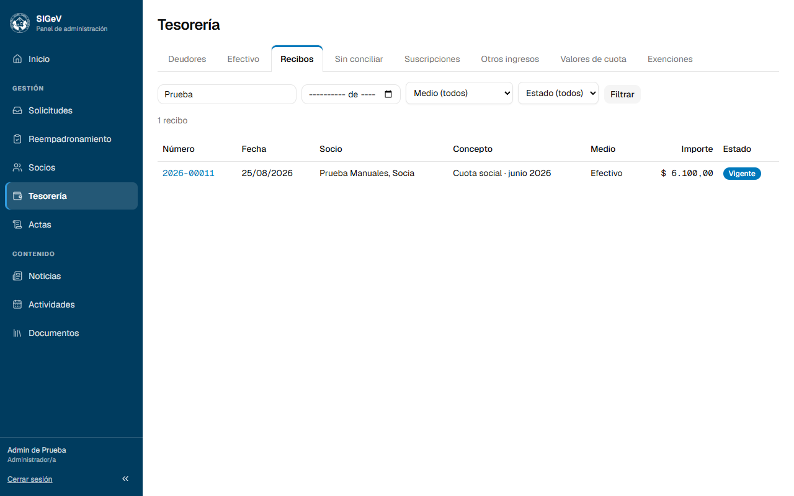

Filtros por número o socio, por mes, por medio de pago y por estado. La ficha de un recibo muestra el número grande, el importe en letras y quién lo registró, y
ofrece:

- **Imprimir / ver PDF**: cada vez que lo abrís queda registrado.
- **Enviar por email**, o **Reenviar por email** si ya salió una vez: el intento queda anotado
  salga o no.
- **Anular este recibo…**, que despliega el motivo y el botón **Anular recibo**. El motivo es
  obligatorio: sin él, "Indicá el motivo de la anulación."

Anular un recibo devuelve las cuotas a pendientes y el socio vuelve a figurar como deudor. El
recibo no se borra: queda con el estado Anulado y el motivo, porque el número no se reutiliza y
la numeración no puede tener huecos.

## Sin conciliar

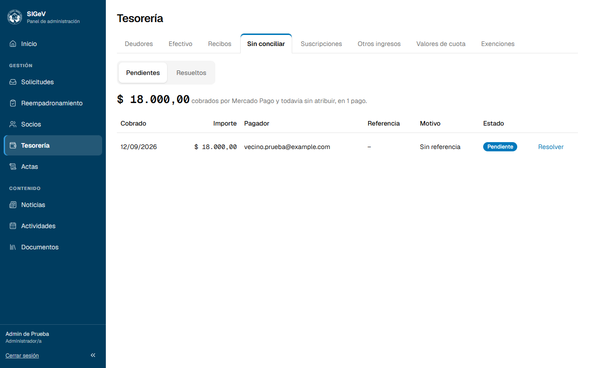

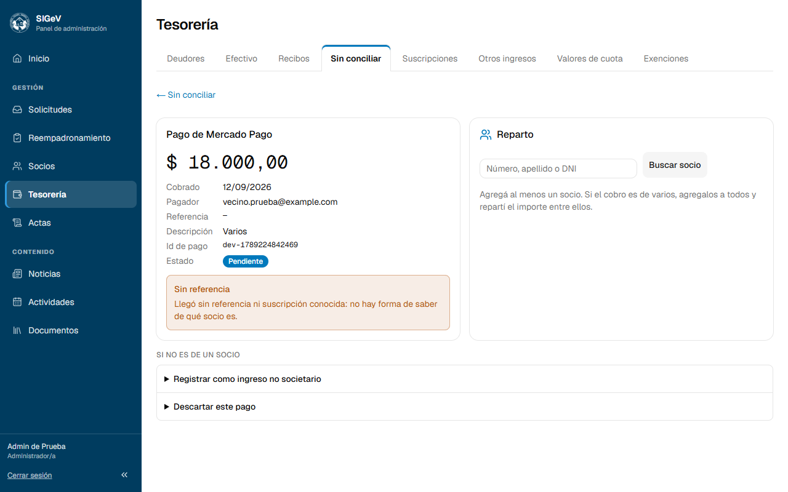

Acá caen los cobros que entraron por Mercado Pago y el sistema **no supo de qué socio son**. La
columna Motivo dice por qué.

| Motivo | Qué pasó |
|---|---|
| Sin referencia | Llegó una transferencia o un pago suelto, sin dato del socio |
| Suscripción sin vincular | Un débito de una suscripción que nadie ató a una ficha |
| Solicitud inexistente | El pago dice ser de una solicitud que no existe |
| Segundo cobro de ingreso | Ya se le había cobrado el ingreso |
| Cesante sin deuda | Le cobraron a alguien dado de baja que no debe nada |
| Rechazado por tesorería | Alguien lo descartó antes |

Cada fila tiene el enlace **Resolver**, que abre la ficha con los datos del cobro, el motivo
explicado y tres salidas.

**Aplicarlo a socios.** Buscá al socio en **Reparto** y agregalo. Si el cobro es de varios,
agregalos a todos y repartí el importe entre ellos, hasta cinco por fila. Para cada parte elegís
el concepto y, si es cuotas, la cantidad y el monto.

La suma de las partes tiene que dar **exactamente** el importe sin asignar. Al confirmar, el
sistema muestra primero la vista previa —qué meses le imputa a cada uno— y recién después
escribe. Sale **un recibo por socio**, cada uno con su número.

Si una fila queda repartida a medias pasa a **Parcial** y sigue en la bandeja con el saldo.
Cuando la suma aplicada alcanza el total, queda **Aplicado**.

**Registrar como ingreso no societario.** Si la plata no es de un socio —un alquiler del salón,
una rifa—, esta salida la manda a Otros ingresos. No emite recibo.

**Descartar este pago.** Para lo que no corresponde imputar. Si otra persona ya resolvió la
fila, aparece "Esta fila ya fue resuelta."

Un cobro de cuotas aplicado desde acá figura con el medio **Mercado Pago**, también cuando fue
una transferencia; un aporte voluntario o extraordinario lleva su propio rótulo.

## Suscripciones

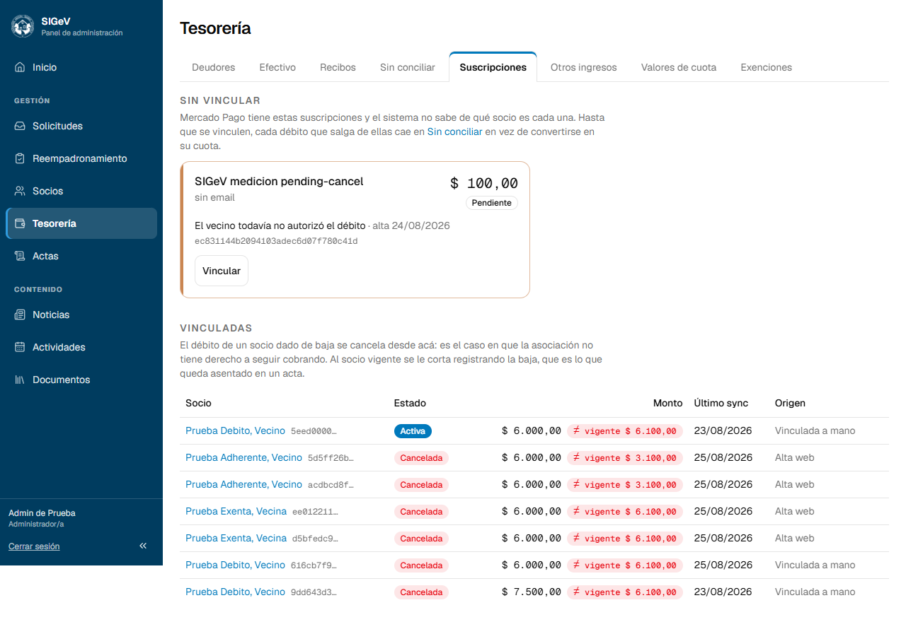

Dos bloques.

**Sin vincular** son suscripciones que Mercado Pago tiene y el sistema no sabe de qué socio son.
Mientras estén así, cada débito que salga de ellas cae en Sin conciliar en vez de convertirse en
la cuota del socio. El botón **Vincular** las ata a una ficha; es una acción de
superadministrador y se confirma con un botón, sin tipear nada.

**Vinculadas** es la tabla de las que ya tienen socio. La marca roja "≠ vigente $ …" avisa que esa suscripción cobra un monto distinto del
valor de cuota de hoy; se corrige desde Valores de cuota y no es una pantalla rota.

El botón **Cancelar el débito** corta un débito vivo, y aparece solo si la suscripción está viva
y el socio dado de baja. Si el socio está vigente, la pantalla lo rechaza con "Ese socio sigue
vigente: el débito se cancela al registrar la baja, que es lo que queda asentado en el acta."

## Otros ingresos

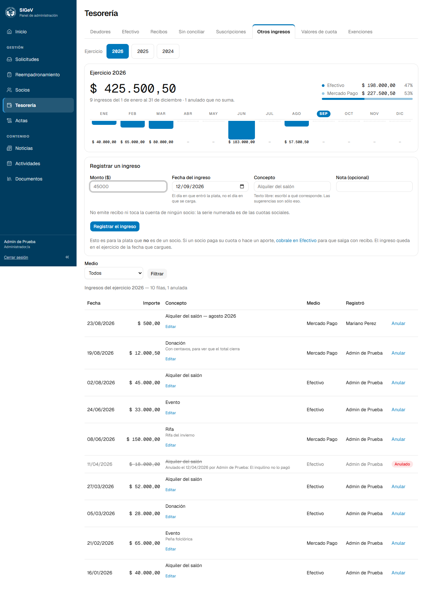

Es para la plata que **no** es de un socio: alquiler del salón, rifas, donaciones, eventos. Se
elige el ejercicio arriba y se ve el total del año, el reparto entre efectivo y Mercado Pago, y
una barra por mes.

El formulario pide monto, fecha del ingreso —el día en que entró la plata, no el día en que la
cargás—, concepto en texto libre y nota opcional.

**No emite recibo y no toca la cuenta de ningún socio**: la serie numerada de recibos es de las
cuotas sociales. Si un socio paga su cuota o hace un aporte, cobralo en Efectivo.

Cada fila se puede **Editar** o **Anular**. Un ingreso anulado se ve tachado, con quién lo anuló
y por qué, y no suma al total; y ya no se puede corregir: "Ese ingreso está anulado: un asiento
anulado no se corrige."

## Exenciones

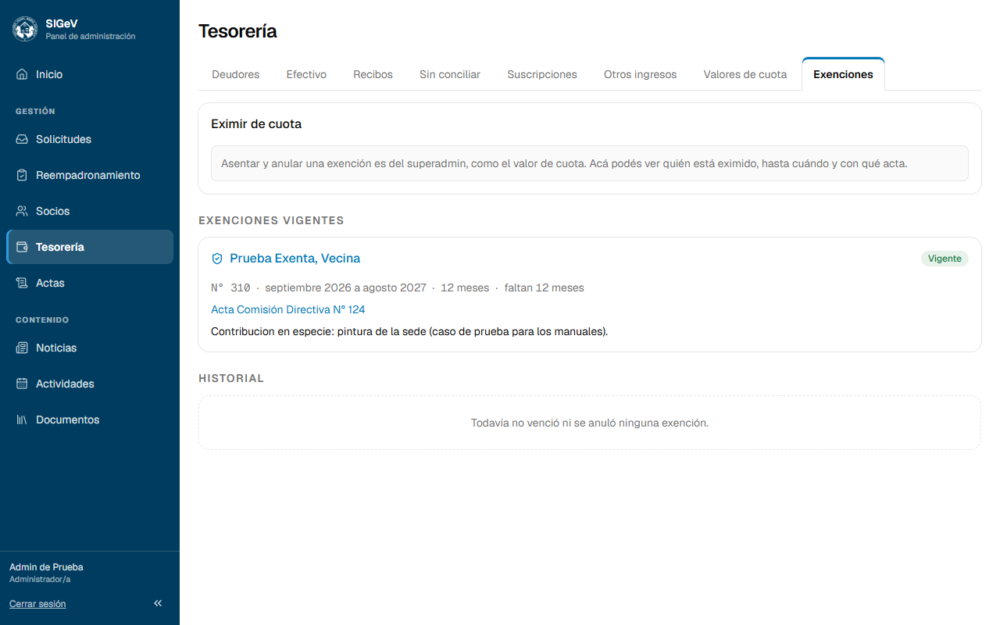

El Art. 7 inc. a.4 permite eximir de la cuota a un socio activo que hace un aporte en especie.
**Asentar y anular una exención es del superadministrador** (capítulo 13); un administrador ve
esta pestaña para saber quién está eximido, hasta cuándo y con qué acta.

**Exenciones vigentes** muestra una tarjeta por socio con el rango de meses, cuántos faltan, el
acta enlazada y la nota. **Historial** guarda las vencidas y las anuladas.

Mientras una exención está vigente, los cinco caminos de cobro quedan cerrados para ese socio
—efectivo, link de pago, reenvío del link, pago desde Mi cuenta y adhesión al débito— y todos
muestran el mismo texto: "El socio está eximido de la cuota hasta {mes} (acta …)."

# 9. Actas

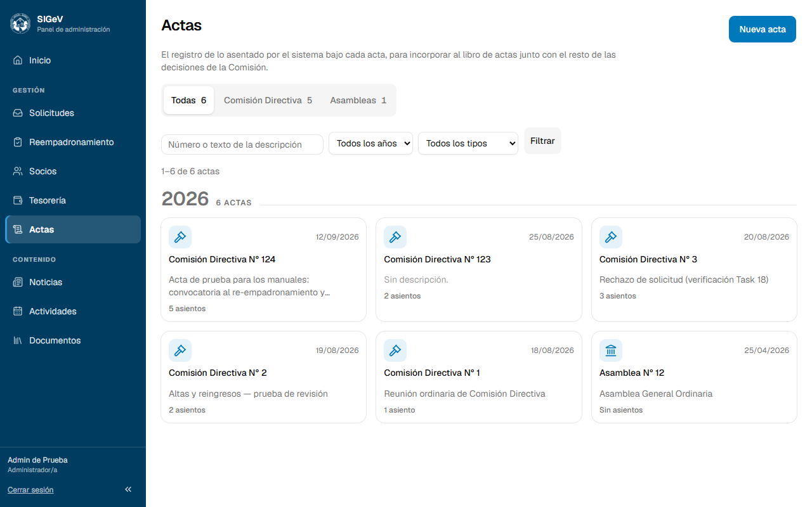

Las actas son la columna vertebral del panel: cada acto societario se asienta bajo una. Esta
sección es el registro de lo que el sistema asentó bajo cada acta, para incorporarlo al libro
junto con el resto de las decisiones de la Comisión.

La lista agrupa por año y filtra por tipo (**Comisión Directiva** o **Asamblea**), año y texto.

## Cargar un acta

1. **Nueva acta**.
2. Elegí el **Tipo** (Comisión Directiva o Asamblea), poné el **Número**, la **Fecha** y una
   **Descripción** breve.
3. **Crear acta**.

Cada tipo lleva su propia numeración. Si repetís un número dentro del mismo tipo, aparece "Ya
existe el acta N° {n} de ese tipo."

## La ficha del acta

Bajo el título **Lo que respalda esta acta** muestra todo lo que se asentó, en seis grupos:
movimientos de socios, valores de cuota, solicitudes rechazadas, libros, reportes y
re-empadronamiento. Los botones son **PDF** y **Word**, para pegarla en el libro, más **Editar**.

## Elegir el acta correcta, siempre

Todos los formularios del panel que piden acta usan el mismo control, con dos modos: **Acta
existente** y **Acta nueva**. Abre en "Acta existente" **con la más reciente elegida**, salvo dos
que abren en "Acta nueva" porque casi siempre corresponde una propia: el cierre del libro y la
anulación de una exención.

Eso ya causó un error real: un cierre de libro quedó asentado bajo el acta de las bajas que se
habían declarado minutos antes. **Mirá qué acta dice el selector antes de cada confirmación.** Un
acta se identifica por tipo y número —"Comisión Directiva N° 124"—; si en alguna pantalla ves un
número que no se parece a eso, no es el número del acta.

# 10. Noticias y Actividades

## Noticias

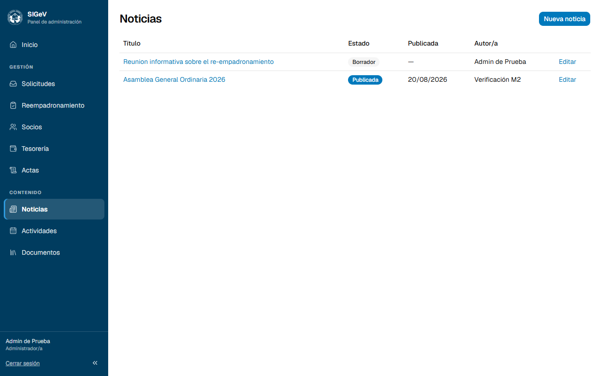

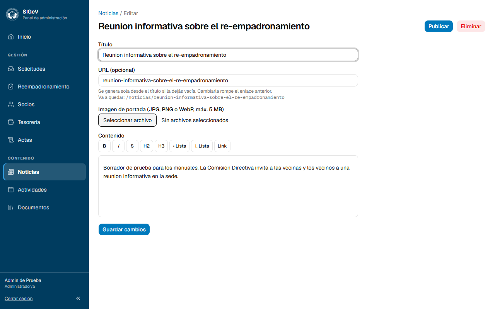

La tabla trae Título, Estado (Borrador o Publicada), fecha de publicación y autor. Nada se ve en
el sitio público hasta que lo publiques.

1. **Nueva noticia**.
2. **Título** (hasta 160 caracteres).
3. **URL (opcional)**: se genera sola desde el título. La pantalla te muestra cómo va a quedar.
   **Cambiarla rompe el enlace anterior**: si ya la compartiste, dejala como está.
4. **Imagen de portada**: JPG, PNG o WebP, hasta 5 MB. Es lo que se ve en la tarjeta del sitio.
5. **Contenido**, con la barra de formato (negrita, cursiva, subrayado, títulos, listas y
   enlace).
6. **Guardar cambios**: queda en borrador.
7. **Publicar** cuando esté lista.

Desde la misma pantalla, **Volver a borrador** la saca del sitio sin borrarla y **Eliminar** la
borra. **Guardar cambios** conserva el estado que tenga. Si repetís una acción, el sistema lo
dice: "La noticia ya está publicada." / "La noticia no está publicada."

## Actividades

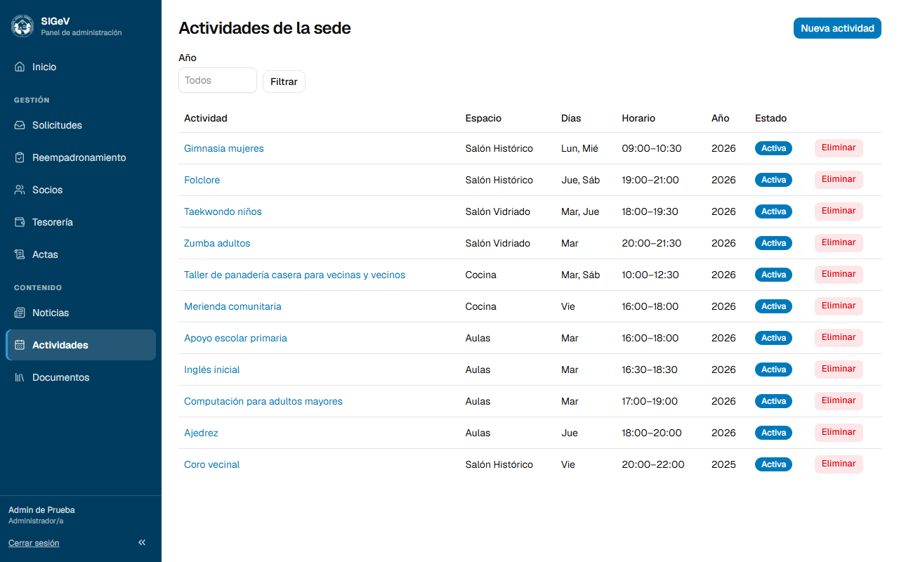

Es el calendario semanal de la sede y lo que ven los vecinos en la página Actividades. Una
actividad pide nombre, **espacio** (Salón Histórico, Salón Vidriado, Cocina o Aulas), los **días
de la semana**, el **rango horario**, el **Año** —la columna por la que se filtra la lista— y si
está activa.

El sistema no deja guardar un horario que termina antes de empezar ("La hora de fin tiene que ser
posterior a la de inicio.") ni dos actividades que se pisen en el mismo espacio. Las Aulas son
tres, así que ahí el choque se cuenta por capacidad: "Las 3 aulas ya están ocupadas de … a …."

# 11. Documentos

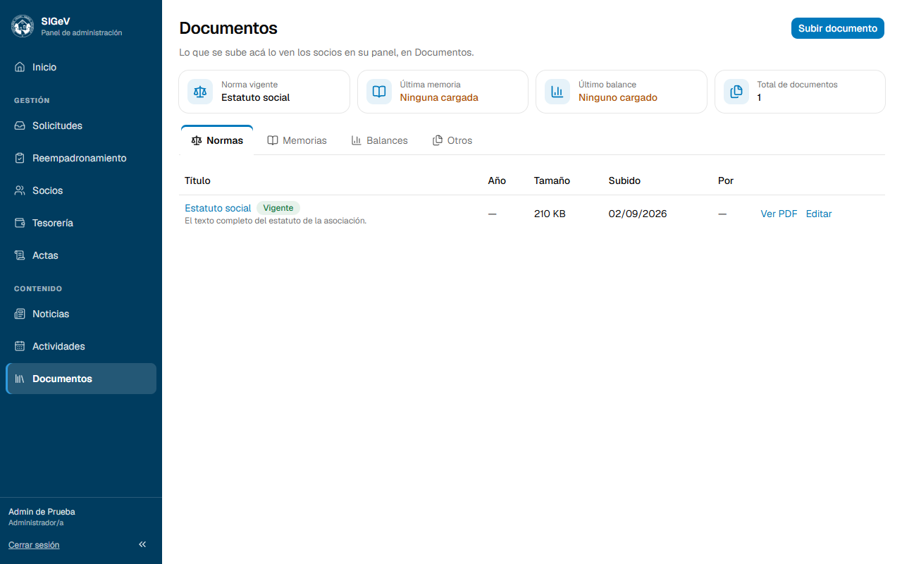

Lo que se sube acá lo ven los socios en su panel, en Documentos. Es el lugar del estatuto, las
memorias y los balances.

Arriba, cuatro indicadores: cuál es la **norma vigente**, la **última memoria**, el **último
balance** y el total. Los que faltan se muestran en ámbar.

Cuatro pestañas por tipo: **Normas**, **Memorias**, **Balances** y **Otros**, con **Ver PDF** y
**Editar** en cada fila.

**Subir documento** pide el archivo, el título, el tipo y el año. Solo puede haber un documento
por tipo y año. La norma marcada como **Vigente** es la que el socio ve destacada.

# 12. Los correos que manda el sistema

El sistema manda los correos **solo**. No hay una pantalla para escribirle a un socio; lo que
sale es lo que dispara cada acción.

| Correo | A quién | Cuándo |
|---|---|---|
| Los cinco de una solicitud de alta | Quien se asocia | Ver la tabla del capítulo 3 |
| Creá tu contraseña | El socio nuevo | Al asentar el alta, o al invitarlo |
| Verificá tu email | El socio | Al cargar su casilla por primera vez |
| Confirmá tu nueva dirección de acceso | El socio, a la casilla nueva | Al cambiarle el email si ya tiene cuenta |
| Cambió la dirección de acceso de tu cuenta | El socio, a la casilla vieja | Al cambiarle el email si ya tiene cuenta |
| Restablecé tu contraseña | Quien la pidió | Al pedir el recupero |
| Recibo | El socio | Al cobrarle, si se tildó el envío |
| Tu link para pagar la cuota | El socio | Al mandarle el link |
| No pudimos cobrar tu cuota | El socio | Cuando falla el débito |
| Tu solicitud fue aceptada o rechazada | El socio | Al resolver su pedido |
| Avisos del re-empadronamiento | El adherente convocado | En cada etapa del proceso |
| Aviso de reporte presentado o tratado | Quien reportó | Al presentarlo o tratarlo |
| Tu acceso al panel de administración | Un usuario de gestión | Al crearle la cuenta |
| Resumen del día | La Comisión | Cada mañana, si hubo novedades |

Al desestimar un reporte **no se manda ningún correo**, a propósito.

## El resumen diario a la Comisión

Todas las mañanas sale un correo con lo que pasó el día anterior: pagos, altas, reportes
recibidos y sin presentar, y lo que quedó pendiente. **Los días sin novedades no se manda
nada**, así que una racha de silencio no significa que esté roto.

Quién lo recibe se configura en Configuración → Avisos. Además, cada reporte nuevo dispara un
correo inmediato a esos mismos destinatarios.

## Cuando un correo no sale

Todos los envíos ocurren **después** de que la acción ya quedó registrada: un correo que no sale
nunca deshace un cobro, una baja ni un asiento. Si falla, el sistema lo anota y aparece en Salud
→ Correo, con el botón **Reenviar**.

Hay un caso especial que **no es una falla**. Mientras el sitio esté en período de prueba, hay
una lista blanca de casillas y **ningún correo sale fuera de esa lista**. Los avisos ámbar del
tipo "el email no salió" que veas en ese período son eso, no un problema del sistema. El día del
lanzamiento se saca la lista y los correos empiezan a salir a todo el mundo.

Un aviso que no salió **no acredita notificación**. En el re-empadronamiento eso tiene
consecuencias: sin notificación no corre el plazo del vecino, y por eso a quien no se le pudo
avisar por correo se lo notifica por la cartelera.

# 13. Solo superadmin

Este capítulo es para quien tiene el rol de superadministrador. Es el grupo **Sistema** de la
barra lateral más cuatro acciones repartidas en otras secciones.

## Usuarios

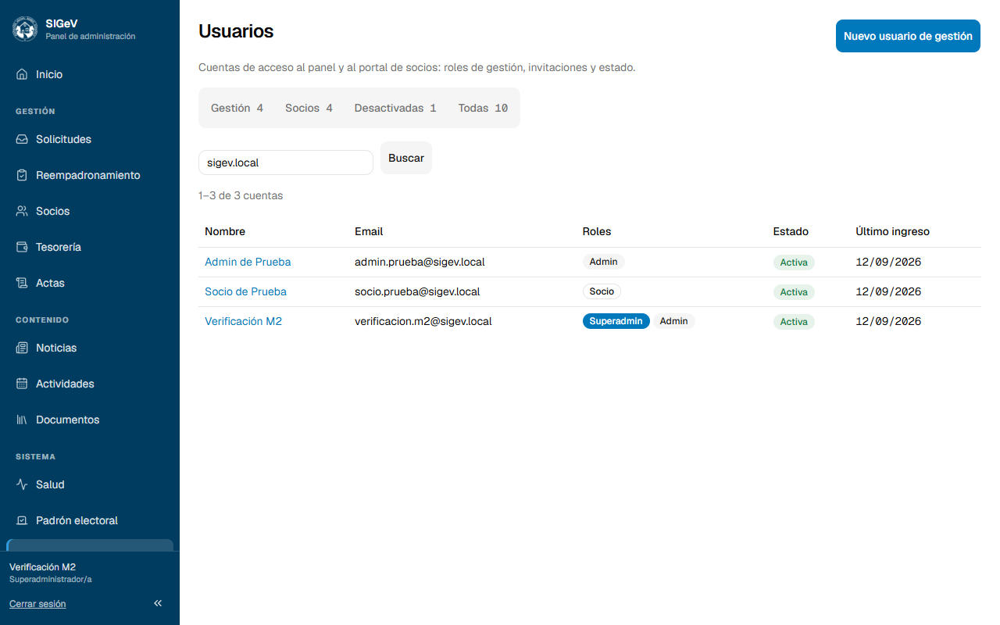

`/admin/usuarios` son todas las cuentas de acceso: las de gestión y las de los socios. Cuatro
vistas —Gestión, Socios, Desactivadas, Todas— y un buscador por nombre o email.

Los estados posibles son **Activa**, **Desactivada**, **Invitación pendiente**, **Invitación
vencida** y **Sin invitación**; los dos últimos son los que piden acción.

### Dar de alta un usuario de gestión

1. **Nuevo usuario de gestión**.
2. **Nombre y apellido** y **Email**.
3. **Crear cuenta y enviar invitación**. La cuenta nace sin contraseña y sale la invitación.

La pantalla te dice si salió —"La cuenta se creó y la invitación salió por correo."— o si no
—"La cuenta se creó, pero el correo de invitación no salió. Reenvialo desde la sección
Invitación."—. El destinatario abre el enlace, elige su contraseña y ya puede entrar. Desde la
ficha de la cuenta están **Reenviar invitación** y **Revocar invitación**.

### Roles y estado

En la ficha de cada usuario se otorgan y revocan roles y se habilita o deshabilita la cuenta. Dos
cosas no se pueden hacer: **quitarte a vos mismo el rol de superadministrador** y **desactivar
tu propia cuenta**. Tampoco se puede dejar al sistema sin ningún superadministrador.

Al cambiar un rol, el menú de esa persona puede tardar hasta ocho horas en reflejarlo, pero **el
permiso cambia en el acto**.

La ficha cierra con la **Actividad**: los últimos movimientos que esa cuenta registró en el
panel.

## Configuración

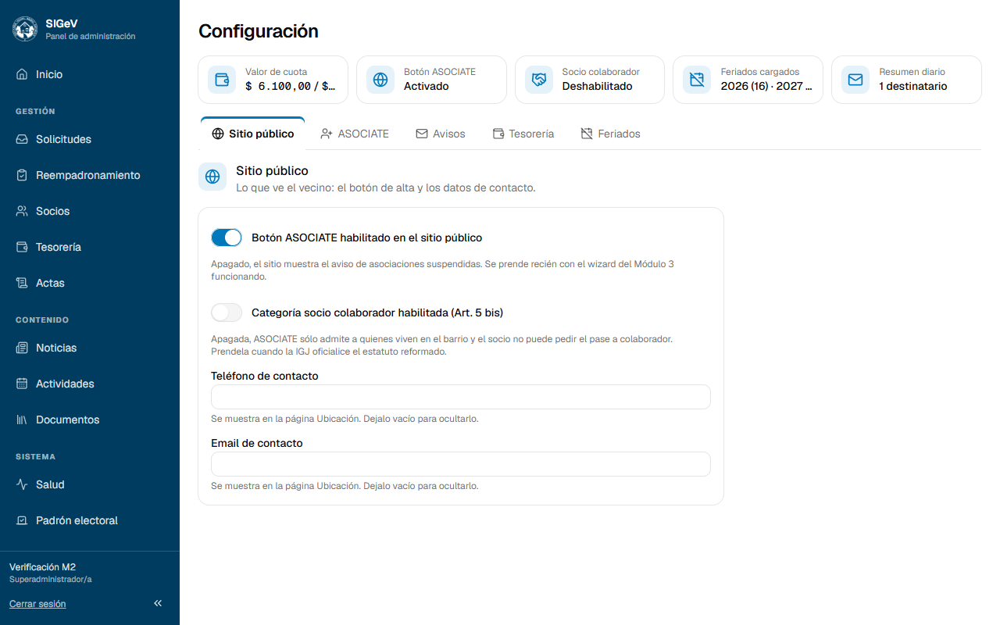

`/admin/configuracion` tiene una tira de estado arriba —valor de cuota, botón ASOCIATE, socio
colaborador, feriados cargados y destinatarios del resumen— y cinco pestañas.

| Pestaña | Qué se configura | Efecto |
|---|---|---|
| Sitio público | Botón ASOCIATE, categoría colaborador, contacto | Lo que ve el vecino |
| ASOCIATE | Textos legales y los planes de Mercado Pago | El trámite de alta |
| Avisos | Destinatarios del resumen diario | Quién recibe los correos |
| Tesorería | El valor de la cuota nuevo | Lo que se cobra |
| Feriados | Alta y baja de feriados | El cómputo de la cartelera |

Dos interruptores merecen una explicación. **Botón ASOCIATE habilitado**: apagado, el sitio
muestra el aviso de asociaciones suspendidas. **Categoría socio colaborador (Art. 5 bis)**:
apagada, el formulario público solo admite a quien vive en el barrio y el socio no puede pedir el
pase a colaborador; se prende el día que la IGJ oficialice el estatuto reformado.

Los feriados no son decorativos: la cartelera cuenta **días hábiles**, y si falta el año que el
cálculo necesita, el sistema se planta en vez de contar mal.

## Valores de cuota

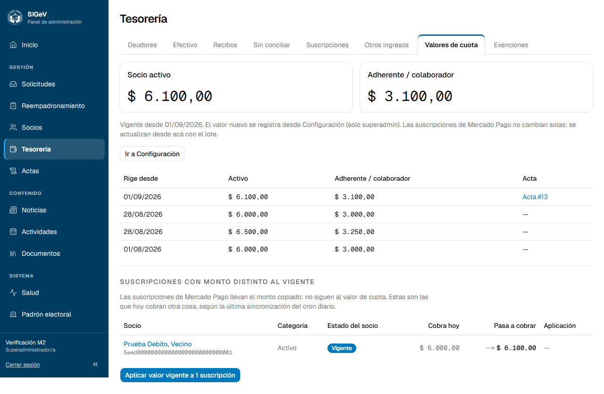

Esta pestaña de Tesorería es la **única fuente del monto de la cuota**. Todo lo que cobra el
sistema —efectivo, links, deuda vieja, reingresos— lee el valor de acá.

Arriba, los dos montos vigentes: socio activo y adherente/colaborador, con la fecha desde la que
rigen. Abajo, el historial completo.

**Un valor nunca se edita: se registra otro encima**, como un asiento de libro. Se hace desde
Configuración → Tesorería (el botón **Ir a Configuración** te lleva), indicando el monto nuevo,
desde cuándo rige y, si corresponde, el acta.

El estatuto limita a cuatro actualizaciones por año (REG-34). **Ese tope lo controla la Comisión,
no el sistema**: el panel te va a dejar registrar la quinta.

La columna **Acta** del historial enlaza al acta asentada. Hoy muestra un identificador interno
en vez del tipo y el número del acta: es una falla conocida y está reportada. Para saber de qué
acta se trata, seguí el enlace.

Al pie, **Suscripciones con monto distinto al vigente**. Las suscripciones de Mercado Pago llevan
el monto copiado y no siguen solas al valor de cuota: acá se ve qué cobran hoy, qué pasarían a
cobrar, y el botón que aplica el valor vigente al lote.

## Salud

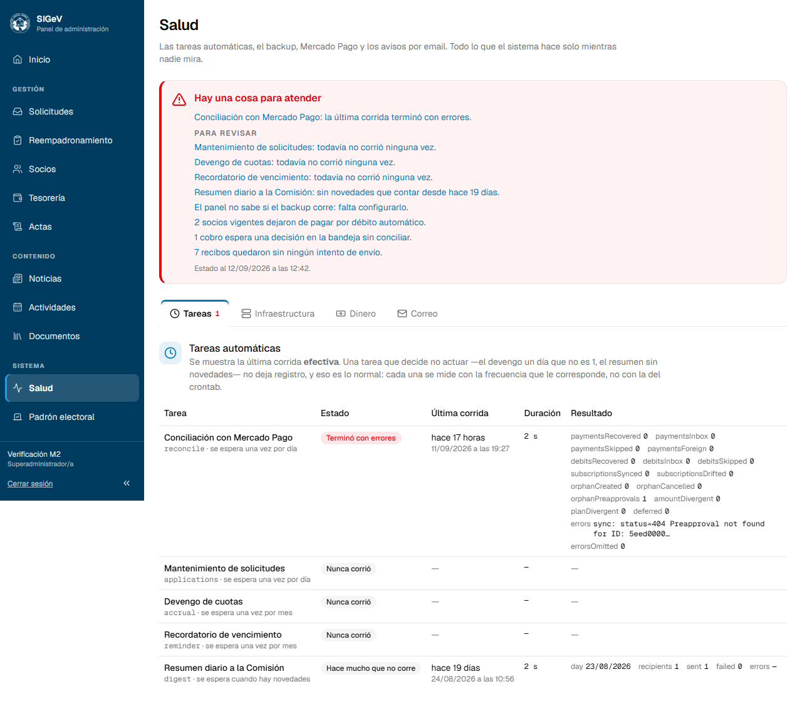

`/admin/salud` es el tablero de todo lo que el sistema hace solo: las tareas automáticas, el
backup, Mercado Pago y los correos.

El banner de arriba da el veredicto y tiene **dos niveles**:

- Lo que está en la línea del título es **para atender**: algo se rompió y hay algo concreto que
  lo apaga. Es lo único que se pinta en rojo.
- Lo que está bajo **PARA REVISAR** vale mirarlo, pero no es una rotura: una tarea que todavía no
  corrió, una cola normal de trabajo, un cruce que puede ser sano.

Cuando no hay nada de ninguno de los dos, el banner dice "Todo en orden".

Cuatro pestañas: **Tareas**, **Infraestructura**, **Dinero** y **Correo**. El punto rojo de una
pestaña cuenta solo lo que es para atender.

En **Tareas** se ve la última corrida **efectiva** de cada trabajo automático. Ojo con esto: una
tarea que decide no actuar no deja registro, y eso es lo normal. El devengo actúa el día 1 y el
recordatorio el último día del mes, así que se los mide **por mes**; la conciliación y el
mantenimiento de solicitudes, por día; el resumen, solo cuando hay novedades.

| Lo que dice el banner | Qué hacer |
|---|---|
| "…: la última corrida terminó con errores." | Abrir la tarea y leer el resultado |
| "…: una corrida se abrió y nunca cerró." | Avisar a quien administra el servidor |
| "…: todavía no corrió ninguna vez." | Verificar que la tarea esté instalada |
| "El panel no sabe si el backup corre…" | Es configuración del servidor, no del panel |
| "N socios vigentes dejaron de pagar por débito…" | Revisar: pueden haber pasado a efectivo |
| "N cobros esperan una decisión en la bandeja…" | Resolverlos en Tesorería → Sin conciliar |
| "N recibos quedaron sin ningún intento de envío." | Reenviarlos desde la pestaña Correo |

## Padrón electoral

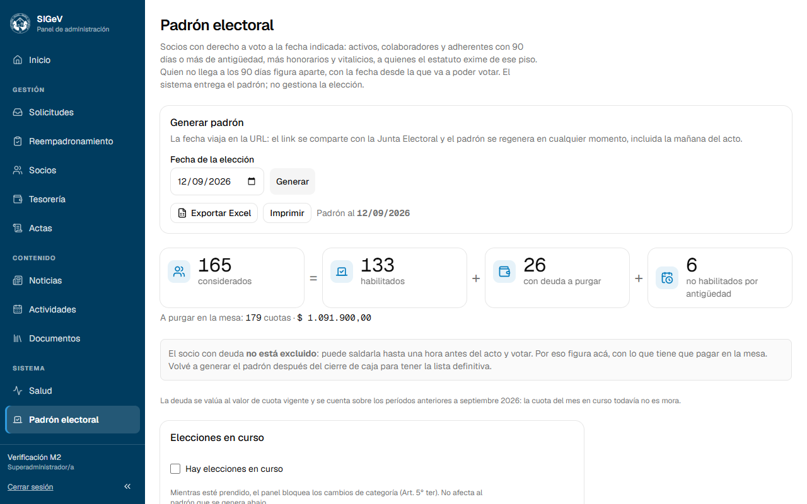

`/admin/padron-electoral` arma la nómina de socios con derecho a voto a una fecha: activos,
colaboradores y adherentes con noventa días o más de antigüedad, más los honorarios y
vitalicios.

1. Poné la **Fecha de la elección**.
2. **Generar**.
3. **Exportar Excel** o **Imprimir**.

El resultado se presenta como una igualdad: los **considerados** son la suma de los
**habilitados**, los que tienen **deuda a purgar** y los **no habilitados por antigüedad**.
Debajo, cuántas cuotas y cuánta plata hay que cobrar en la mesa.

Quien tiene deuda **no está excluido**: puede saldarla hasta una hora antes del acto y votar. Por
eso figura aparte, con lo que tiene que pagar. Conviene volver a generar el padrón después del
cierre de caja para tener la lista definitiva.

La fecha viaja en la dirección web, así que el enlace se le puede pasar a la Junta Electoral y
ellos regeneran el padrón cuando quieran, incluso la mañana del acto.

Abajo está la casilla **Hay elecciones en curso**. Mientras esté prendida, el panel bloquea los
cambios de categoría (Art. 5° ter). No afecta al padrón que se genera arriba.

## Reempadronamiento: convocar y cerrar

### Convocar

1. **Reempadronamiento** → **Convocar proceso** (superadmin).
2. Fecha de convocatoria (no futura y que no deje la 1ª instancia ya vencida), fechas opcionales
   de oficialización ante la IGJ y de elección estimada, y el acta.

Al convocar pasan tres cosas a la vez: la **cohorte se congela** (una fila por cada adherente
vigente en ese momento), salen los correos a quienes tienen casilla, y el resto queda en la lista
de la cartelera.

**Convocar suspende ASOCIATE**: desde ese momento el sitio público deja de aceptar altas y
muestra el aviso de suspensión mientras dure el proceso.

Después de convocar, mirá el tablero: si aparece el aviso rojo "El sitio público no está
apuntando a este proceso (la clave … dice …). Mientras siga así, ASOCIATE no queda suspendido y
el botón REEMPADRONATE no aparece.", resolvelo antes de seguir.

### Abrir la segunda instancia

Cuando vence la primera, **Iniciar 2ª instancia** abre diez días corridos más y avisa, bajo
apercibimiento de baja, a todos los convocados que todavía no tienen su presentación aprobada.
Los que no tienen casilla van a un cartel nuevo.

### Preparar el cierre

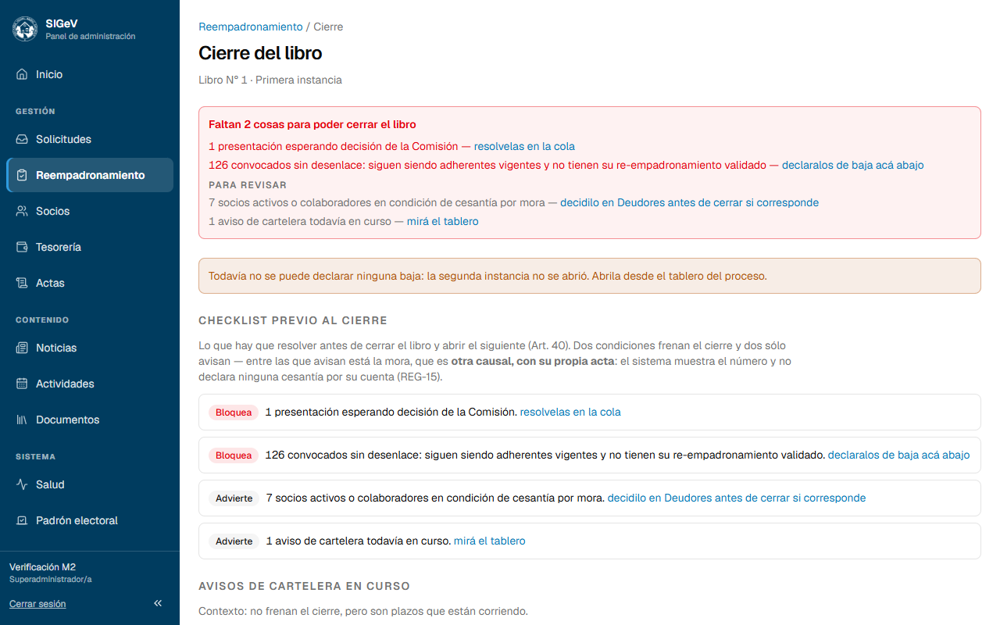

**Preparar cierre** se puede abrir en cualquier momento del proceso, también en primera instancia
como en la captura: sirve para ver qué falta. Lo que se bloquea son las **acciones**. Mientras la
segunda instancia no esté vencida, la pantalla no deja declarar ninguna baja y lo dice: "Todavía
no se puede declarar ninguna baja: la segunda instancia no se abrió. Abrila desde el tablero del
proceso.", o bien "Todavía no se puede declarar ninguna baja: la segunda instancia vence el
{fecha} y el convocado tiene ese día entero para presentarse."

La pantalla abre con un checklist que separa dos clases de condición:

- **Bloquea**: hay que resolverlo antes de cerrar. En la captura, una presentación esperando
  decisión y 126 convocados sin desenlace.
- **Advierte**: no frena el cierre, pero conviene mirarlo. La mora, por ejemplo, es **otra causal
  con su propia acta**: el sistema te muestra el número y no declara ninguna cesantía por su
  cuenta.

Después vienen los avisos de cartelera en curso, el lote de bajas, las bajas declaradas sin
notificar y el cartel de bajas para la sede.

### Las bajas en lote

Funciona como la cesantía por mora: tildás, elegís el acta, el sistema te devuelve la lista
resuelta contra la base y recién al confirmar escribe. A cada uno le llega el aviso de baja; **un
correo que no salió no acredita notificación**, y esas bajas quedan listadas aparte para
reintentar el aviso o mandarlo a cartelera.

El tope del lote **no cuenta socios: cuenta llamadas a Mercado Pago**. Los adherentes convocados
no pueden tener débito, así que en la práctica entran de a muchos; lo que se frena es el lote que
tenga demasiados débitos vivos que cancelar.

### Cerrar el libro

1. Desde el checklist, **Ir a la vista previa del cierre**.
2. La pantalla muestra el libro que se cierra, el que se abre, la **renumeración** planificada
   socio por socio y el selector de acta.
3. Revisá **con qué acta** se va a firmar. Un cierre de libro se asienta en **su propia acta**, no
   en la de las bajas de hace un rato; el selector abre en "Acta nueva" justamente por eso.
4. Tildá la casilla, que dice todo lo que va a pasar: "Entiendo que este paso cierra el Libro
   N° …, abre el Libro N° … con N socios renumerados, y que solo se revierte restaurando un
   backup."
5. **Cerrar el Libro N° {viejo} y abrir el N° {nuevo}**.

El sistema revalida todo otra vez en el momento de escribir, así que si algo cambió entre la vista
previa y el botón, se planta en vez de abrir un libro mal armado.

Al terminar quedan: el libro viejo cerrado con la foto de cada socio tal como estaba ese día, el
libro nuevo abierto con los socios renumerados de 1 en adelante por fecha de ingreso, y el
asiento en el acta que elegiste.

# 14. Preguntas frecuentes y problemas

**No le llega el correo a un socio.** Mirá Salud → Correo: si el envío falló, ahí está con el
botón **Reenviar**. En período de prueba ningún correo sale fuera de la lista blanca y eso no es
una falla. Si la casilla está mal escrita, corregila en la ficha del socio.

**El socio dice que pagó y no figura.** Fijate primero en Tesorería → Sin conciliar: si entró sin
referencia o de una suscripción sin vincular, está ahí esperando que alguien lo impute. Si no
aparece, puede que todavía no haya llegado el aviso de Mercado Pago; la conciliación diaria lo
recupera solo.

**Hay un pago en la bandeja y no sé de quién es.** Abrilo con **Resolver**: aplicalo al socio,
repartilo entre varios, o registralo como ingreso no societario. Descartar es la última opción y
queda registrada.

**Anulé un recibo por error.** No se desanula. Las cuotas volvieron a pendientes: volvé a cobrar y
emití un recibo nuevo. El anulado queda en la lista con su motivo.

**Salud está en rojo.** Leé la línea del banner: dice qué pasó y adónde ir. Si es una tarea que
terminó con errores, abrí la pestaña Tareas y leé el resultado. Lo que está bajo "Para revisar" no
es una rotura.

**Me da un error al subir un archivo y no dice nada.** Probá con una foto de menor calidad; el
tope de los anexos es de 10 MB. Si persiste, avisale a quien administra el servidor: hay un filtro
de seguridad delante del sitio que a veces rechaza subidas legítimas.

**El socio no puede adherirse al débito automático.** Son cinco guardas, y el panel del socio le
muestra la primera que corresponda:

- está eximido de la cuota ("Estás eximido de la cuota hasta {mes}: no hay nada que debitar.");
- su categoría no paga cuota ("Tu categoría no paga cuota, así que no hay débito que adherir.");
- ya tiene un débito vivo ("Ya tenés un débito automático activo. Si querés cambiarlo, primero
  cancelalo.");
- ya pagó una cuota este mes calendario ("Ya abonaste una cuota este mes. Podés adherirte desde
  el {fecha}."), porque el primer débito caería en un mes ya cubierto;
- no tiene email cargado en la ficha ("Para adherir el débito necesitás un email cargado en tu
  ficha. Cargalo en Mis datos."). Alcanza con que esté cargado: no hace falta que esté
  verificado.

**Una exención no bloquea el cobro.** Revisá que siga vigente: una exención vencida o anulada ya
no bloquea nada. La pestaña Exenciones muestra las vigentes arriba y las vencidas o anuladas en el
Historial.

**Quiero cambiar el valor de la cuota.** Lo hace el superadministrador desde Configuración →
Tesorería, registrando un valor nuevo con su fecha de vigencia y su acta; el viejo no se toca.
Después, desde Valores de cuota, aplicalo a las suscripciones que quedaron con el monto
anterior.

**Cerré el libro con el acta equivocada.** No hay forma de corregirlo desde el panel: la única
salida es restaurar una copia de seguridad. Por eso la confirmación pide leer con qué acta se va a
firmar.

# Documentos relacionados

- **Manual del socio (M2)** — el portal `/mi`: cuota, pagos, débito automático, solicitudes y
  reportes desde la cuenta del socio.
- **Guía del vecino (M3)** — el sitio público: asociarse, re-empadronarse, reportar.
- **Serie técnica T1 a T7** — para quien mantiene el sistema: arquitectura, modelo de datos,
  tesorería y Mercado Pago, despliegue y operación, seguridad.
- `docs/02-marco-estatutario.md` — las reglas del estatuto que el sistema aplica.
- `docs/05-flujos-funcionales.md` — el detalle de cada flujo, pantalla por pantalla.
