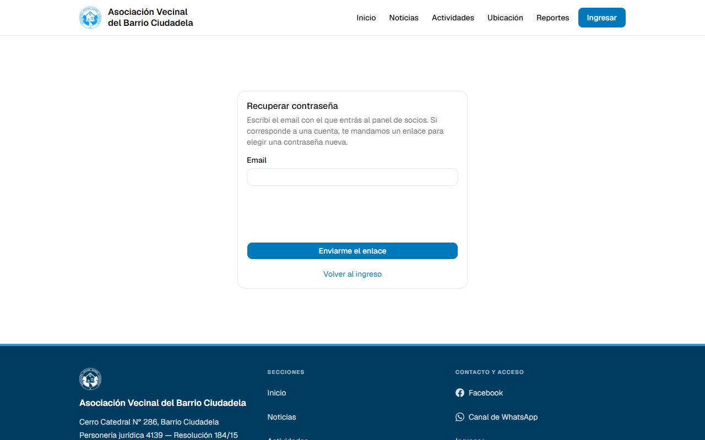
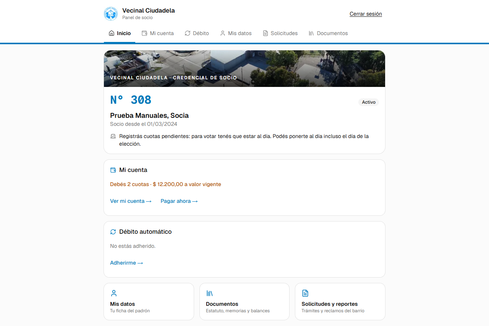
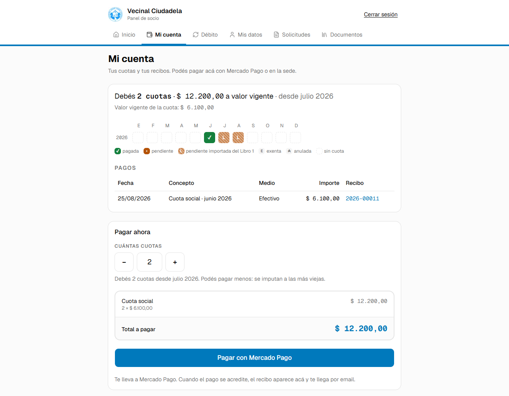
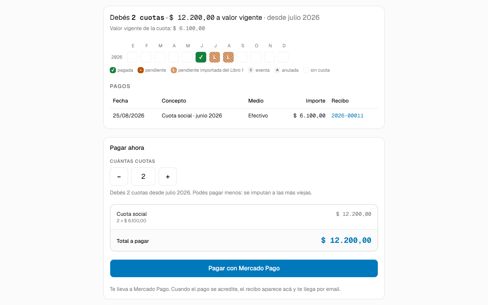
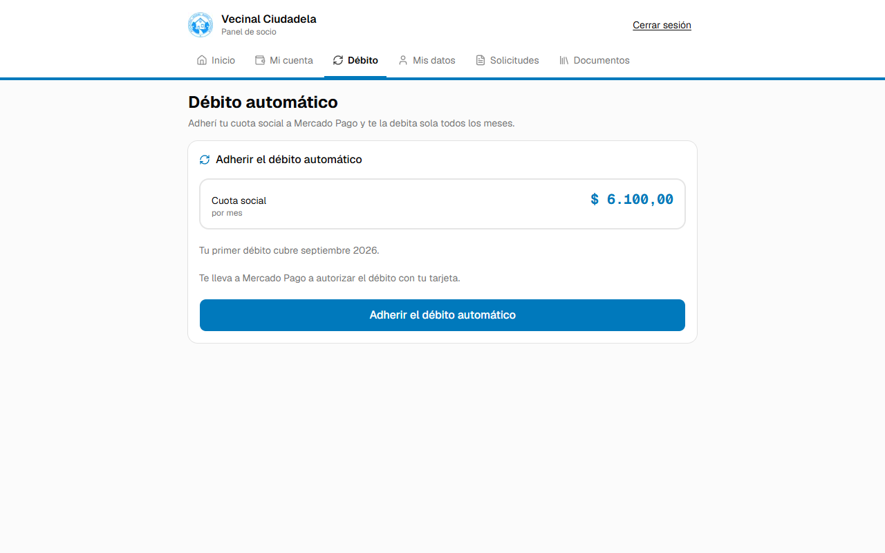
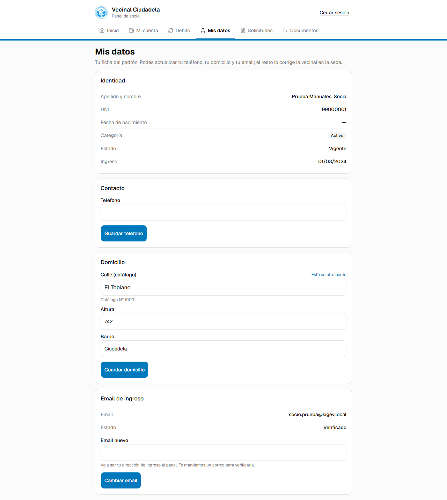
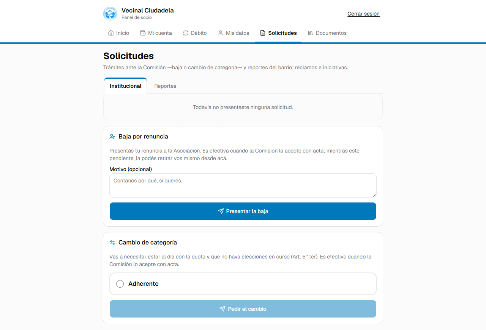
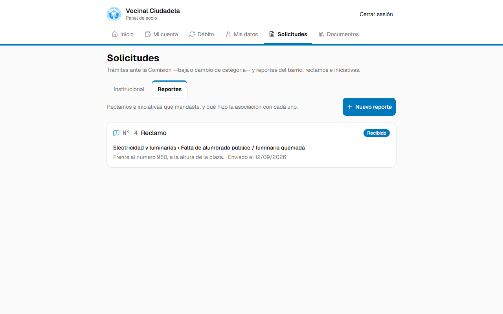
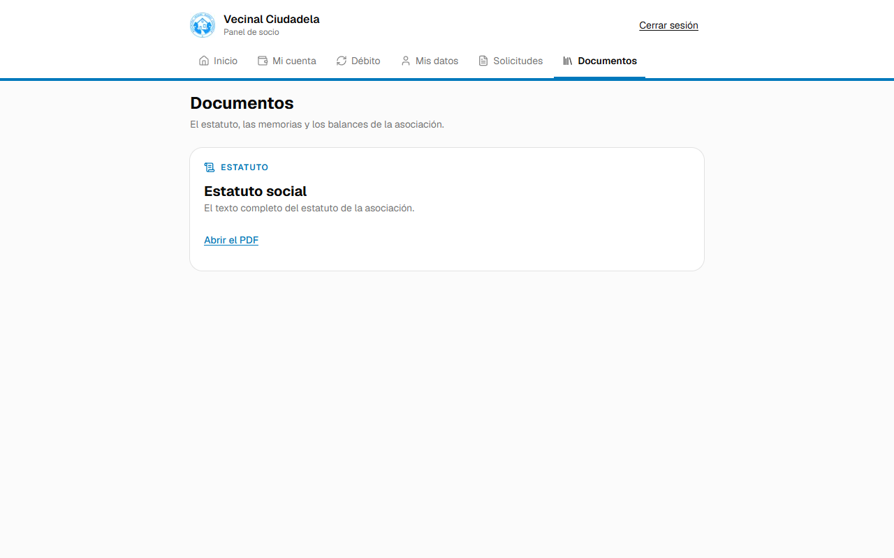

# Antes de empezar

## Para quién es y qué da por sabido

Este manual es para **vos, socia o socio de la Asociación Vecinal del Barrio Ciudadela**, que entrás
a tu panel en el sitio de la asociación. Cuenta qué ves en cada pantalla, qué podés hacer, qué
mensaje te va a aparecer y qué pasa después.

Da por sabido que sabés usar un navegador en la computadora o en el celular, y que la vecinal ya
cargó tu ficha en el padrón. **No** da por sabido nada más: ni cómo se paga por Mercado Pago, ni qué
es un débito automático, ni qué dice el estatuto. Las pantallas se nombran como aparecen en el sitio,
y la primera vez va también su dirección entre paréntesis. Las capturas salen de una ficha de prueba
inventada (la socia N° 308): los datos que se ven ahí no son los de nadie.

## Cómo leer este manual

El capítulo 1 dice quién puede entrar y el 2 cuenta la primera vez. Los capítulos 3 a 8 recorren las
seis pestañas del panel en el orden en que aparecen arriba de la pantalla. El 9 es para el caso de
que tu condición de socio esté suspendida, y el 10 junta los correos que vas a recibir y las
preguntas más habituales.

Si venís por algo puntual, andá directo al capítulo de esa pestaña. Si recién te dieron el alta,
empezá por el 2.

# 1. Qué es Mi cuenta y quién puede entrar

**Mi cuenta** es el panel de socio del sitio de la asociación (`/mi`). Desde ahí podés ver tu
credencial y tu situación para votar, consultar tus cuotas y descargar tus recibos, pagar con Mercado
Pago, adherir o cancelar el débito automático, actualizar tu teléfono, tu domicilio y tu correo,
presentar una baja o un cambio de categoría, mandar reclamos e iniciativas del barrio y leer el
estatuto y los documentos que publica la Comisión.

Para entrar hacen falta dos cosas: que **tu ficha del padrón tenga un correo cargado y verificado** y
que **tengas una cuenta con contraseña** sobre ese correo. Las dos las arranca la vecinal; el
capítulo 2 cuenta ese camino.

El panel no abre en dos casos: si figurás con baja en el padrón ("Figurás con baja en el padrón, así
que tu panel de socio no está disponible.") o si tu cuenta de acceso está deshabilitada ("Tu cuenta
de acceso está deshabilitada. Comunicate con la vecinal."). Si tu condición de socio está
**suspendida**, en cambio, el panel sí abre en modo lectura: eso está en el capítulo 9.

Hay un caso más, frecuente en el barrio: **si tu correo ya tiene una cuenta de otra persona** —un
matrimonio que comparte casilla— no vas a poder tener acceso propio con esa misma dirección. Tu
condición de socio no cambia: seguís recibiendo las notificaciones ahí, podés pagar en la sede y
tenés voz y voto. Para tener acceso propio, pedí en la sede que te carguen otra dirección en tu
ficha.

# 2. La primera vez: tu cuenta y tu contraseña

## 2.1 Los dos correos del principio

Según cómo esté tu ficha, la vecinal te manda uno de estos dos correos:

1. **"Verificá tu email — Vecinal Ciudadela"**, si tu dirección todavía no está confirmada. El
   enlace abre una pantalla que muestra **tu dirección** (no tu nombre) y explica que, con tu
   confirmación, la asociación va a poder notificarte de manera fehaciente a esa casilla (Art. 5°
   quater del estatuto). Si no esperabas ese correo, cerrá la página: sin tu confirmación no queda
   registrada ninguna dirección.
2. **"Creá tu contraseña — Vecinal Ciudadela"**, si tu dirección ya está confirmada y sólo falta la
   contraseña.

Si te llegó el primero, al confirmar **el trámite sigue solo**: el sistema te lleva directo a crear
la contraseña y además te manda ese mismo enlace por correo. Los dos enlaces **duran 7 días** y son
de un solo uso.

## 2.2 Crear la contraseña e ingresar

La pantalla de creación dice "Elegí una contraseña para entrar al portal con esta dirección:", con tu
correo a la vista. Escribí una contraseña de **8 caracteres como mínimo**, repetila y confirmá. Vas a
quedar en la pantalla de ingreso con el aviso "Tu contraseña quedó creada. Ingresá con tu email y la
contraseña que elegiste."

La pantalla **Ingresá a tu cuenta** (`/ingresar`) pide Email y Contraseña. Debajo hay una **casilla de
verificación de Cloudflare** que comprueba que no seas un programa automático: en general se marca
sola y no tenés que hacer nada.

## 2.3 Si el enlace venció o ya se usó

El mensaje es "El enlace venció o ya fue usado. Pedí a la vecinal que te lo reenvíe." Eso es lo que
hay que hacer: pedir el reenvío en la sede o por los canales de contacto de la asociación.

Hay una variante que **no** es un enlace perdido: si tu correo ya quedó confirmado y sólo falta la
contraseña, el texto dice "Tu email ya está confirmado. Buscá en tu casilla el correo «Creá tu
contraseña» y entrá por ese enlace; si no lo encontrás, pedile a la vecinal que te lo reenvíe."

## 2.4 Recuperar la contraseña

Si ya tenés cuenta y te la olvidaste, no hace falta molestar a nadie: desde la pantalla de ingreso,
el enlace **¿Olvidaste tu contraseña?** lleva a **Recuperar contraseña** (`/ingresar/recuperar`).

Escribí el correo y tocá **Enviarme el enlace**. Entre el campo y el botón está, otra vez, la casilla
de verificación de Cloudflare. Tres cosas para tener en cuenta:

- La respuesta es **siempre la misma**, exista o no una cuenta con ese correo. Es a propósito: así
  nadie puede usar esta pantalla para averiguar quién es socio.
- El enlace dura **30 minutos**, mucho menos que los otros. Si se te pasa, pedí uno nuevo.
- Si venció o ya lo usaste: "El enlace venció o ya fue usado. Pedí uno nuevo desde la pantalla de
  ingreso."

Al terminar leés "Tu contraseña quedó actualizada. Ingresá con la nueva."

> **Ojo:** hoy no hay una pantalla para cambiar la contraseña desde adentro del panel. Si querés
> cambiarla, cerrá sesión y pedí un recupero.

## 2.5 Por qué te puede pedir entrar de nuevo

Tu sesión se cierra sola en tres casos. Después de **ocho horas sin usarla** volvés directamente a la
pantalla de ingreso, sin aviso; en los otros dos el panel te dice qué pasó: a los **siete días desde
que ingresaste**, aunque la uses todos los días ("Por seguridad, las sesiones duran como máximo 7
días y esta ya los cumplió. Cerrá la sesión y volvé a ingresar."), o si **se cambió la contraseña de
la cuenta** ("Se cambió la contraseña de esta cuenta, así que esta sesión dejó de valer. Cerrá la
sesión y volvé a ingresar con la contraseña nueva.").

Para salir por tu cuenta está **Cerrar sesión**, arriba a la derecha en todas las pantallas.

# 3. Inicio

**Inicio** (`/mi`) es la primera pantalla del panel y resume tu situación de un vistazo.

Arriba está el encabezado con **Cerrar sesión** y, debajo, la barra con las seis pestañas: Inicio, Mi
cuenta, Débito, Mis datos, Solicitudes y Documentos. En el celular esa barra es una tira grande que
se desliza con el dedo. La pestaña **Débito** sólo aparece si tu categoría paga cuota.

**La credencial.** Tu número de socio del libro abierto, tu categoría, tu nombre y desde cuándo sos
socio (si todavía no tenés número, va un guion). El renglón de abajo es tu **situación para votar**:
puede decir que cumplís con la antigüedad necesaria, que te faltan meses, que tu categoría no vota,
que estás suspendido, o —como en la captura— "Registrás cuotas pendientes: para votar tenés que estar
al día. Podés ponerte al día incluso el día de la elección."

**Mi cuenta.** Resume tu deuda en una línea: "Debés 2 cuotas · $ 12.200,00 a valor vigente", o bien
"Estás al día.", o "Tu categoría no paga cuota.". Los adherentes sin cuotas pendientes leen "Tu
aporte es voluntario: no tenés cuotas pendientes." Al lado, **Ver mi cuenta →** y, cuando corresponde
pagar, **Pagar ahora →**.

**Débito automático.** Dice si el débito está activo, pendiente de autorización o si no estás
adherido, y lleva al detalle. Abajo hay tres atajos: **Mis datos**, **Documentos** y **Solicitudes y
reportes**.

**El llamado al re-empadronamiento.** Si la asociación convocó un re-empadronamiento y estás entre
los convocados sin haber presentado, arriba de todo aparece una tarjeta destacada con el plazo y el
botón **Re-empadronarme →**. Si la Comisión te pidió una corrección, el texto te manda a entrar con
el enlace que te mandaron por correo y el botón pasa a ser **Pedir el enlace →**.

# 4. Mi cuenta: cuotas, pagos y recibos

**Mi cuenta** (`/mi/cuenta`) es tu cuenta corriente con la asociación.

## 4.1 Qué muestra

- **El resumen**: cuántas cuotas debés, cuánto suman **a valor vigente** y desde qué mes. Debajo,
  "Valor vigente de la cuota: $ 6.100,00".
- **La cinta de meses**: una fila por año con los doce meses. La referencia explica los colores:
  pagada, pendiente, pendiente importada del Libro 1, exenta, anulada y sin cuota. Donde hay recibo,
  la celda es un enlace.
- **Pagos**: fecha, concepto, medio, importe y recibo. El medio puede ser Efectivo, Mercado Pago,
  Débito automático, Cuota de ingreso, Aporte voluntario o Aporte extraordinario. Un pago anulado va
  tachado y con la aclaración "(anulado)". Si no hay ninguno: "Sin pagos registrados."

Un punto importante sobre los montos: **tus cuotas no tienen precio congelado**. La deuda se valúa
siempre al valor vigente al momento de pagar, así que el total puede cambiar si la Comisión actualiza
la cuota.

## 4.2 Pagar con Mercado Pago, paso a paso

La sección **Pagar ahora** está al final de la pantalla.

1. **Elegí cuántas cuotas** con los botones **−** y **+**, o escribiendo el número. Arranca en la
   cantidad que debés y podés pedir entre 1 y 60.
2. **Leé la línea de abajo del contador**: "Debés 2 cuotas desde julio 2026. Podés pagar menos: se
   imputan a las más viejas." Si estás al día, te dice qué meses cubre el pago.
3. **Mirá el total**: la boleta previa muestra la multiplicación (2 × $ 6.100,00) y el **Total a
   pagar**.
4. Tocá **Pagar con Mercado Pago**: el botón cambia a "Abriendo Mercado Pago…" y salís al sitio de
   Mercado Pago, donde pagás con el medio que prefieras.

Tres cosas antes de salir. **Vos elegís la cantidad, no los meses**: el sistema imputa siempre las
cuotas más viejas primero. **El enlace de pago vence a las 72 horas**, así que si lo dejás abierto en
una pestaña y volvés tres días después hay que generarlo de nuevo. Y si la asociación todavía no
publicó el valor de la cuota, en lugar del formulario vas a leer "El valor de la cuota todavía no está publicado. Probá más
tarde o consultá en la sede."

## 4.3 Qué pasa cuando volvés de Mercado Pago

Mercado Pago te devuelve a **Mi cuenta** y arriba aparece una tarjeta con el desenlace:

| Lo que ves | Qué significa |
|---|---|
| "¡Listo! Tu pago quedó registrado. Abajo tenés el recibo." | Entró. El recibo ya está en la tabla de pagos. |
| Un círculo girando y "Estamos esperando la confirmación de Mercado Pago…" | La confirmación todavía no llegó. La pantalla se actualiza sola. |
| "Mercado Pago rechazó el pago: no se te cobró nada y la cuota sigue impaga…" | No se cobró nada. **Probar de nuevo** te devuelve al formulario. |
| "Mercado Pago dejó el pago pendiente de acreditación…" | Típico de efectivo o transferencia: puede tardar hasta dos días hábiles. |
| "Este intento de pago no se completó y no se te cobró nada. Tenés otro pago registrado hace unos minutos…" | Este intento no entró, pero **sí** hay otro pago tuyo reciente: mirá qué cuotas te quedan antes de volver a pagar. |

**La pantalla de espera dura dos minutos.** Se refresca cada 5 segundos, hasta 24 veces, y sólo
mientras tengas esa pestaña a la vista. Si se agota, el texto pasa a "Todavía no nos llegó la
confirmación de Mercado Pago. Si el pago se aprobó, la cuota se imputa sola y el recibo aparece acá
abajo. Si se rechazó, no se te cobró nada y la cuota sigue impaga.", con **Volver a consultar** y
**Probar de nuevo**. Que se agote la espera **no significa que el pago falló**: significa que el
aviso todavía no llegó. Volvé a entrar más tarde antes de pagar de nuevo.

## 4.4 El recibo, y la exención

Cuando el pago se aplica, el recibo te llega por correo con el asunto **"Recibo {número} — Vecinal
Ciudadela"** y el PDF adjunto. El mismo recibo queda para siempre en la tabla de pagos: tocá el
número (**2026-00011**) y se abre el PDF. Si Mercado Pago no pudo cobrarte, te llega en cambio el
correo "No pudimos cobrar tu cuota — Vecinal Ciudadela", con el motivo en palabras.

La Comisión puede **eximirte de la cuota** por un período (Art. 7 inc. a.4). Mientras la exención
esté vigente vas a ver arriba el aviso "Estás eximido de la cuota hasta {mes}.", **la sección Pagar
ahora no aparece**, y los meses cubiertos figuran en la cinta como exentos y no cuentan como deuda.

# 5. Débito automático

**Débito** (`/mi/debito`) es donde autorizás que Mercado Pago te cobre la cuota todos los meses sin
que tengas que acordarte.

## 5.1 Requisitos

Tienen que darse **cinco** condiciones, y el sistema las mira en este orden. Si alguna falla, en
lugar del botón vas a leer el motivo:

1. **Sin exención vigente**: "Estás eximido de la cuota hasta {mes}: no hay nada que debitar."
2. **Categoría que paga cuota**: "Tu categoría no paga cuota, así que no hay débito que adherir."
3. **Sin un débito vivo**: "Ya tenés un débito automático activo. Si querés cambiarlo, primero
   cancelalo."
4. **Sin una cuota pagada este mes**: "Ya abonaste una cuota este mes. Podés adherirte desde el
   01/10/2026." Es para que el primer débito no te cobre un mes que ya pagaste; la fecha que te
   muestra es el primer día del mes siguiente.
5. **Con un correo cargado**: "Para adherir el débito necesitás un email cargado en tu ficha.
   Cargalo en Mis datos."

**Tener deuda no te impide adherirte.** Al contrario: el débito cubre de acá en más y la deuda vieja
la saldás aparte, con un pago o en la sede.

## 5.2 Adherirse, paso a paso

1. Entrá a la pestaña **Débito**: vas a ver una boleta de un renglón que dice Cuota social, por mes,
   con el monto mensual a la derecha.
2. Fijate en la línea "Tu primer débito cubre septiembre 2026.": ese es el mes que cubre el primer
   cobro.
3. Tocá **Adherir el débito automático**. El botón pasa a "Abriendo Mercado Pago…" y salís al sitio
   de Mercado Pago, donde **autorizás el débito con tu tarjeta**.
4. Volvés al panel y la pantalla consulta el estado. Vas a leer una de tres cosas: "¡Listo! Tu débito
   quedó autorizado.", "MP todavía está confirmando la autorización. Actualizá en un rato." o "No
   pudimos confirmar el estado de tu adhesión. Actualizá la página en un rato o consultá en la sede."

El tercer mensaje **no quiere decir que la adhesión falló**: quiere decir que en ese momento no se
pudo confirmar. Actualizá la pantalla un rato después antes de intentar nada. Una vez adherido, cada
mes Mercado Pago cobra la cuota, el sistema la imputa sola y te llega el recibo por correo.

> Hay un mensaje que aparece muy de vez en cuando y que hay que tomar al pie de la letra: "No pudimos
> registrar la adhesión. NO vuelvas a intentarlo: comunicate con la vecinal." Si lo leés, **no toques
> el botón de nuevo**: la autorización ya quedó hecha en Mercado Pago y un segundo intento crearía un
> segundo cobro mensual.

Si quedaran dos débitos vivos, la pantalla lo dice: "Tenés más de un débito vivo: consultá en la
sede."

## 5.3 Cancelar el débito

Desde la tarjeta de tu débito, el enlace **Cancelar el débito →** lleva a una confirmación que te
dice en dos renglones qué va a pasar: al confirmar, "Mercado Pago te deja de debitar la cuota de $X
todos los meses" (o el texto que corresponda si estaba pausado o sin autorizar todavía); y de ahí en
más, "Podés seguir pagando por link o en la sede, y volver a adherirte cuando quieras." El navegador
te pide una confirmación más. Al terminar leés "Listo: tu débito automático quedó cancelado."

**La cancelación corta de acá en adelante**: esta pantalla no devuelve cobros ya hechos; para eso
consultá a la Comisión. Si el débito ya estaba cancelado, la pantalla te tranquiliza ("Ese débito ya está cancelado: Mercado Pago
no te va a volver a cobrar."); y si Mercado Pago no la acepta, el mensaje es "Mercado Pago no aceptó
la cancelación. Probá más tarde o consultá en la sede."

Pagar, adherir, cancelar y la consulta de estado al volver comparten un tope de **5 operaciones por
minuto**. Si lo superás vas a leer "Demasiados intentos seguidos. Esperá un minuto y volvé a probar."
No es un error: esperá un minuto.

# 6. Mis datos

**Mis datos** (`/mi/datos`) es tu ficha del padrón. El subtítulo lo resume: "Tu ficha del padrón.
Podés actualizar tu teléfono, tu domicilio y tu email; el resto lo corrige la vecinal en la sede."

**Lo que no podés cambiar desde acá.** La tarjeta **Identidad** es de sólo lectura: apellido y
nombre, DNI, fecha de nacimiento, categoría, estado (Vigente o Suspendido) y fecha de ingreso. No es
un capricho: son los datos del libro de socios, y corregirlos es un acto de la Comisión, no de una
pantalla. Para cualquiera de ellos, acercate a la sede. La **categoría** además tiene su propio trámite, en el capítulo 7.

**Teléfono.** Escribilo y tocá **Guardar teléfono**. Respuesta: "Teléfono guardado."

**Domicilio.** El campo **Calle (catálogo)** autocompleta con las calles del barrio a medida que
escribís; si tu calle no está, el enlace **Está en otro barrio** te deja escribirla como texto libre.
Después van **Altura** y **Barrio**, y el botón **Guardar domicilio**. La respuesta es un aviso en
ámbar: "Domicilio guardado. La Comisión va a constatar el cambio (queda anotado en tu ficha)."
Mientras esa constatación esté pendiente vas a ver el recordatorio "Tu último cambio de domicilio
está pendiente de constatación por la Comisión." El domicilio no es un dato menor: es el que define
si sos vecino del barrio a los efectos del estatuto, y por eso lo constata la Comisión.

**Email de ingreso.** La tarjeta muestra tu dirección y su estado (Sin email, Sin verificar,
Verificado o Rebotado) y, debajo, el campo **Email nuevo** con la advertencia "Va a ser tu dirección
de ingreso al panel. Te mandamos un correo para verificarla." Cambiarlo dispara tres cosas a la vez:
**tu dirección de ingreso cambia** (de ahí en más entrás con la nueva), **te llegan dos correos**
—uno a la casilla anterior avisando del cambio y otro a la nueva para confirmarla— y **los enlaces
viejos dejan de servir**. El mensaje final es "Email guardado. A partir de ahora ingresás con la
dirección nueva; te mandamos un correo para verificarla."

Dos rechazos posibles: "Ese ya es tu email actual." y "Ese email ya está en uso en el sistema.
Escribí otra dirección o consultá en la sede." Y una advertencia que no es un fallo: "El cambio se
guardó, pero no pudimos mandarte el correo de verificación. Probá más tarde o consultá en la sede."
El dato quedó bien; lo que falta es el correo.

# 7. Solicitudes: trámites y reportes

**Solicitudes** (`/mi/solicitudes`) junta dos cosas distintas en dos sub-pestañas: "Trámites ante la
Comisión —baja o cambio de categoría— y reportes del barrio: reclamos e iniciativas."

## 7.1 Institucional

Arriba está lo que ya presentaste —tus últimas 20 solicitudes, con su tipo, su estado (Pendiente,
Aceptada, Rechazada, Retirada o Sin efecto), la fecha, el texto formal y la nota de la Comisión—; si
nunca presentaste nada, como en la captura, dice "Todavía no presentaste ninguna solicitud."

**Baja por renuncia.** Motivo opcional (hasta 500 caracteres) y el botón **Presentar la baja**. El
efecto está escrito en la tarjeta: "Presentás tu renuncia a la Asociación. Es efectiva cuando la
Comisión la acepte con acta; mientras esté pendiente, la podés retirar vos mismo desde acá."
Renunciar **no tiene más requisitos**: podés hacerlo aunque debas cuotas.

**Cambio de categoría.** Elegís la categoría nueva entre las que ofrece la pantalla (nunca la que ya
tenés) y tocás **Pedir el cambio**; el botón está deshabilitado hasta que elijas una. El aviso dice
"Vas a necesitar estar al día con la cuota y que no haya elecciones en curso (Art. 5° ter). Es
efectivo cuando la Comisión lo acepte con acta." Esos son también los dos rechazos habituales: tener
cuotas pendientes, o que haya elecciones en curso.

**Una pendiente por tipo.** No podés tener dos bajas ni dos cambios de categoría pendientes a la vez
("Ya tenés una solicitud pendiente de este tipo. Podés retirarla desde tu panel."); sí una de cada
tipo, y mientras esté Pendiente la podés **retirar**.

**Qué pasa después.** La Comisión resuelve **con acta** y te llega un correo diciendo si tu solicitud
fue aceptada o rechazada; el estado en tu panel cambia solo. El estado **Sin efecto** aparece cuando
se asienta tu baja y quedaban solicitudes pendientes: no hace falta que hagas nada.

## 7.2 Reportes

Cada tarjeta lleva el **N° público** del reporte —el que tenés que citar si preguntás por él—, el
tipo, la categoría, la ubicación, la fecha de envío y una pastilla de estado.

Para mandar uno nuevo, tocá **+ Nuevo reporte**. Como sos socio el trámite es corto —**dos pasos**,
sin captcha y sin subir tu documento—, porque tu ficha ya la tiene la asociación.

1. **Empezar.** Elegís qué querés reportar: **Un reclamo** ("Un problema en la vía pública: agua,
   cloacas, luz, residuos, calles, árboles, transporte.") o **Una iniciativa** ("Una propuesta para
   el barrio, que la Comisión Directiva evalúa (Art. 6 del estatuto)."). Y elegís cómo querés
   figurar: **Con mi nombre** o **De forma reservada** —sin tu nombre ante el organismo, o sin
   publicarlo—. En los dos casos **la asociación siempre sabe quién reportó**: lo reservado es hacia
   afuera.
2. **Tu reporte.** Elegís la categoría y el tipo, describís el problema o la propuesta, marcás dónde
   es (calle, altura y, si querés, un punto en el mapa) y podés adjuntar fotos. La ubicación es
   obligatoria en un reclamo, salvo que elijas la categoría "Otro reporte".

**Qué pasa con cada uno.** Un **reclamo** lo presenta la asociación **ante el organismo** que
corresponda, y la tarjeta pasa a decir "Presentado ante {organismo} el {fecha}". Una **iniciativa**
la **trata la Comisión Directiva** y no sale de la asociación: la tarjeta dice "Tratada por la
Comisión Directiva el {fecha}".

# 8. Documentos

**Documentos** (`/mi/documentos`) es la biblioteca institucional: "El estatuto, las memorias y los
balances de la asociación."

Arriba va el documento destacado —el **Estatuto social**— en una tarjeta propia, con **Abrir el
PDF**. Debajo, cuando hay, se arman secciones por tipo: Normas, Memorias, Balances y Otros
documentos; una sección sin documentos no se muestra. Cada PDF se abre en una pestaña nueva. Si
todavía no hay nada publicado: "Los documentos van a aparecer acá cuando la Comisión los publique."

# 9. Si tu condición de socio está suspendida

Una suspensión (Art. 10) no te deja afuera del panel: te deja en **modo lectura**. Apenas entrás, un
banner permanente te lo dice, con las fechas si están cargadas:

> Tu condición de socio está suspendida del DD/MM/AAAA al DD/MM/AAAA (Art. 10). Podés consultar tu
> cuenta, tus recibos y pagar tus cuotas; el resto de las acciones está deshabilitado.

**Lo que sí podés hacer:** ver todas las pantallas del panel; **pagar tus cuotas** con Mercado Pago,
que es justamente lo que te acerca a la rehabilitación; descargar tus recibos; y **mandar reclamos e
iniciativas**, porque un reporte del barrio no es un trámite societario y no está alcanzado por la
suspensión.

**Lo que no podés hacer:** adherir el débito automático ("Mientras estés suspendido no podés adherir
el débito automático desde acá. Comunicate con la vecinal."), cancelarlo ("Mientras estés suspendido
no podés cancelar el débito desde acá. Comunicate con la vecinal."), editar tu teléfono, tu domicilio
o tu correo, ni presentar una baja o un cambio de categoría. En esos casos la pantalla muestra los
datos en sólo lectura, sin los formularios.

# 10. Correos y preguntas frecuentes

## 10.1 Los correos que vas a recibir

Todos los asuntos terminan con **"— Vecinal Ciudadela"**; acá van sin ese final, para que la tabla
entre.

| Asunto | Cuándo te llega |
|---|---|
| Verificá tu email | La vecinal manda la verificación de tu dirección desde tu ficha |
| Creá tu contraseña | Te invitan a crear tu cuenta, o después de que confirmaste tu dirección |
| Restablecé tu contraseña | Pediste un recupero desde la pantalla de ingreso |
| Cambió la dirección de acceso de tu cuenta | A tu casilla **anterior**, cuando cambiás el correo de ingreso |
| Confirmá tu nueva dirección de acceso | A tu casilla **nueva**, por el mismo cambio |
| Recibo {N} | Cada pago aplicado, con el PDF adjunto |
| Tu link para pagar la cuota | La vecinal te genera un enlace de pago desde la sede |
| No pudimos cobrar tu cuota | Mercado Pago intentó cobrar y no pudo |
| Tu cuota de {mes} vence mañana / venció y quedó impaga | Recordatorio mensual de la cuota |
| Tu solicitud de … fue aceptada / fue rechazada | La Comisión resolvió tu baja o tu cambio de categoría |
| Correos del re-empadronamiento y de tus reportes | Cuando hay novedades de esos trámites |

Dos aclaraciones: si tu casilla **rebota** los correos, el sistema deja de mandarte y hay que
corregir la dirección desde Mis datos o en la sede. Y **el panel no tiene una pantalla donde ver los
correos que te mandaron**: lo que llegó está en tu casilla.

## 10.2 Preguntas frecuentes

**Pagué y no figura en mi cuenta.** Esperá un rato y volvé a entrar: el aviso de Mercado Pago puede
demorar, y si elegiste efectivo o transferencia la acreditación tarda hasta dos días hábiles. Si al
día siguiente sigue sin figurar, consultá en la sede con el comprobante. **No vuelvas a pagar** sin
consultar.

**No me llegó el recibo.** El recibo queda siempre en la tabla de **Pagos** de Mi cuenta, llegue el
correo o no: entrá y tocá el número para abrir el PDF. Si el correo no aparece, revisá la carpeta de
spam y confirmá en Mis datos que tu dirección esté bien escrita y en estado Verificado.

**No puedo adherirme al débito.** La pantalla te dice el motivo exacto en lugar del botón; los cinco
están en el capítulo 5.1. El más frecuente es haber pagado una cuota este mismo mes, y ahí el propio
mensaje te da la fecha desde la cual vas a poder.

**El enlace del correo venció.** Los de verificación e invitación duran 7 días; los de recupero de
contraseña, 30 minutos. Si era de los primeros, pedí el reenvío a la vecinal; si era de recupero,
pedí otro desde **¿Olvidaste tu contraseña?**.

**Quiero cambiar el correo con el que entro.** Se hace desde **Mis datos** → Email de ingreso. A
partir de ese momento ingresás con la dirección nueva, te llegan dos correos (uno a cada casilla) y
los enlaces viejos dejan de servir.

**Me olvidé la contraseña.** Entrá a **¿Olvidaste tu contraseña?** desde la pantalla de ingreso,
escribí tu correo y seguí el enlace, que dura 30 minutos. No hay forma de cambiarla desde adentro del
panel: ese es el camino.

**Comparto el correo con otra persona de mi casa.** La cuenta es una por dirección, así que sólo una
de las dos puede tener acceso propio con esa casilla. Tu condición de socio no cambia. Si querés tu
propio acceso, pedí en la sede que te carguen otra dirección en tu ficha.

**Quiero darme de baja.** Se presenta desde **Solicitudes** → Institucional → Baja por renuncia, con
motivo opcional. **No es inmediata**: es efectiva cuando la Comisión la acepta con acta, y mientras
esté pendiente la podés retirar. Podés renunciar aunque debas cuotas, y si tenías débito automático
se cancela cuando se asienta la baja.

**¿Cuánto debo y a qué valor?** El resumen de **Mi cuenta** dice cuántas cuotas debés, cuánto suman
**a valor vigente** y desde qué mes. Las cuotas no se guardan con un precio congelado: se valúan al
valor del día en que pagás, así que el total puede cambiar si la Comisión actualiza el monto. Si
pagás menos cuotas de las que debés, se imputan a las más viejas.

# Documentos relacionados

| Documento | Contenido |
|---|---|
| M1 — Manual del operador | El panel de administración de la Comisión, pantalla por pantalla |
| M2 — Manual del socio | Este manual |
| M3 — Guía del vecino | El sitio público y los trámites sin cuenta: asociarse, re-empadronarse y reportar |

Si alguna pantalla no coincide con lo que dice este manual, manda la pantalla: el sitio se actualiza
y el manual se rehace después. Para todo lo que no se resuelve desde el panel —corregir tu nombre o
tu documento, un pago que no aparece, un enlace que no llega— el camino es la sede de la asociación.
