# Antes de empezar

## Para quién es y qué da por sabido

Esta guía es para cualquier vecina o vecino del Barrio Ciudadela que quiera usar el sitio de la
Asociación Vecinal: leer las novedades, ver las actividades de la sede, asociarse, re-empadronarse
cuando la Comisión Directiva lo convoque, o plantear un reclamo o una idea para el barrio.

No da por sabido nada: alcanza con un celular con internet y no hay que instalar nada. Si ya sos
socia o socio y buscás tu cuenta, el resto está en el **Manual del socio**.

## Cómo leer este documento

El capítulo 1 recorre el sitio público; los capítulos 2, 3 y 4 son los tres trámites que se hacen
por la web —asociarse, re-empadronarse y presentar un reporte—; el 5 explica cómo entrar si ya
tenés cuenta, el 6 qué datos se piden y para qué, y el 7 responde las preguntas más frecuentes.
Buscá el capítulo del trámite que vas a hacer; no hace falta leerla entera.

Las figuras son pantallas reales con datos inventados: los montos y las fechas que aparecen son de
una prueba, y lo que manda es lo que veas el día que hagas el trámite.

En varios formularios vas a encontrar, antes del botón, una casilla de verificación de Cloudflare
que comprueba que sos una persona y no un programa. Casi siempre se resuelve sola en un segundo; si
te pide que la marques, marcala. En las figuras de esta guía aparece como un hueco en blanco porque
no se dibuja en las capturas.

# 1. El sitio

El sitio es **vecinalciudadela.ar**. Arriba, en todas las páginas, está la misma barra —**Inicio ·
Noticias · Actividades · Ubicación · Reportes**— más el botón **Ingresar**; en el celular se abre
con el botón de menú. Todo lo de este capítulo se mira sin cuenta y sin dar ningún dato.

## Inicio

La portada muestra la sede, el nombre de la asociación, el botón del trámite que esté abierto y
las últimas noticias publicadas.

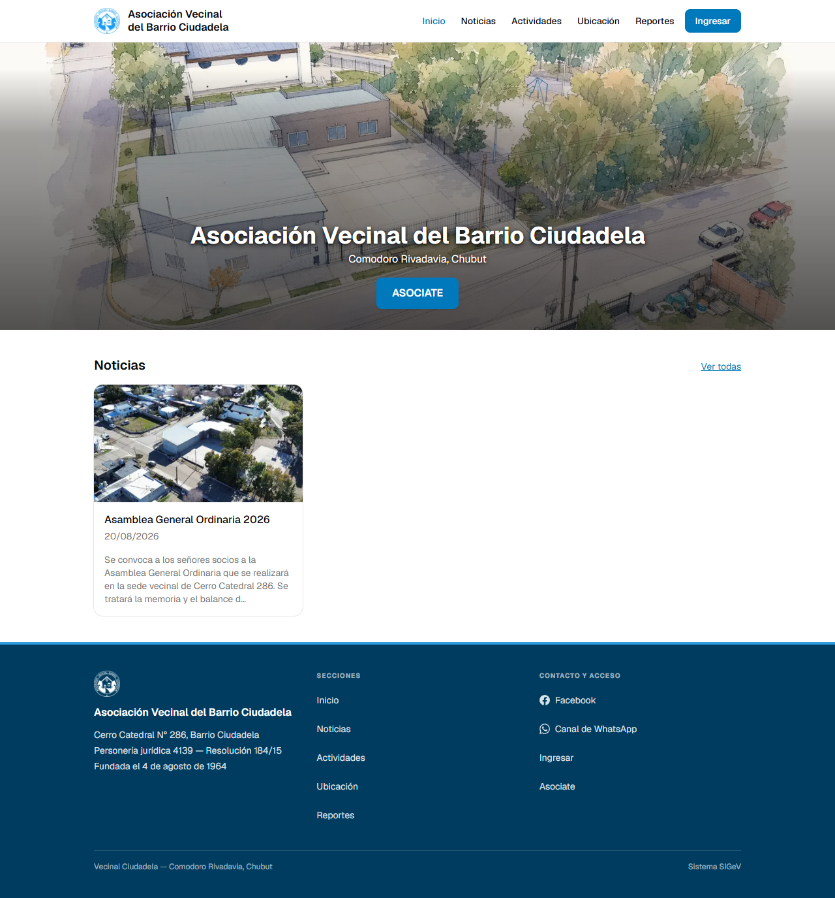

Ese botón cambia según el momento: **ASOCIATE** cuando las altas en línea están abiertas, y
**REEMPADRONATE** mientras haya un re-empadronamiento convocado —ahí las altas nuevas quedan
suspendidas y la portada lo avisa, con la fecha del plazo si la hay—. Si están cerradas por otro
motivo, en lugar del botón aparece el aviso de acercarse a la sede.

## Noticias

Las novedades y comunicados de la asociación, de la más nueva a la más vieja, de a diez por
página. Cada tarjeta muestra la foto, el título, la fecha y el comienzo del texto; al tocarla se
abre la nota completa. Es para leer y compartir: no hay nada que completar.

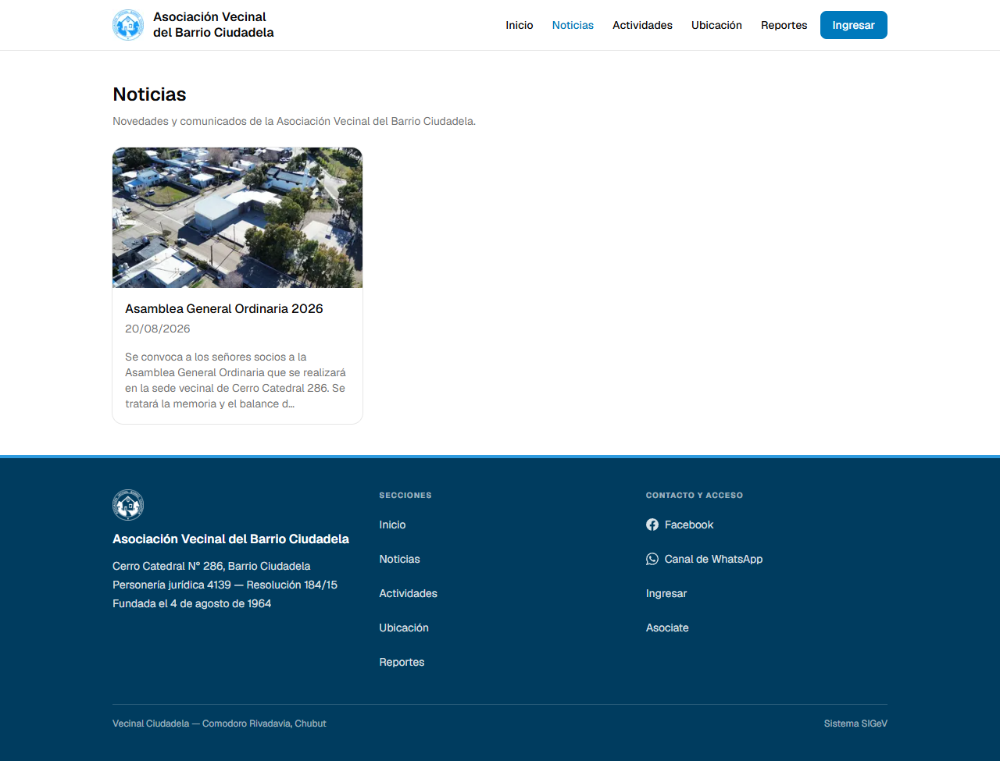

## Actividades

El calendario semanal de lo que pasa en la sede.

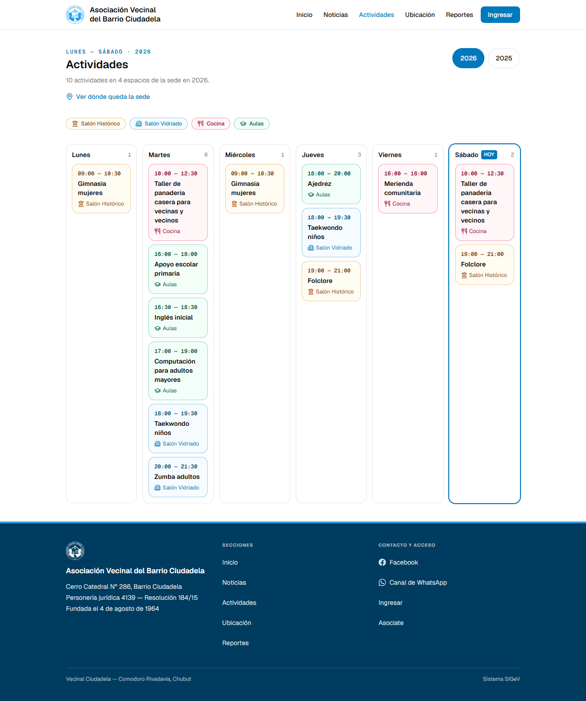

En la computadora se ve la semana entera, de lunes a sábado (la vecinal no abre los domingos); en
el celular, un día por vez, que abre en el de hoy. El día en curso viene marcado con **HOY** si
estás mirando el año corriente, y arriba a la derecha se elige el año. Cada actividad muestra el
horario, el nombre y el espacio: Salón Histórico, Salón Vidriado, Cocina o Aulas. Para anotarte hay
que acercarse a la sede: el sitio informa, no toma inscripciones.

## La sede y cómo llegar

**Ubicación** muestra dónde queda la sede, con el contorno del barrio sobre el mapa del Instituto
Geográfico Nacional. El botón **Cómo llegar** abre las indicaciones en el mapa del celular.

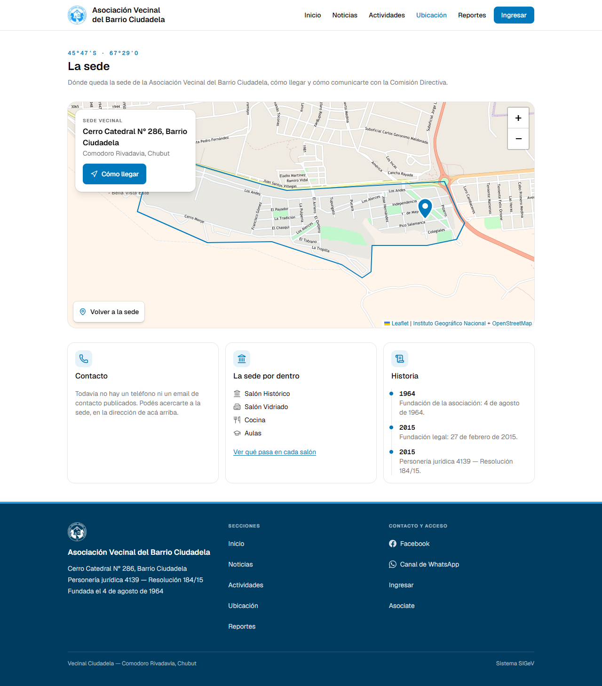

Debajo hay tres tarjetas: **Contacto**, **La sede por dentro** e **Historia**. La dirección es
**Cerro Catedral N° 286, Barrio Ciudadela**, Comodoro Rivadavia, Chubut.

El estatuto y los demás documentos institucionales **no tienen página pública**: se leen desde el
panel de socio. Si todavía no sos socia o socio y querés consultarlos, acercate a la sede.

# 2. Asociarte a la vecinal

**ASOCIATE** es el alta por la web: seis pasos cortos que terminan con tu solicitud presentada
ante la Comisión Directiva.

Conviene tenerlo claro desde el principio: **el trámite no te convierte en socio/a**, lo que hacés
es pedir el ingreso. La admisión la resuelve la Comisión Directiva y el alta queda asentada en un
acta; recién ahí sos socia o socio, y la fecha de esa acta es tu fecha de ingreso.

## Quién puede asociarse por la web

- **Mayor de 18 años.** Los cadetes, de 14 a 17, se asocian en la sede.
- **Vivir en el Barrio Ciudadela**, para pedir el ingreso como socio activo o adherente. La
  categoría de colaborador, para quien vive en otro barrio, depende de una reforma del estatuto
  todavía no oficializada: mientras tanto esa opción aparece deshabilitada.
- **Una dirección de correo tuya**: ahí llega todo, y es el domicilio electrónico donde la
  asociación te notifica.
- **Las dos caras del DNI**, en foto o escaneadas.

Se puede hacer entero desde el celular. A partir del paso 4 el trámite queda guardado; si cerrás la
página, volvé a ASOCIATE, escribí tu DNI y pedí que te reenvíen el enlace.

## Paso 1 — Tu DNI

Escribí tu número de documento, sin puntos ni espacios, y tocá **Continuar**.

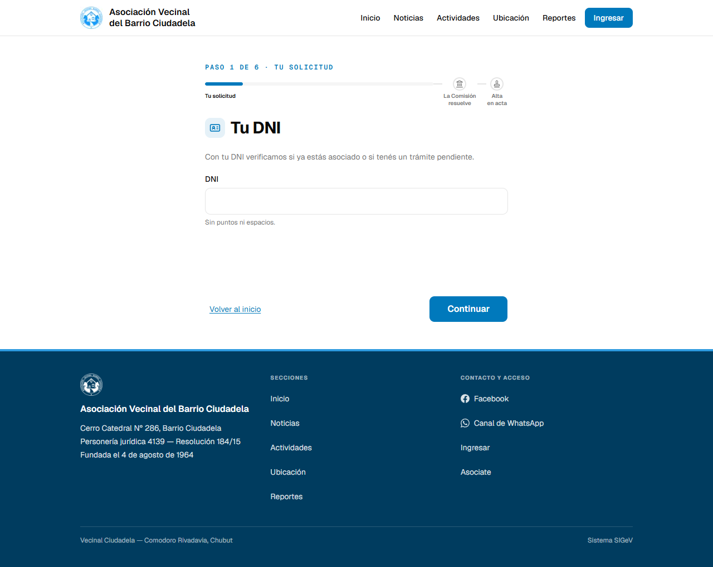

Con ese número el sistema verifica si ya estás asociado o si tenés un trámite pendiente, para no
hacerte llenar todos los campos y enterarte al final. Arriba está la barra del trámite completo:
**Tu solicitud → La Comisión resuelve → Alta en acta**; las dos últimas no dependen de vos.

## Paso 2 — ¿Dónde vivís?

De tu domicilio depende en qué categorías podés pedir el ingreso.

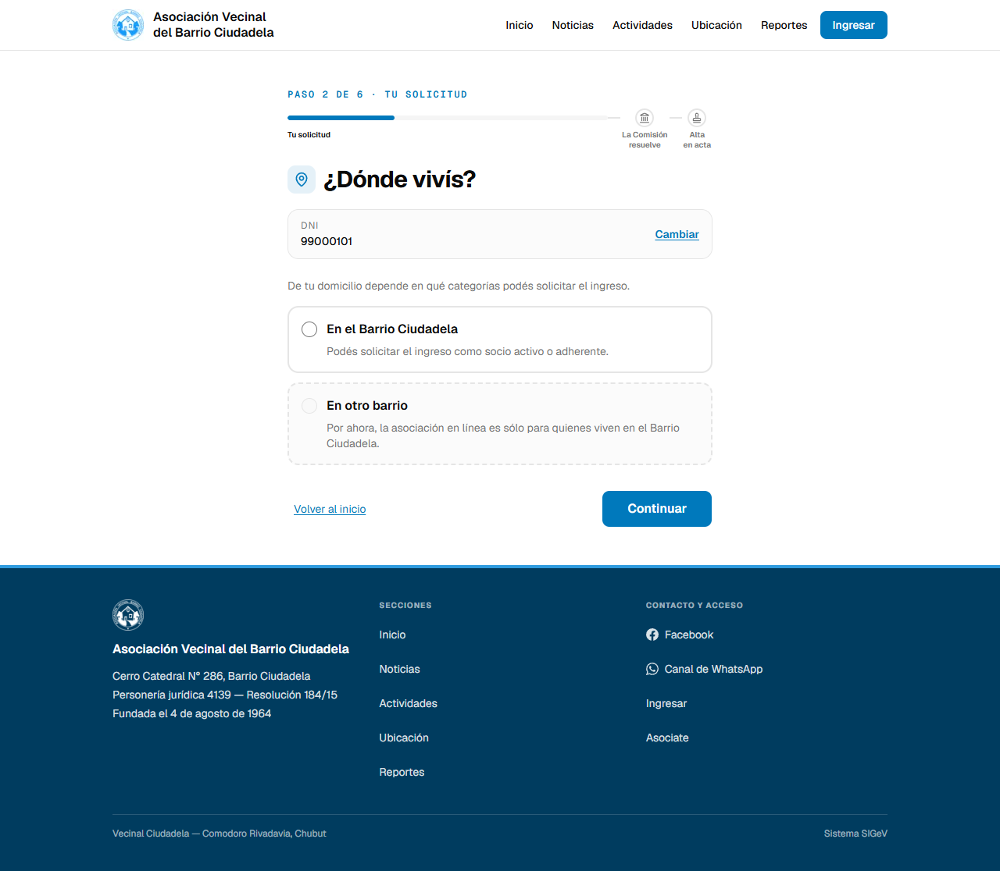

**En el Barrio Ciudadela**: elegí la calle del listado —empezá a escribir y el buscador la
encuentra, con tilde o sin tilde— y poné la altura. **En otro barrio** aparece atenuada mientras la
categoría de colaborador no esté habilitada, con el motivo escrito: *"Por ahora, la asociación en
línea es sólo para quienes viven en el Barrio Ciudadela."*

Arriba queda el resumen de lo ya contestado, con un enlace **Cambiar** al lado de cada dato: ése es
el camino para volver atrás.

## Paso 3 — ¿En qué categoría querés asociarte?

Viviendo en el barrio, las opciones son dos.

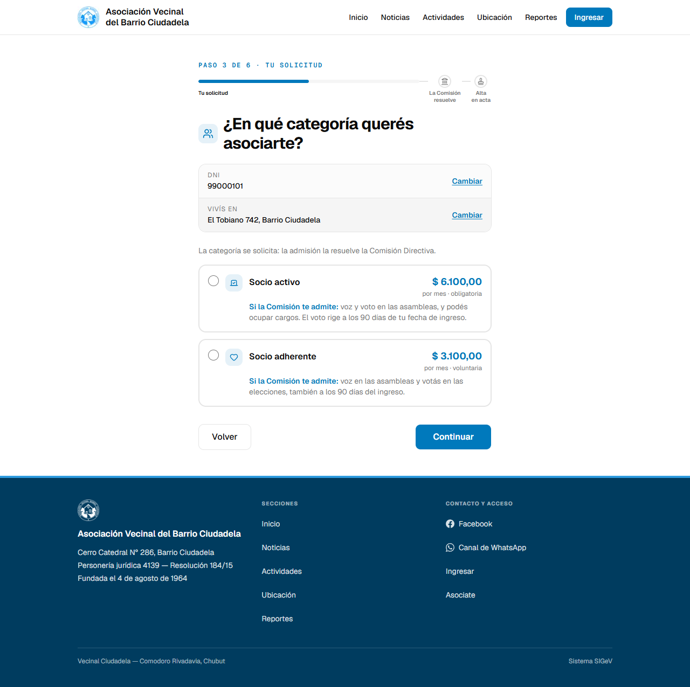

- **Socio activo**: cuota mensual obligatoria. Si la Comisión te admite, tenés voz y voto en las
  asambleas y podés ocupar cargos. El voto rige a los 90 días de tu fecha de ingreso.
- **Socio adherente**: cuota voluntaria. Si te admiten, tenés voz en las asambleas y votás en las
  elecciones, también a los 90 días del ingreso. Acá el paso pregunta además si querés adherir al
  débito automático; los socios activos van siempre con débito.

El monto de cada categoría es el que rige ese día; si no estuviera cargado, el paso lo dice y no
deja avanzar. Y fijate en la línea de arriba: *"La categoría se solicita: la admisión la resuelve
la Comisión Directiva."*

## Paso 4 — Tus datos

Nombre y apellido, fecha de nacimiento, estado civil, nacionalidad, ocupación, teléfono y correo
—con una segunda casilla para repetirlo, así un error de tipeo no te deja sin avisos—. El DNI no
se vuelve a pedir: quedó fijado en el paso 1. Abajo están los **términos y condiciones** y el
**consentimiento de datos personales**, que hay que leer y aceptar.

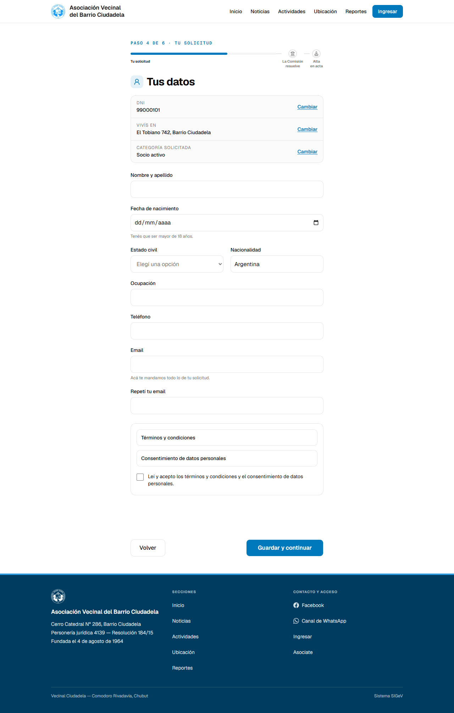

Al tocar **Guardar y continuar** tu solicitud queda creada. Desde ese momento te llega un correo
para **verificar tu dirección** —confirmalo: así la vecinal sabe que la casilla es tuya— y ya no se
puede volver a los pasos 1 a 4; si te equivocaste en algo, avisalo en la sede.

## Paso 5 — Documentación

Subí las **dos caras de tu DNI**: las dos son obligatorias.

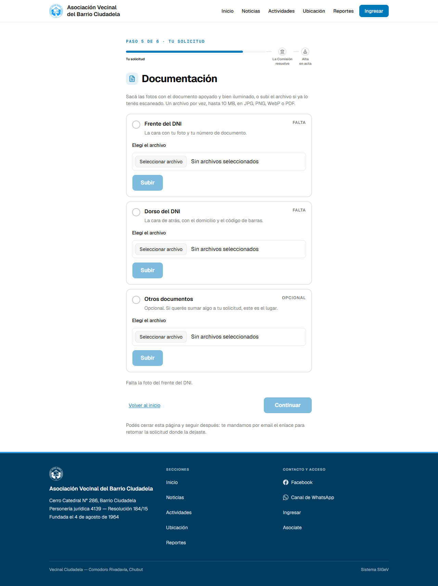

- Un archivo por vez, hasta **10 MB**, en **JPG, PNG, WebP o PDF**. Sacá las fotos con el documento
  apoyado y bien iluminado, o subí el archivo escaneado.
- Cada ranura se sube con su propio botón **Subir**; cuando queda lista deja de decir *FALTA*.
- **Otros documentos** es opcional: hasta dos archivos, por ejemplo algo que acredite tu domicilio.
- Si volvés a subir el frente o el dorso, el nuevo reemplaza al anterior; los anexos se suman.

**Continuar** se enciende recién cuando están las dos caras, y abajo la pantalla dice qué falta.

## Paso 6 — Pago y envío

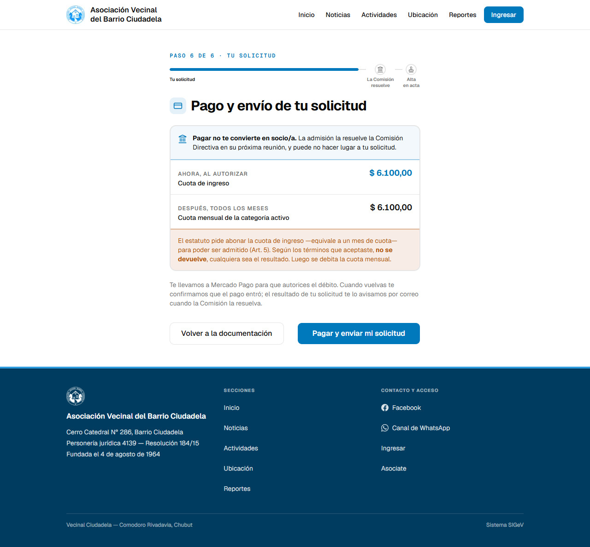

**Con débito automático** (socio activo, o adherente que eligió adherir) la pantalla muestra la
boleta antes de mandarte a pagar: el aviso de que **pagar no te convierte en socio/a**; la **cuota
de ingreso**, que equivale a un mes de cuota y que el estatuto pide abonar para ser admitido
(Art. 5); la **cuota mensual** que se debita después; y la advertencia de que esa cuota de ingreso
**no se devuelve**, cualquiera sea el resultado.

Al tocar **Pagar y enviar mi solicitud** vas a Mercado Pago a autorizar el débito. Cuando volvés,
el sitio dice *"Estamos confirmando tu pago"* y espera el aviso, que suele tardar menos de un
minuto; podés cerrar la página, porque la solicitud queda guardada y te escribimos cuando el pago
se confirme. Si cerraste el pago sin terminarlo, el mismo enlace te ofrece volver a Mercado Pago
mientras la solicitud no venza a los 7 días: es la misma operación, no un cobro nuevo.

**Sin pago** (adherente que no adhirió al débito) no se te cobra nada y el botón es **Enviar
solicitud**; si más adelante querés adherir, avisalo en la sede.

## Qué pasa después de enviar

La pantalla muestra la línea del trámite y en cuál de los tres hitos estás.

1. **Solicitud presentada**, o **completa y pago acreditado** —ahí el recibo de la cuota de ingreso
   llega por correo—.
2. **La Comisión Directiva resuelve.** Todavía no sos socia o socio: se resuelve en la próxima
   reunión (Art. 5 del estatuto) y el resultado llega por correo.
3. **Alta en acta.** Si te admiten, la fecha del acta es tu fecha de ingreso, y desde ahí corren
   los 90 días para votar.

Cuando el alta se asienta, recibís la invitación para crear tu contraseña. **No llega antes**: la
cuenta cuelga de la ficha de socio, y antes del acta esa ficha todavía no existe.

## Retomar un trámite empezado

El enlace para volver lo pedís desde el paso 1 con tu DNI: si hay una solicitud en trámite con ese
documento, la pantalla te lo reenvía al correo que dejaste, y esa dirección nunca se muestra, por si
quien tipea el DNI no sos vos. También llega con el recordatorio de pago a los 3 días. Al abrirlo
caés en el paso donde lo dejaste, o en la pantalla de estado si ya lo enviaste.

Dos plazos: si empezaste y no completás, a los **7 días** la solicitud vence —podés empezar otra—;
y si quedó esperando el pago, a los **3 días** llega un recordatorio, una sola vez. Las solicitudes
que ya están en manos de la Comisión no vencen.

## Si el sistema no te deja seguir

La pantalla siempre dice qué pasa y te deja **probar con otro documento** o volver al inicio.

| Qué dice la pantalla | Qué significa |
|---|---|
| **Ya estás asociado/a** | Ese documento figura en una ficha ya asociada. Muestra el nombre incompleto para que te reconozcas sin publicar datos ajenos. Entrá al panel de socio. |
| **Ya tenés una solicitud en trámite** | Hay un trámite abierto con ese DNI. La misma pantalla te reenvía el enlace. |
| **No pudimos seguir** — deuda | La ficha registra cuotas pendientes: dice cuántas, no el monto. Regularizalas en la sede y después completás la solicitud. |
| **No pudimos seguir** — expulsión | La ficha registra la expulsión de la asociación, ratificada por asamblea. Conforme al estatuto, un socio expulsado no puede reingresar. |
| **No pudimos seguir** — rechazo reciente | Una solicitud anterior fue rechazada hace menos de seis meses. La pantalla dice desde qué fecha podés volver a presentarla. |
| **No pudimos seguir** — otros casos | Hay algo en la ficha que no se resuelve por un formulario web. Acercate a la sede con tu documento. |

Si creés que hay un error, acercate a la sede. Si fuiste socio, te diste de baja y no tenés nada
pendiente, el trámite sigue normal: después se asienta como un reingreso sobre tu ficha de siempre,
no como un socio nuevo.

## Los correos del trámite

| Asunto | Cuándo llega |
|---|---|
| Verificá tu email | Al crear la solicitud, en el paso 4 |
| Retomá tu solicitud | Cuando pedís que te reenvíen el enlace |
| Recibimos tu solicitud | Al enviarla sin pago |
| Recibimos tu solicitud y tu pago | Cuando Mercado Pago confirma la autorización y el primer cobro |
| Tu solicitud está esperando el pago | A los 3 días, si quedó sin pagar |
| Creá tu contraseña | Cuando el alta se asienta en el acta |

Si alguno no aparece, revisá la carpeta de correo no deseado.

# 3. Re-empadronarte

El **re-empadronamiento** lo convoca la Comisión Directiva para actualizar el padrón (Art. 9° bis
del estatuto). Existe sólo mientras el proceso está abierto.

## Quién tiene que hacerlo y cómo enterarse

Se convoca a los **socios adherentes** vigentes al momento de la convocatoria. Esa lista se congela
ese día: quien pasa a ser adherente después no está convocado y no le corre ningún plazo. Si sos
socio activo, no te toca.

El aviso llega por **correo**; si no tenemos una dirección utilizable, se publica en la **cartelera
de la sede**. Mientras el proceso está abierto la portada muestra el botón **REEMPADRONATE**; si no
hay proceso en curso, la página lo dice.

## Los cuatro pasos

El trámite **no tiene ningún paso de pago**: no se ofrece pagar, ni adherir un débito, ni cambiar
de monto. Sólo se actualiza tu ficha.

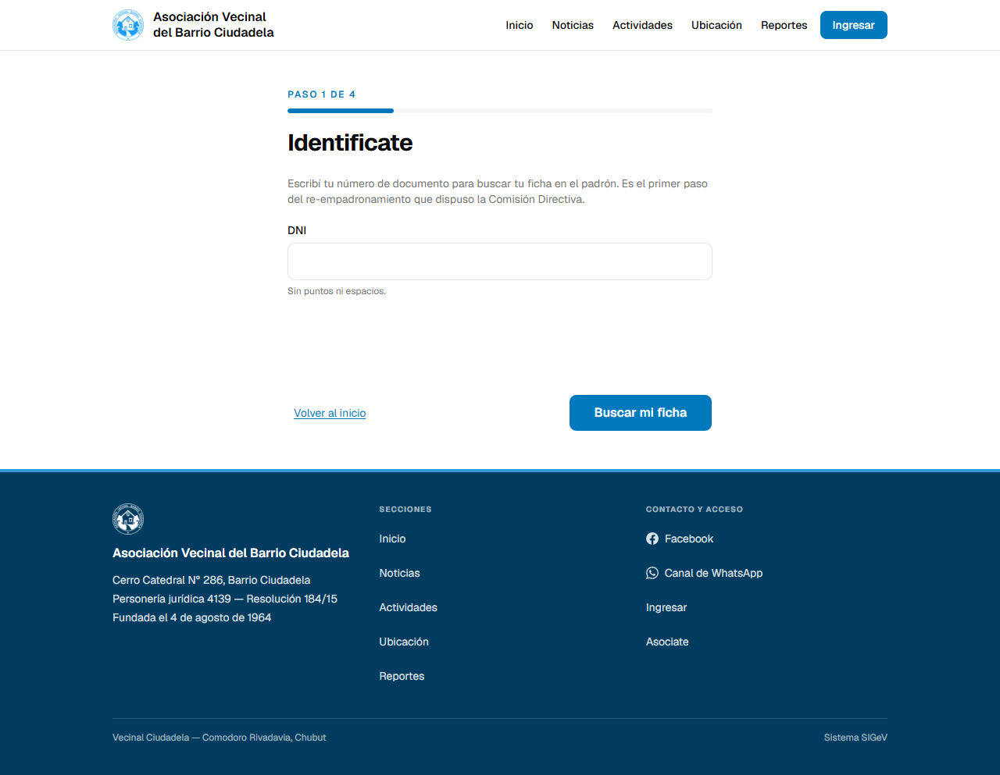

1. **Identificate.** Escribí tu DNI y tocá **Buscar mi ficha**. Si estás convocado, la pantalla
   te pregunta si sos vos mostrando solo la inicial del nombre, el resto tapado con asteriscos y la inicial del apellido (por ejemplo M***** P.), a propósito: alcanza para que te
   reconozcas y no publica los datos de otra persona. Confirmás con **Sí, soy yo**.
2. **Tus datos.** Fecha de nacimiento, estado civil, nacionalidad, ocupación, domicilio (calle del
   listado y altura; el barrio es Ciudadela y no se elige), teléfono y **correo obligatorio**,
   porque es el domicilio electrónico donde se te notifica. El nombre y el DNI no se editan y se
   corrigen en la sede; salvo el correo, todo se tipea de cero.
3. **Documentación.** Las dos caras del DNI, obligatorias, y hasta dos anexos opcionales para
   acreditar el domicilio. Mismos formatos y tamaño máximo que en ASOCIATE.
4. **Declaración jurada.** El resumen de lo declarado y una casilla para jurar que es verdadero.
   Sin esa casilla no se envía.

Al enviar, la pantalla muestra la **constancia** con fecha y hora: *"Esa fecha es la constancia de
que te presentaste dentro del plazo."* La misma constancia llega por correo, con un enlace para
volver a verla; si el correo no pudo salir, la pantalla te lo dice y te pide que la guardes.

Lo que declarás **no modifica tu ficha en el momento**: queda en tu presentación hasta que la
Comisión la valide. Si hay que corregir algo, te escriben a ese correo y lo corregís desde el
enlace que te mandaron.

## Los plazos, y qué pasa si no te presentás

| Etapa | Plazo |
|---|---|
| Primera instancia | 30 días corridos |
| Segunda instancia, para quienes no se presentaron | 10 días corridos más |
| Recurso, si te dieron de baja | 30 días corridos desde la notificación |
| Aviso por cartelera | 20 días hábiles de publicación |

Cuando el aviso va por cartelera, lo que acredita la notificación es el cumplimiento de los veinte
días hábiles, no el día en que se fijó el cartel.

Vencidas las dos instancias, la Comisión puede dar de baja a quien no se re-empadronó, y esa baja
se asienta en un acta. Te lo notifican por correo o por cartelera, y desde esa notificación tenés
treinta días corridos para interponer un recurso. Si ya venció el plazo por la web, la salida es
la sede: acercate con tu documento.

Y si ya te presentaste, al entrar de nuevo con tu DNI la pantalla dice *"Tu presentación ya está"*
y no deja empezar otra vez: tu trámite sigue por el enlace del correo, que esa misma pantalla te
reenvía si no lo encontrás. Es a propósito, porque entrar por el DNI genera un enlace nuevo y le
mataría el del buzón a quien esté en el medio de una corrección con el plazo corriendo.

# 4. Reclamos e iniciativas

En **Reportes** podés plantearle a la asociación un problema del barrio o una propuesta. Está
abierto a socios y a vecinos sin cuenta (Art. 2 inc. g del estatuto).

Un **reclamo** es un problema en la vía pública —agua, cloacas, luz, residuos, calles, árboles,
transporte—: la Comisión Directiva lo revisa y, si corresponde, lo **presenta ante el organismo**
que atiende ese tema. Una **iniciativa** es una propuesta para el barrio: la **trata la Comisión
Directiva** en su reunión (Art. 6 del estatuto), y no se presenta ante ningún organismo.

La página de Reportes tiene las dos puertas y dos números del año: cuántos se recibieron y cuántos
se presentaron. Nunca se publica un reporte de otro vecino ni quién lo hizo, y esto no reemplaza el
reclamo que puedas hacer directamente ante el municipio o la SCPL.

## Paso 1 — Empezar

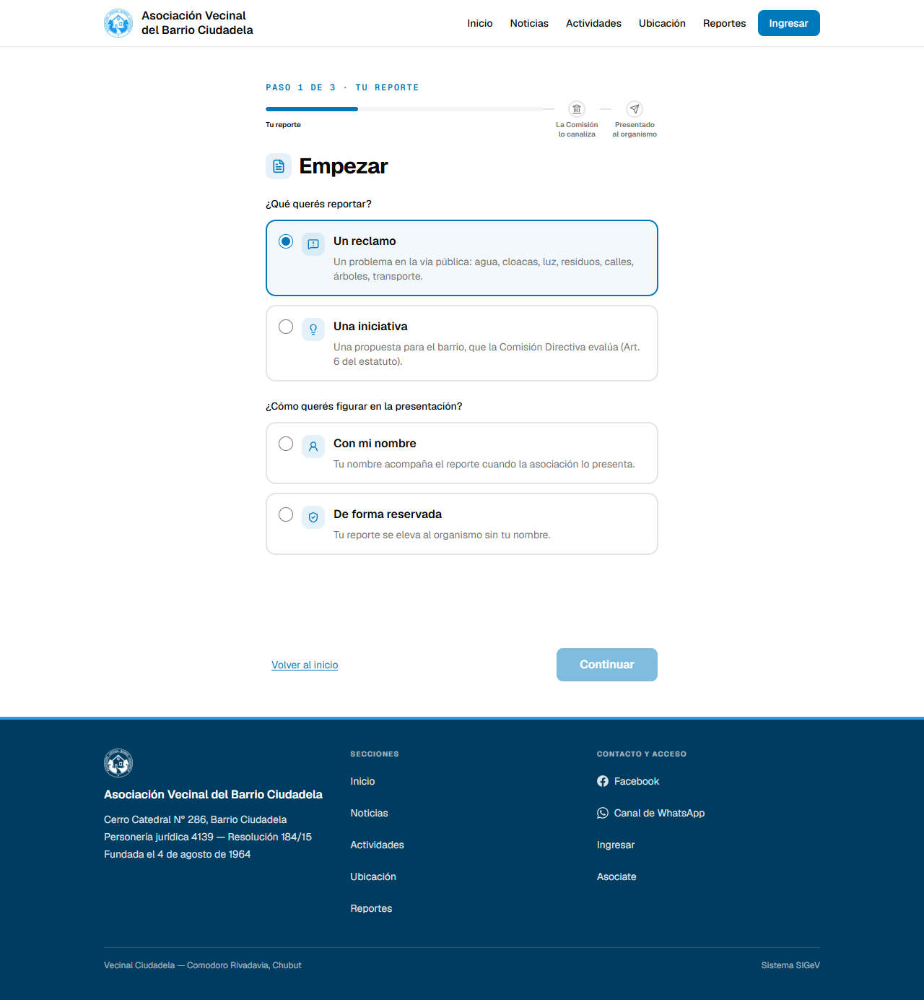

Dos preguntas en la misma pantalla. **¿Qué querés reportar?**: un reclamo o una iniciativa.
**¿Cómo querés figurar en la presentación?**: *Con mi nombre*, y tu nombre acompaña el reporte
cuando la asociación lo presenta; o *De forma reservada*, y se eleva sin tu nombre. Ojo: **la
asociación siempre sabe quién reporta**; lo reservado es cómo figurás ante el organismo.

Al continuar nace tu borrador y la dirección de la página cambia por un enlace propio, que de ahí
en más es tu credencial: guardalo si pensás seguir más tarde.

## Paso 2 — Tus datos

Sólo para vecinos sin cuenta: si entrás como socia o socio desde tu panel, este paso no existe.

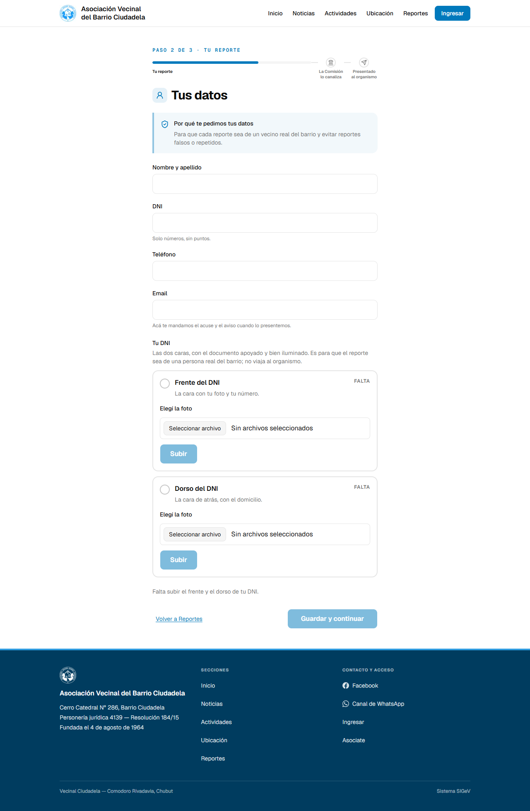

Se piden nombre y apellido, DNI, teléfono y correo, más las **dos caras del DNI**, para que cada
reporte sea de un vecino real del barrio y evitar reportes falsos o repetidos. La pantalla aclara
algo importante: la foto del documento **no viaja al organismo**. Sin las dos caras, **Guardar y
continuar** no avanza.

## Paso 3 — Tu reporte

- **Categoría** y, en los reclamos, el **tipo**. Si es de los que atiende la SCPL, aparece un aviso
  con el WhatsApp de la cooperativa y un campo opcional para el N° de reclamo.
- **Descripción**, hasta 2000 caracteres.
- **Ubicación.** Tocá el mapa para marcar el punto y arrastralo para ajustarlo; el contorno es el
  barrio. También podés usar tu ubicación actual o elegir la calle del listado y poner la altura o
  una referencia. Si el punto queda fuera del barrio, la pantalla avisa pero **deja enviar igual**.
  En un reclamo la ubicación es obligatoria, salvo en la categoría "Otro reporte".
- **Fotos**, hasta dos y opcionales. Se les quitan los metadatos: la ubicación que guarda tu
  celular en la foto no viaja con ella.
- El **consentimiento de datos personales**, al final.

**Enviar reporte** se enciende recién cuando está todo. En esta pantalla la tecla Enter no envía
nada: el envío es irreversible y tiene que ser un clic deliberado.

## Qué pasa después, y cómo retomar un borrador

Al enviar, la pantalla muestra tu **número de reporte** y la línea del trámite: **Recibido** (ya
está en manos de la Comisión Directiva), **La Comisión lo canaliza** —o *la evalúa*, en una
iniciativa— y **Presentado ante el organismo** —o *Tratada por la Comisión*—. Llega un acuse por
correo con ese número, y te avisamos cuando el reporte se presente o se trate. Si la Comisión
resuelve no darle curso, la pantalla lo dice y podés consultar el motivo en la sede. El número se
asigna al enviar, no al empezar el borrador.

Mientras no lo envíes, el reporte queda como borrador y se abre con tu enlace. Los borradores sin
enviar **se borran a las 48 horas**. Si el enlace ya no sirve —porque venció, porque no existe o
porque es de otra persona— la pantalla dice siempre lo mismo: *"No encontramos ese reporte"*.

# 5. Ingresar y recuperar el acceso

El botón **Ingresar** es para quienes ya tienen cuenta: socias y socios con el alta asentada, y
las cuentas de gestión de la Comisión.

Se entra con el **correo** y la **contraseña**. Si el dato está mal, el mensaje es siempre el mismo
—*"Email o contraseña incorrectos."*— sin decir cuál de los dos falló, y después de varios intentos
seguidos el ingreso se frena un rato: *"Demasiados intentos. Probá de nuevo más tarde."* **¿Olvidaste tu contraseña?** abre el pedido de recupero:
escribís tu correo y, si corresponde a una cuenta, llega un enlace que **vence en 30 minutos**; la
respuesta en pantalla es la misma exista o no la cuenta.

La **primera contraseña** no se crea desde acá: llega en el correo de invitación, después de que tu
alta se asienta en el acta. Qué hacer una vez adentro está en el **Manual del socio**.

# 6. Tus datos

Los trámites de esta guía piden datos personales, y algunos son sensibles: el documento, el
domicilio, el teléfono y el correo. Se piden porque el estatuto y la ley los exigen para incorporar
a una persona como socia, para notificarla, y para que un reclamo que la asociación eleva sea de un
vecino real del barrio. No se usan para otra cosa y, según el consentimiento que aceptás, no se
ceden a terceros; ese texto está escrito en cada formulario y hay que aceptarlo antes de enviar
(Ley 25.326).

En concreto: las fotos del DNI no son públicas ni se abren con un enlace —sólo las ve la Comisión
desde el panel, y queda registrado quién las abrió y cuándo—; en un reporte la foto del documento
no viaja al organismo y se conserva 360 días; las fotos que subís a un reporte se guardan sin
metadatos; los borradores que no se envían se borran a las 48 horas; el sitio nunca muestra el
nombre completo ni la dirección de correo de otra persona; y lo que declarás en un
re-empadronamiento no cambia tu ficha hasta que la Comisión lo valida. Si querés saber qué datos
tuyos figuran, corregirlos o pedir que se den de baja, acercate a la sede con tu documento.

# 7. Preguntas frecuentes

**¿Pagar la cuota de ingreso me hace socio?** No. Es un requisito del estatuto para pedir la
admisión (Art. 5). La admisión la resuelve la Comisión Directiva y el alta queda en un acta. Esa
cuota no se devuelve, cualquiera sea el resultado.

**Empecé a asociarme y cerré la página. ¿Perdí todo?** Si llegaste al paso 4, no: el trámite quedó
guardado. Volvé a ASOCIATE, escribí tu DNI en el paso 1 y pedí que te reenvíen el enlace para
retomarlo donde lo dejaste. Si no habías llegado al paso 4, son tres pantallas cortas.

**No me llegó ningún correo.** Revisá el correo no deseado. Si aun así no aparece, volvé a
ASOCIATE, escribí tu DNI y pedí que te reenviemos el enlace; para el re-empadronamiento, lo mismo
desde el paso 1. Si el correo que dejaste tiene un error de tipeo, acercate a la sede.

**Vivo fuera del barrio, o tengo 16 años. ¿Puedo asociarme?** Por la web no: la categoría de
colaborador depende de una reforma del estatuto todavía no oficializada, y el trámite en línea es
para mayores de 18. En los dos casos, consultá en la sede.

**Fui socio y me di de baja. ¿Puedo volver?** Sí, salvo que tengas cuotas pendientes o que la ficha
registre una expulsión ratificada por asamblea. Si te frena, la pantalla dice por qué. Y si una
solicitud tuya fue rechazada, podés presentar otra pasados seis meses: la pantalla te dice la fecha.

**Soy adherente y no me llegó el aviso del re-empadronamiento.** Va por correo, y si no hay una
dirección utilizable se publica en la cartelera. Entrá igual a REEMPADRONATE y probá con tu DNI: si
estás convocado, el trámite se abre.

**No puedo subir la foto del DNI.** Revisá que sea JPG, PNG, WebP o PDF y que no pase de 10 MB, y
subí una cara por vez. Si sale muy pesada, sacala con menos resolución o escaneala.

**¿Por qué me piden el DNI si el reporte es reservado?** Porque un reclamo que la asociación eleva
tiene que ser de una persona real del barrio: reservada es la forma de figurar ante el organismo,
no la identidad frente a la asociación.

# Documentos relacionados

- **Manual del socio** — qué podés hacer con tu cuenta: ver y pagar cuotas, descargar recibos,
  adherir el débito automático, actualizar tus datos, presentar solicitudes y reportes.
- **Manual del operador** — para la Comisión Directiva: cómo se resuelven las solicitudes, se
  validan los re-empadronamientos y se canalizan los reportes.
- **Serie técnica (documentos 1 a 7)** — para quien mantiene el sistema.
